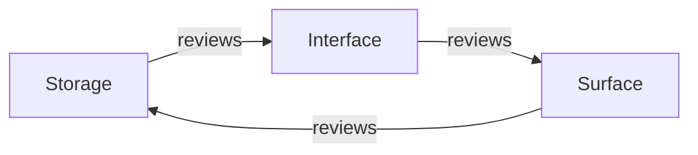

# Chapter 3 — How the team works together

**What you'll build:** a habit that stops you breaking each other's work.

**Time:** 20 minutes to read, then you use it every day.

---

## Before you start

```markdown
- [ ] Chapter 2 is finished — you have a branch to push
- [ ] You can push to the repository, or someone has invited you to it
```

Every checklist in this chapter also lives in [CHECKLISTS.md](CHECKLISTS.md) in
copy-and-paste form. This chapter explains *why*; that file is what you keep
open.

If you are three people starting together, read [the three-person
plan](TEAM-PLAN.md) straight after this chapter — it turns these rules into a
week-by-week schedule with names on it.

---

You are a team of beginners on a shared repository. The single biggest risk is
not that the code is wrong — it is that `main` breaks and everyone is blocked.
This chapter is the smallest process that prevents that.

## The rules

1. **Never push straight to `main`.** Always work on a branch.
2. **Never commit code that does not build.** Run the checks first, every time.
3. **One change per branch.** Small PRs get reviewed; big ones sit for a week.
4. **Pull before you start.** Someone else has probably merged something.

## The daily loop

```bash
git checkout main
git pull
git checkout -b feat/thing-you-are-building
```

Do the work. Then, before you commit:

```bash
cargo fmt --all
cargo clippy --workspace --all-targets -- -D warnings
cargo test --workspace
```

Then:

```bash
git add -A
git commit -m "feat(local): add block placement"
git push -u origin feat/thing-you-are-building
```

Open the pull request on GitHub, get one review, merge. Then delete the branch
and go back to the top.

### Save yourself the typing

Add this to `~/.zshrc` (or `~/.bashrc`) so you cannot forget the checks:

```bash
mmcheck() {
  cargo fmt --all &&
  cargo clippy --workspace --all-targets -- -D warnings &&
  cargo test --workspace &&
  echo "✔ ready to commit"
}
```

Then `mmcheck` before every commit.

## Branch names

| Prefix | For | Example |
| --- | --- | --- |
| `feat/` | a new capability | `feat/viz-blocks` |
| `fix/` | a bug fix | `fix/empty-dir-listing` |
| `docs/` | documentation only | `docs/localbackend-guide` |
| `refactor/` | restructuring, no behaviour change | `refactor/extract-placement` |
| `chore/` | tooling, CI, dependencies | `chore/bump-tokio` |

## Commit messages

Same prefixes, plus a scope naming the crate or area:

```
feat(cli): add mammoth version command
fix(local): last block was padded instead of left partial
docs(guide): add chapter on the Backend trait
chore(ci): run clippy on all targets
```

Why bother? Because `git log --oneline` becomes readable, and because release
notes can be generated from it later. Write the message as a command: "add X",
not "added X" or "adding X".

## Who does what

Chapters 5–9 split cleanly across a team. These pieces barely touch each other,
so two or three people can work in parallel without conflicts:

| Person | Chapters | Files they own |
| --- | --- | --- |
| A | 5, 6 | `crates/mammoth-local/` |
| B | 7, 8 | `crates/mammoth-cli/`, `crates/mammoth-viz/` |
| C | 9 | `ui/`, `crates/mammoth-gateway/` |
| Anyone | 10 | `web/`, `.github/workflows/pages.yml` |

**Chapter 4 is for everyone.** Read it together before splitting up — the
`Backend` trait is the contract between all three tracks, and if you disagree
about it you will waste a week.

The dependency is: B needs A's chapter 5 finished before starting chapter 7. In
the meantime, B can build the output layer and the table rendering against
hand-written fake data.

> **The full version of this table** — with a week-by-week schedule, the three
> handoff contracts, the fake-data trick that keeps everyone working, and what
> to do when someone is stuck or away — is in
> [the three-person plan](TEAM-PLAN.md). Read it once, together, right after
> this chapter.

### Put real names in it

Do this on day one, out loud, and write the answer down. "We will figure it out"
is how two people spend a week writing the same function.

| | Track | Chapters | Owns |
| --- | --- | --- | --- |
| ________ | Storage | 5, 6 | `crates/mammoth-local/` |
| ________ | Interface | 7, 8 | `crates/mammoth-cli/`, `crates/mammoth-viz/` |
| ________ | Surface | 9, 10 | `ui/`, `crates/mammoth-gateway/`, `web/` |

Rough rule: the strongest Rust person takes **storage**, because everyone else
is downstream of it. Anyone with web experience takes **surface**, because it is
TypeScript and HTTP rather than Rust. Whoever is left takes **interface**, which
is the most fun.

"Owns" means they make the final call inside those directories and are the
default reviewer for changes to them. It does not mean nobody else may touch the
files.

### The review rota

With three people, review is a ring, so nobody has to ask who will look at it:



**Every PR gets a first response within one working day.** Not necessarily an
approval — a response. On a three-person team, a PR sitting for two days is a
third of the project stopped, which is always worse than whatever is wrong
inside the PR.

## Reviewing each other's code

You are all learning, so review for understanding, not for style. `cargo fmt`
and `clippy` already handle style — do not spend review comments on it.

Ask these four questions:

1. **Does it build and pass tests?** CI answers this; check the green tick.
2. **Can I explain what it does?** If not, ask. Unclear code is a real finding.
3. **What happens on the unhappy path?** Empty directory, missing file, zero
   bytes, a path with spaces in it.
4. **Is there an `.unwrap()` on a path a user can reach?** That is a crash
   waiting to happen. It should be a `?` with a real error.

Approve when you would be comfortable debugging it at 2am. That is the bar.

## When you break `main` anyway

You will, once. It is fine.

```bash
git revert <the-commit-hash>
git push
```

`git revert` makes a *new* commit undoing the old one. It does not rewrite
history, so nobody else's clone breaks. **Never** use `git reset --hard` or
`git push --force` on a shared branch — that is how people lose work.

## Check it works

Prove the loop end to end with a change so small it cannot fail. Add yourself
to the authors list:

```bash
git checkout main && git pull
git checkout -b chore/add-me-to-authors
```

Open `Cargo.toml` and edit the `authors` line:

```toml
authors      = ["ProjectOrcha", "Your Name <you@example.com>"]
```

```bash
cargo build --workspace
git add -A && git commit -m "chore: add Your Name to authors"
git push -u origin chore/add-me-to-authors
```

Open the PR, have a teammate approve it, merge it, then:

```bash
git checkout main && git pull
git branch -d chore/add-me-to-authors
```

Everyone on the team should do this once, on day one. It gets the awkward parts
— permissions, review, the merge button — out of the way before there is real
code at stake.

## Done when

Each of the three of you, individually:

```markdown
- [ ] `mmcheck` is in my `~/.zshrc` (or `~/.bashrc`) and works
- [ ] I pushed the `chore/add-me-to-authors` branch
- [ ] A teammate reviewed and approved my PR
- [ ] I merged it, pulled `main`, and deleted the branch
- [ ] I reviewed and approved one of someone else's
```

And once, together:

```markdown
- [ ] Branch protection is on for `main` — require one approval and a green CI run
- [ ] The review rota is written down: who reviews whose PRs
- [ ] Standup time is agreed and in all three calendars
- [ ] The [progress tracker](CHECKLISTS.md#the-whole-guide--progress-tracker) is
      pinned as a GitHub issue, with owners filled in
- [ ] We have decided who takes which track in [the three-person plan](TEAM-PLAN.md)
```

Branch protection is the box people skip. Turn it on — Settings → Branches → Add
rule. It takes two minutes and it makes "never push to `main`" a fact rather
than a promise.

## If it went wrong

**`Updates were rejected because the remote contains work that you do not have`**
— someone pushed while you were working. Get their changes and replay yours on
top:

```bash
git pull --rebase
```

**Merge conflict** — Git marks the clash with `<<<<<<<`, `=======`, `>>>>>>>`.
Open the file, delete the markers, keep the code you want, then:

```bash
git add <the-file> && git rebase --continue
```

If you panic: `git rebase --abort` puts everything back the way it was.

**`Permission denied (publickey)`** — GitHub does not know your machine. Either
[add an SSH key](https://docs.github.com/en/authentication/connecting-to-github-with-ssh),
or clone over HTTPS instead.

**You committed to `main` by mistake and have not pushed** — move the commit to
a branch:

```bash
git branch feat/my-work
git reset --hard origin/main
git checkout feat/my-work
```

---

**Next:** [Chapter 4 — Understanding the Backend trait](04-the-backend-trait.md)
