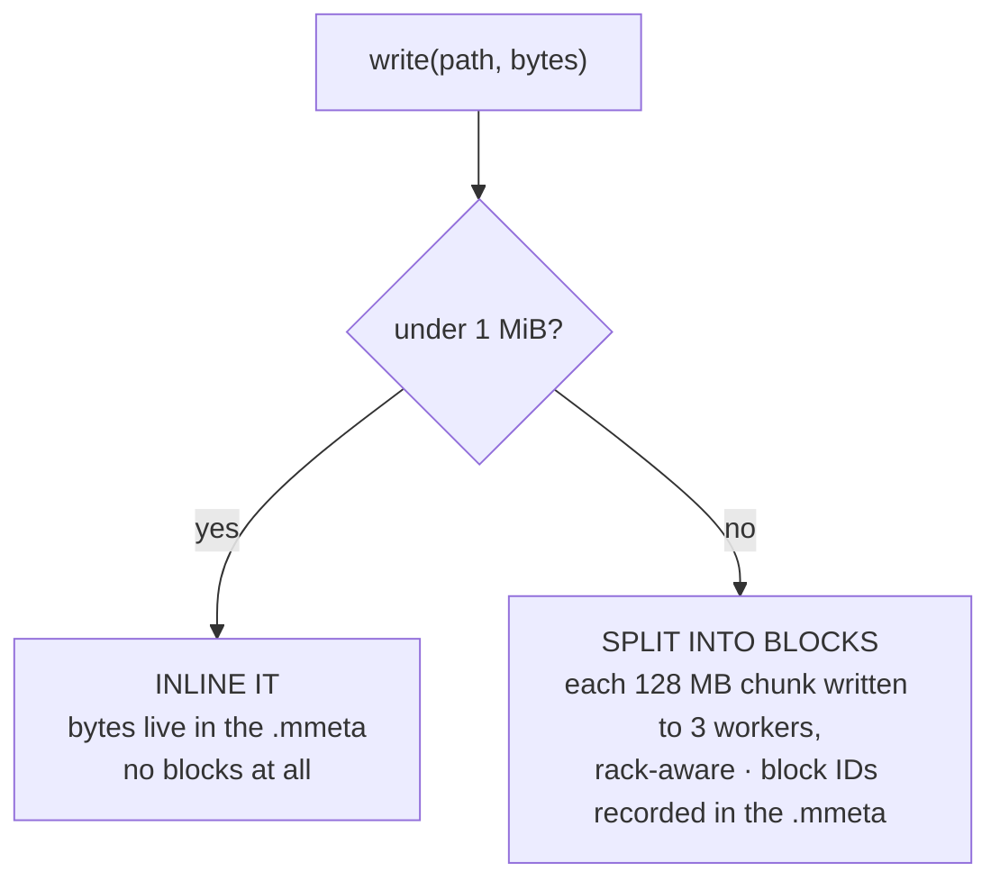

# Chapter 6 — LocalBackend, part 2: `write`, `read`, blocks

**What you'll build:** the data path. Files get chopped into blocks, replicated
across three workers, and read back byte-identical.

**Time:** about 3 hours.

---

## Before you start

```markdown
- [ ] Chapter 5 is merged — `cargo test -p mammoth-local` passes its two tests
- [ ] I am on a new branch: `git checkout -b feat/local-backend-data-path`
```

### Files you will touch

```
crates/mammoth-local/
├── src/
│   └── lib.rs          EDIT   five more methods: write, read, remove,
│   │                          block_layout, cluster_report
└── tests/
    └── layout.rs       EDIT   two tests become five
```

Nothing outside `mammoth-local` changes. That is worth noticing: you are adding
the entire data path to the system and no other crate needs to know.

### The two ideas to hold on to

Before you type anything, know what you are aiming at — the rest is mechanics:

1. **A file is cut into blocks, and the last block is left partial.** A 300 KB
   file with 128 KB blocks is `128 + 128 + 44`, not three padded 128s. Getting
   this wrong is the single most common bug in this chapter, and the tests catch
   it.
2. **A very small file skips blocks entirely.** Under the inline threshold, the
   bytes live in the metadata. `blocks: 0`, `inlined: true`. This is Mammoth's
   answer to the small-file problem that plagues HDFS.

### Who this is for

Still **Ana's track**. Finishing it completes
[handoffs 2 and 3](TEAM-PLAN.md#the-three-handoff-contracts) at once — it
unblocks the rest of chapter 7, all of chapter 8, and the real-data half of
chapter 9. It is the most unblocking commit in the project, so if it is running
long, that is when the team pairs on it rather than starting something new.

---

This is the chapter where Mammoth becomes a real filesystem. At the end of it
you can put a file in, get it back out, and ask where every block landed.

## The two paths a write can take



**Inlining is Mammoth's answer to the small-file problem.** In Hadoop, one
million 10 KB files consume the same index space as one million 128 MB files —
clusters genuinely die from this. If a file is smaller than the block layer is
worth, its bytes just live in the metadata. No block ID, no block report entry,
no replica bookkeeping.

## Step 1 · Helpers

Add these two free functions at the **bottom** of `lib.rs`, outside any `impl`:

```rust
/// Current Unix time in seconds.
fn now() -> i64 {
    std::time::SystemTime::now()
        .duration_since(std::time::UNIX_EPOCH)
        .map(|d| d.as_secs() as i64)
        .unwrap_or(0)
}

/// Wrap one buffer as a single-chunk stream.
fn one_chunk(b: Bytes) -> ByteStream {
    Box::pin(futures_util::stream::once(async move { Ok(b) }))
}

/// Hand out the next block ID, persisting the counter so IDs stay unique
/// across restarts. A real master allocates these from Raft.
fn next_block_id(root: &Path) -> Result<u64> {
    let counter = root.join("next-block-id");
    let current: u64 =
        std::fs::read_to_string(&counter).ok().and_then(|s| s.trim().parse().ok()).unwrap_or(1000);
    let next = current + 1;
    std::fs::write(&counter, next.to_string())?;
    Ok(next)
}
```

Add the imports they need, at the top of the file:

```rust
use std::ops::Range;

use bytes::Bytes;
use futures_util::StreamExt;
use mammoth_core::backend::ByteStream;
```

## Step 2 · `write`

Replace the `write` stub in the `impl Backend` block:

```rust
    async fn write(&self, path: &Path, mut data: ByteStream) -> Result<()> {
        // Drain the stream into memory. Fine here — LocalBackend only ever
        // sees test data. ClusterBackend must stream properly; a real file
        // can be 10 TB.
        let mut buf = Vec::new();
        while let Some(chunk) = data.next().await {
            buf.extend_from_slice(&chunk?);
        }

        // Refuse the write if we could not satisfy the replication factor.
        let live = WORKERS.len() as u8;
        if self.replication > live {
            return Err(Error::NotEnoughWorkers { wanted: self.replication, available: live });
        }

        if let Some(parent) = self.ns_path(path).parent() {
            std::fs::create_dir_all(parent)?;
        }

        let meta = if (buf.len() as u64) <= self.inline_threshold {
            // Small file: the bytes ARE the metadata. No blocks at all.
            FileMeta {
                len: buf.len() as u64,
                block_size: self.block_size,
                replication: self.replication,
                inlined: true,
                inline_data: Some(buf),
                blocks: Vec::new(),
                modified: now(),
            }
        } else {
            // Big file: chop it up and place each block on `replication` workers.
            let mut blocks = Vec::new();
            for (index, chunk) in buf.chunks(self.block_size as usize).enumerate() {
                let id = BlockId(next_block_id(&self.root)?);
                for replica in self.place(id, self.replication) {
                    std::fs::write(self.block_path(&replica.node.0, id), chunk)?;
                }
                blocks.push(BlockMeta { id: id.0, index: index as u32, len: chunk.len() as u64 });
            }
            FileMeta {
                len: buf.len() as u64,
                block_size: self.block_size,
                replication: self.replication,
                inlined: false,
                inline_data: None,
                blocks,
                modified: now(),
            }
        };

        std::fs::write(self.meta_path(path), serde_json::to_vec_pretty(&meta).unwrap())?;
        Ok(())
    }
```

### What to notice

**`buf.chunks(self.block_size as usize)`** does the whole "chop the file into
blocks" job in one call. The last chunk is whatever is left over — `chunks`
does not pad it. That is correct and it matters: a 350 MB file with 128 MB
blocks is 128 + 128 + 94, not 128 + 128 + 128.

**The `NotEnoughWorkers` check** is where the error from the README comes from.
With six workers you will never hit it, but drop `WORKERS` to two and ask for
replication 3 and you get the real thing, with its hints and its docs link.

**We write the same `chunk` to three different paths.** A real cluster does not
do this, and it is worth knowing what it does instead — because Hadoop and
Mammoth answer differently here.

*HDFS* uses **chain replication**: the client sends each 64 KB packet once to
the first DataNode, which writes it and forwards it to the second, which
forwards to the third; acks come back down the chain. The client's uplink is
never tripled — but three hops out and three acks back are all in series, one
slow disk stalls the whole write, and a node dying mid-block means rebuilding
the pipeline and re-sending.

*Mammoth* **disperses** instead. The block is erasure-coded into `k` data plus
`m` parity fragments and all `k + m` go out **at the same time** to `k + m`
workers — network depth 1 instead of 3 — and the write acks as soon as any
`k + 1` are durable, so the slowest node is never waited on. Storage drops from
3× to 1.67×, and the fabric carries 1.67× instead of 3×; the cost is that the
client's own uplink carries 1.67× rather than 1×.

`LocalBackend` has no network, so the loop above is fine — there is no latency
to save. When you build the real write path, build the fan-out:
[Chapter 12 — The four fast paths](12-the-fast-paths.md).

## Step 3 · `read`

```rust
    async fn read(&self, path: &Path, range: Range<u64>) -> Result<ByteStream> {
        let meta = self.read_meta(path)?;

        let all = if meta.inlined {
            meta.inline_data.clone().unwrap_or_default()
        } else {
            let mut buf = Vec::with_capacity(meta.len as usize);
            for b in &meta.blocks {
                // Recompute placement and read from the primary replica.
                let replicas = self.place(BlockId(b.id), meta.replication);
                let first = &replicas[0];
                buf.extend_from_slice(
                    &std::fs::read(self.block_path(&first.node.0, BlockId(b.id)))?,
                );
            }
            buf
        };

        let start = range.start.min(all.len() as u64) as usize;
        let end = range.end.min(all.len() as u64) as usize;
        Ok(one_chunk(Bytes::from(all[start..end].to_vec())))
    }
```

**Clamping the range** with `.min(all.len())` is what lets callers pass
`0..u64::MAX` to mean "the whole file" without doing arithmetic first. Without
the clamp, that slice would panic.

**Reading only the primary replica** is the simple choice. A real client would
try another replica if the first one is slow or corrupt — that is hedged reads,
and it is one of the biggest tail-latency wins available. Not today.

## Step 4 · `remove`, `block_layout`, `cluster_report`

```rust
    async fn remove(&self, path: &Path, recursive: bool) -> Result<()> {
        let ns = self.ns_path(path);
        if ns.is_dir() {
            if !recursive && std::fs::read_dir(&ns)?.next().is_some() {
                return Err(Error::WrongKind {
                    path: path.to_path_buf(),
                    actual: "non-empty directory",
                    expected: "empty directory (pass --recursive)",
                });
            }
            std::fs::remove_dir_all(ns)?;
            return Ok(());
        }

        // Delete every replica of every block, then the metadata.
        let meta = self.read_meta(path)?;
        for b in &meta.blocks {
            for replica in self.place(BlockId(b.id), meta.replication) {
                let _ = std::fs::remove_file(self.block_path(&replica.node.0, BlockId(b.id)));
            }
        }
        std::fs::remove_file(self.meta_path(path))?;
        Ok(())
    }

    async fn block_layout(&self, path: &Path) -> Result<Vec<BlockPlacement>> {
        let meta = self.read_meta(path)?;
        Ok(meta
            .blocks
            .iter()
            .map(|b| BlockPlacement {
                id: BlockId(b.id),
                index: b.index,
                len: b.len,
                replicas: self.place(BlockId(b.id), meta.replication),
            })
            .collect())
    }

    async fn cluster_report(&self) -> Result<ClusterReport> {
        let mut nodes = Vec::new();
        let mut used_total = 0;

        for (id, rack) in WORKERS {
            let dir = self.root.join("workers").join(id);
            let mut used = 0;
            let mut blocks = 0;
            if let Ok(entries) = std::fs::read_dir(&dir) {
                for e in entries.flatten() {
                    used += e.metadata().map(|m| m.len()).unwrap_or(0);
                    blocks += 1;
                }
            }
            used_total += used;
            nodes.push(NodeReport {
                id: NodeId(id.to_string()),
                address: format!("127.0.0.1:70{:02}", nodes.len() + 1),
                rack: rack.to_string(),
                state: NodeState::Healthy,
                used,
                capacity: FAKE_CAPACITY,
                blocks,
                volumes: 1,
                disk_p99_ms: 0.4,
            });
        }

        Ok(ClusterReport {
            name: "local".into(),
            leader: Some(NodeId("local".into())),
            safe_mode: false,
            used: used_total,
            capacity: FAKE_CAPACITY * WORKERS.len() as u64,
            nodes,
            health: ReplicationHealth::default(),
        })
    }
```

**`remove` uses `let _ =` on the block deletion** deliberately. If a replica file
is already gone, that is not an error worth failing the whole delete over. But
`remove_file` on the metadata *does* use `?` — if that fails, the file would
still appear in listings, which is a real problem.

**`cluster_report` counts what is actually on disk.** It walks each worker
directory and sums the file sizes. That means `mammoth viz cluster` in chapter 8
shows real numbers that change as you add data, rather than something invented.

**`block_layout` is the payoff.** Seven lines, and it is the entire data source
for `mammoth viz blocks` and the web UI's block matrix — the feature that makes
this project worth building.

## Check it works

Replace `crates/mammoth-local/tests/layout.rs` with this — it keeps the two
tests from chapter 5 and adds the real ones:

```rust
use std::path::Path;

use bytes::Bytes;
use futures_util::{stream, StreamExt};
use mammoth_core::backend::ByteStream;
use mammoth_core::types::ReplicaState;
use mammoth_core::Backend;
use mammoth_local::{LocalBackend, WORKERS};

fn body(bytes: Vec<u8>) -> ByteStream {
    Box::pin(stream::once(async move { Ok(Bytes::from(bytes)) }))
}

async fn collect(mut s: ByteStream) -> Vec<u8> {
    let mut out = Vec::new();
    while let Some(c) = s.next().await {
        out.extend_from_slice(&c.unwrap());
    }
    out
}

#[test]
fn open_creates_the_layout() {
    let dir = std::env::temp_dir().join("mm-layout-test");
    let _ = std::fs::remove_dir_all(&dir);

    let _be = LocalBackend::open(&dir).unwrap();

    assert!(dir.join("ns").is_dir(), "namespace root must exist");
    for (id, _) in WORKERS {
        assert!(dir.join("workers").join(id).is_dir(), "worker {id} must have a directory");
    }

    std::fs::remove_dir_all(&dir).unwrap();
}

#[tokio::test]
async fn missing_path_is_a_teaching_error() {
    let dir = std::env::temp_dir().join("mm-missing-test");
    let _ = std::fs::remove_dir_all(&dir);
    let be = LocalBackend::open(&dir).unwrap();

    let err = be.stat(Path::new("/nope.txt")).await.unwrap_err();
    assert_eq!(err.code(), "E0101");
    assert!(err.to_string().contains("no such path"));

    std::fs::remove_dir_all(&dir).unwrap();
}

#[tokio::test]
async fn small_file_is_inlined() {
    let dir = std::env::temp_dir().join("mm-inline-test");
    let _ = std::fs::remove_dir_all(&dir);
    let be = LocalBackend::open(&dir).unwrap();

    be.write(Path::new("/data/hello.txt"), body(b"hello from mammoth".to_vec())).await.unwrap();

    let st = be.stat(Path::new("/data/hello.txt")).await.unwrap();
    assert!(st.inlined, "small files must skip the block layer");
    assert_eq!(st.blocks, 0);
    assert_eq!(st.len, 18);

    let got = collect(be.read(Path::new("/data/hello.txt"), 0..u64::MAX).await.unwrap()).await;
    assert_eq!(got, b"hello from mammoth");

    std::fs::remove_dir_all(&dir).unwrap();
}

#[tokio::test]
async fn big_file_is_split_and_placed_rack_aware() {
    let dir = std::env::temp_dir().join("mm-blocks-test");
    let _ = std::fs::remove_dir_all(&dir);
    // 100-byte blocks and a 10-byte inline threshold, so 350 bytes -> 4 blocks.
    let be = LocalBackend::open(&dir).unwrap().with_block_size(100).with_inline_threshold(10);

    let payload: Vec<u8> = (0..350u32).map(|i| (i % 251) as u8).collect();
    be.write(Path::new("/data/big.bin"), body(payload.clone())).await.unwrap();

    let st = be.stat(Path::new("/data/big.bin")).await.unwrap();
    assert!(!st.inlined);
    assert_eq!(st.blocks, 4, "350 bytes / 100 = 3 full + 1 partial");
    assert_eq!(st.len, 350);

    let layout = be.block_layout(Path::new("/data/big.bin")).await.unwrap();
    assert_eq!(layout.len(), 4);
    assert_eq!(layout[3].len, 50, "last block is partial, not padded");

    for b in &layout {
        assert_eq!(b.replicas.len(), 3, "replication 3");
        assert_eq!(b.replicas[0].state, ReplicaState::Primary);

        let racks: std::collections::HashSet<_> = b.replicas.iter().map(|r| &r.rack).collect();
        assert!(racks.len() >= 2, "replica 2 must land in a different rack: {racks:?}");
        assert_eq!(b.replicas[1].rack, b.replicas[2].rack, "replica 3 shares rack with replica 2");

        let nodes: std::collections::HashSet<_> = b.replicas.iter().map(|r| &r.node.0).collect();
        assert_eq!(nodes.len(), 3, "three distinct nodes");
    }

    let got = collect(be.read(Path::new("/data/big.bin"), 0..u64::MAX).await.unwrap()).await;
    assert_eq!(got, payload, "bytes survive the block round-trip");

    let mid = collect(be.read(Path::new("/data/big.bin"), 120..130).await.unwrap()).await;
    assert_eq!(mid, payload[120..130]);

    let report = be.cluster_report().await.unwrap();
    assert_eq!(report.nodes.len(), 6);
    assert_eq!(report.used, 350 * 3, "each block stored 3 times");

    std::fs::remove_dir_all(&dir).unwrap();
}

#[tokio::test]
async fn list_and_remove() {
    let dir = std::env::temp_dir().join("mm-list-test");
    let _ = std::fs::remove_dir_all(&dir);
    let be = LocalBackend::open(&dir).unwrap();

    be.write(Path::new("/data/a.txt"), body(b"aaa".to_vec())).await.unwrap();
    be.write(Path::new("/data/b.txt"), body(b"bbb".to_vec())).await.unwrap();
    be.write(Path::new("/data/sub/c.txt"), body(b"ccc".to_vec())).await.unwrap();

    let listing = be.list(Path::new("/data")).await.unwrap();
    let names: Vec<_> =
        listing.iter().map(|f| f.path.file_name().unwrap().to_string_lossy().to_string()).collect();
    assert_eq!(names, vec!["a.txt", "b.txt", "sub"]);
    assert!(listing.iter().find(|f| f.path.ends_with("sub")).unwrap().is_dir);

    be.remove(Path::new("/data/a.txt"), false).await.unwrap();
    assert_eq!(be.list(Path::new("/data")).await.unwrap().len(), 2);

    let missing = be.stat(Path::new("/data/a.txt")).await.unwrap_err();
    assert_eq!(missing.code(), "E0101");

    std::fs::remove_dir_all(&dir).unwrap();
}
```

Run them:

```bash
cargo test -p mammoth-local
```

```
running 5 tests
test open_creates_the_layout ... ok
test missing_path_is_a_teaching_error ... ok
test small_file_is_inlined ... ok
test list_and_remove ... ok
test big_file_is_split_and_placed_rack_aware ... ok

test result: ok. 5 passed; 0 failed; 0 ignored; 0 measured; 0 filtered out
```

### Look at what you built

The tests clean up after themselves. To keep the store around and look at it,
temporarily add a `println!` and comment out the cleanup in
`big_file_is_split_and_placed_rack_aware`:

```rust
    println!("store: {}", dir.display());
    // std::fs::remove_dir_all(&dir).unwrap();
```

Then run that one test with `--nocapture`, which lets `println!` through:

```bash
cargo test -p mammoth-local big_file -- --nocapture
```

```
store: /var/folders/s2/fk0htgb94b3gs6tyxhpl_rhh0000gn/T/mm-blocks-test
```

> **Do not assume the path is `/tmp`.** `std::env::temp_dir()` is `/tmp` on
> Linux, but on macOS it is a long per-user path under `/var/folders/`, and on
> Windows it is under `%LOCALAPPDATA%\Temp`. Always use the printed path.

Set a shell variable from what it printed, then look:

```bash
STORE=/var/folders/s2/fk0htgb94b3gs6tyxhpl_rhh0000gn/T/mm-blocks-test
```

```bash
find "$STORE" -type f | sort
```

```
<store>/next-block-id
<store>/ns/data/big.bin.mmeta
<store>/workers/w1/blk_0000000000001001.data
<store>/workers/w1/blk_0000000000001002.data
<store>/workers/w2/blk_0000000000001001.data
<store>/workers/w2/blk_0000000000001003.data
<store>/workers/w3/blk_0000000000001002.data
<store>/workers/w3/blk_0000000000001003.data
<store>/workers/w3/blk_0000000000001004.data
<store>/workers/w4/blk_0000000000001002.data
<store>/workers/w4/blk_0000000000001003.data
<store>/workers/w5/blk_0000000000001004.data
<store>/workers/w6/blk_0000000000001001.data
<store>/workers/w6/blk_0000000000001004.data
```

**Four blocks, twelve files.** Every block exists in exactly three places, and
no worker holds two copies of the same block. Trace block 1001: it is on `w6`,
`w1` and `w2`. `w6` is rack-c; `w1` and `w2` are both rack-a. That is the
placement rule, working: replica 1 anywhere, replica 2 in a different rack,
replica 3 alongside replica 2.

Now the metadata:

```bash
cat "$STORE/ns/data/big.bin.mmeta"
```

```json
{
  "len": 350,
  "block_size": 100,
  "replication": 3,
  "inlined": false,
  "blocks": [
    {
      "id": 1001,
      "index": 0,
      "len": 100
    },
    {
      "id": 1002,
      "index": 1,
      "len": 100
    },
    {
      "id": 1003,
      "index": 2,
      "len": 100
    },
    {
      "id": 1004,
      "index": 3,
      "len": 50
    }
  ],
  "modified": 1787655504
}
```

Note `"len": 50` on the last block. **The last block is partial, not padded** —
a 350-byte file in 100-byte blocks is 100 + 100 + 100 + 50, and a 350 MB file in
128 MB blocks is 128 + 128 + 94.

**That is the whole idea of a distributed filesystem, on your laptop.** The file
is not a file — it is an ordered list of block IDs. The bytes are elsewhere, in
triplicate, spread across racks. Fetch the blocks in order, concatenate, and you
have your file back.

Compare with the inlined file from the other test — no blocks at all, the bytes
are right there in the metadata:

```bash
cargo test -p mammoth-local small_file -- --nocapture
```

Clean up and put the test back the way it was:

```bash
rm -rf "$STORE"
```

## Commit it

Everything should be green now, including clippy:

```bash
cargo fmt --all && cargo clippy --workspace --all-targets -- -D warnings && cargo test --workspace
```

```bash
git add -A && git commit -m "feat(local): add write, read, remove, block layout and cluster report"
```

You have finished **milestone M1's hardest piece**. Chapter 7 connects it to the
CLI, which is the easy part by comparison.

## Done when

```markdown
- [ ] `cargo test -p mammoth-local` passes all **five** tests
- [ ] `big_file_is_split_and_placed_rack_aware` passes — the file is split, and
      no block has all three replicas in one rack
- [ ] The **last block is partial**, not padded out to full size
- [ ] `small_file_is_inlined` passes — `blocks: 0`, `inlined: true`
- [ ] `list_and_remove` passes
- [ ] A file written and read back is **byte-identical**
- [ ] I ran the `-- --nocapture` variants and actually looked at the output
- [ ] `mmcheck` passes
- [ ] Committed, pushed, PR opened and merged
```

The seventh box is not busywork. Run this and read what it prints:

```bash
cargo test -p mammoth-local big_file -- --nocapture
```

You are looking at your own filesystem placing replicas across racks. It is the
first moment the project stops being an exercise, and it is worth thirty seconds
of attention before you move on.

**Handoffs 2 and 3 are now done.** Say so in the team channel — two people are
waiting on this one, and both can now swap their fake data for the real thing.

## If it went wrong

**`error[E0599]: no method named next found for ByteStream`** — you are missing
`use futures_util::StreamExt;`. In Rust, trait methods need the trait imported.

**`error[E0308]: mismatched types` on `Bytes::from`** — `Bytes::from` wants an
owned `Vec<u8>`. If you have a slice, call `.to_vec()` first, as the code does.

**`byte index N is out of bounds`** on a read — your range clamping is wrong.
Both `start` and `end` need `.min(all.len() as u64)`, not just one of them.

**`assertion failed: racks.len() >= 2`** — your `place` function is putting all
replicas in one rack. Check the `!=` in the replica-2 search; it is easy to
type `==` there.

**`assertion failed: left == right` on `report.used`** — you wrote the block to
fewer or more workers than `replication`. Check the inner loop in `write` runs
over *all* of `self.place(...)`, not just the first entry.

**Tests pass individually but fail together** — two tests are sharing a temp
directory. Each `std::env::temp_dir().join(...)` name must be unique.

**`serde_json` panics with "key must be a string"** — you added a field to
`FileMeta` whose type does not serialize. Every field needs `Serialize` and
`Deserialize`, which is what `#[derive(...)]` on the struct provides.

---

**Next:** [Chapter 7 — Wiring up the CLI](07-wiring-the-cli.md)
