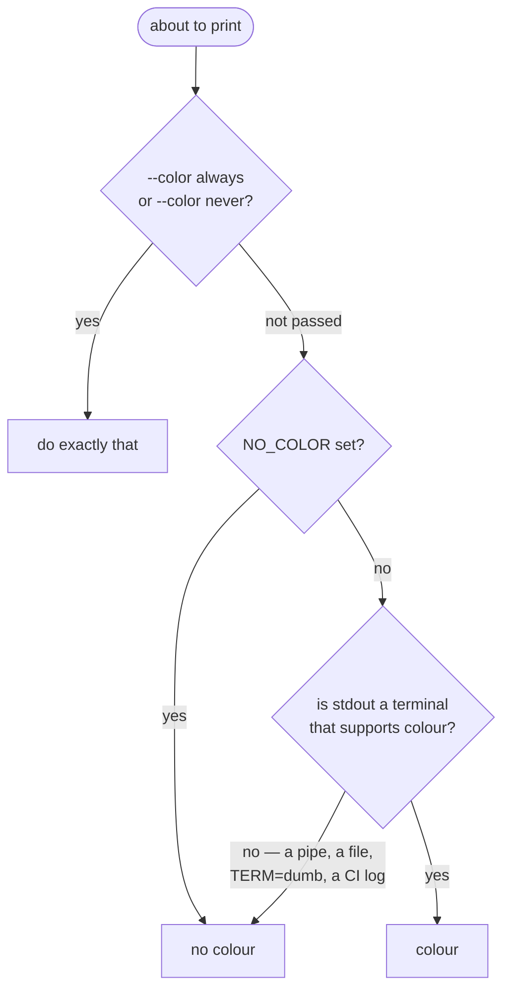

# Chapter 8a — Colour, done properly

**What you'll build:** one palette module that colours the CLI, and later the
TUI and the web UI, from a single list of meanings.

**Time:** about 90 minutes.

---

## Before you start

```markdown
- [ ] Chapter 8 is merged — `viz blocks` and `viz cluster` draw in black and white
- [ ] Chapter 7 is merged — `ls`, `stat`, `put`, `cat` work
- [ ] My terminal shows colour: `printf '\033[31mred\033[39m\n'` prints a red word
- [ ] I am on a new branch: `git checkout -b feat/colour`
```

### Files you will touch

```
crates/mammoth-viz/
├── Cargo.toml              EDIT   add owo-colors
└── src/
    ├── lib.rs              EDIT   pub mod style;
    └── style.rs            NEW    ① the palette — the whole chapter, really
crates/mammoth-cli/
├── Cargo.toml              EDIT   add indicatif
└── src/
    ├── cli.rs              EDIT   ② --color auto|always|never
    ├── main.rs             EDIT   ③ decide once, at startup
    ├── output.rs           EDIT   ⑤ colour the error printer
    └── commands/
        ├── fs.rs           EDIT   ④ colour the listing, add the put progress bar
        └── viz.rs          EDIT   ④ colour the matrix and the heatmap
```

### Who this is for

**Ben's track**, straight after chapter 8. Ana and Cai should read
[step 1](#step-1--what-colour-actually-is) and
[step 3](#step-3--the-palette) anyway: the same six names show up in the TUI
(chapter 8b) and again in the web UI (chapter 9), and the whole benefit
evaporates if the three surfaces invent their own.

### Run the examples first

Everything in this chapter exists as a runnable program. Twenty minutes with
these will make the rest of the chapter obvious rather than abstract:

```bash
cargo run -q -p mammoth-parts --example 10-colour-basics
```

```bash
cargo run -q -p mammoth-parts --example 11-colour-palette
```

Then run each of them again through `| cat` and note what changes.

---

## Why this chapter is not decoration

Your `viz cluster` output currently looks like this:

```
  /dc1/rack-a     w1 ███████████▍░░░░  71%     w2 █████████▎░░░░░░  58%
  /dc1/rack-b     w3 ███████████████░  94%     w4 ████████████▊░░░  80%
  /dc1/rack-c     w5 █████▌░░░░░░░░░░  34%     w6 ██████▌░░░░░░░░░  41%
```

One of those six workers is nine tenths full and about to start refusing
writes. Finding it takes you about four seconds — you read six numbers and
compare each against a threshold you are holding in your head.

With colour it takes about a fifth of a second, and you do not read anything at
all. That is the entire argument. **Colour is a way of doing the comparison for
the reader**, and on a screen that a sleep-deprived person checks at 3 a.m.
during an incident, that is worth more than it sounds.

It is also, done badly, the fastest way to make a tool feel amateurish and to
break every script anyone writes against you. So there are rules.

---

## Step 1 · What colour actually is

There is no such thing as a red string. Colour is a pair of control sequences
that you wrap around ordinary text, and that the terminal interprets:

```
\x1b[31m  hello  \x1b[39m
^^^^^^^^         ^^^^^^^^
set red          back to default
```

`\x1b` is the ESC character. The whole thing is called an **ANSI escape
sequence**. See them for yourself:

```bash
printf '\033[31mred\033[39m and \033[1mbold\033[0m\n' | cat -v
```

```
^[[31mred^[[39m and ^[[1mbold^[[0m
```

`cat -v` shows the escapes rather than obeying them, and it is the single most
useful debugging tool in this chapter.

Three consequences follow, and every rule in this chapter is one of them:

1. **A terminal renders them. Nothing else does.** `grep`, `jq`, a log file, a
   CI web page and a colleague's `less` all show `^[[31m` as literal
   characters. So colour must be *conditional*, never unconditional.
2. **They take up no visual width but they do take up bytes.** `"red".len()` is
   3; the coloured version is 13. Any code that pads, centres or truncates must
   run on the plain text and colour the result — not the other way round. This
   is the one bug everybody writes.
3. **Colour is a channel that can be lost.** Piped, redirected, printed, or read
   by someone with a red/green deficiency — roughly one man in twelve — it is
   simply not there. So it can carry emphasis, and it can never carry the only
   copy of a fact.

### The palette you can actually rely on

There are three colour depths, and Mammoth deliberately uses the smallest:

| Depth | How it is written | Works on |
| --- | --- | --- |
| **16 colours** | `\x1b[31m` | Everything. SSH into a router, tmux, an old Windows console, a CI log |
| 256 colours | `\x1b[38;5;208m` | Most terminals since ~2010 |
| 24-bit "truecolor" | `\x1b[38;2;255;140;0m` | Modern terminals with `$COLORTERM=truecolor` |

Reach for the basic sixteen, and not only for compatibility. **The sixteen are
defined by the user's own terminal theme.** Somebody on a light background gets
*their* green, which is legible on white; hard-code `#00FF00` and you have
picked a colour for a background you cannot see. The one exception in this
chapter is the truecolor demo in example 10, which exists to show you the
difference.

---

## Step 2 · The three questions

Before emitting a single escape, a well-behaved program asks three questions in
this order. Skip any one of them and you will get a bug report.



**Question 1, the explicit flag,** exists because `less -R` and most CI log
viewers *do* render ANSI, and question 3 cannot tell. Without `--color always`
those users are stuck.

**Question 2, `NO_COLOR`,** is a one-line convention ([no-color.org](https://no-color.org))
that any program can honour: if the environment variable exists at all — even
empty — do not colour. It costs you nothing and it is the difference between
a tool that respects a user's setup and one that does not.

**Question 3, the terminal check,** is `std::io::stdout().is_terminal()` in the
standard library. That answers "is this a pipe" but not "is this terminal any
good", so we let a crate handle the rest.

### The crate

`owo-colors` answers questions 2 and 3 for you if you turn on one feature. This
is already done in the workspace manifest:

```toml
# Cargo.toml, [workspace.dependencies]
owo-colors   = { version = "4", features = ["supports-colors"] }
```

That feature adds `if_supports_color`, which checks the stream every time, and
`set_override`, which lets question 1 win. Without the feature you get colouring
but no gating, and you have to write the `is_terminal()` checks yourself.

Add it to the viz crate — `crates/mammoth-viz/Cargo.toml`:

```toml
[dependencies]
mammoth-core = { workspace = true }
owo-colors   = { workspace = true }
```

---

## Step 3 · The palette

Here is the mistake nearly everyone makes, and it looks completely reasonable:

```rust
// don't
println!("{}", node.id.red());
```

Six weeks later "red" means dead nodes, over-capacity disks, corrupt replicas
and failed writes. Somebody decides dead nodes should be bright red and
capacity should be orange, and it is a thirty-file search-and-replace with no
way to know you got them all. Worse, `viz cluster` and `mammoth top` drift
apart, because nobody wrote down what red meant.

The fix is one module that maps **meaning** to colour, and a rule that no colour
name appears anywhere else in the codebase.

Create `crates/mammoth-viz/src/style.rs`:

```rust
//! The palette. Colour by *meaning*, decided in exactly one place.
//!
//! The rule this file exists to enforce: no other file in the workspace may
//! name a colour. Everything asks for a [`Tone`]. When somebody decides that
//! `Warn` should be orange, they change one line here and the CLI, the TUI and
//! the web UI all follow.

use owo_colors::{AnsiColors, Style};

/// What a piece of output *means*. Never "red", never "green".
#[derive(Debug, Clone, Copy, PartialEq, Eq)]
pub enum Tone {
    /// Healthy, complete, at target replication.
    Ok,
    /// Degraded but still serving. Attention, not panic.
    Warn,
    /// Data at risk, or an outright failure.
    Critical,
    /// Neutral emphasis: totals, the selected row, the number that matters.
    Accent,
    /// Structure: column headers, section rules.
    Heading,
    /// Units, hints, absent values — everything the eye should slide over.
    Muted,
}

/// Every tone, in the order a legend prints them.
pub const TONES: [Tone; 6] =
    [Tone::Ok, Tone::Warn, Tone::Critical, Tone::Accent, Tone::Heading, Tone::Muted];

impl Tone {
    /// The ANSI colour. From the basic sixteen on purpose — see chapter 8a §1.
    pub fn colour(self) -> AnsiColors {
        match self {
            Tone::Ok => AnsiColors::Green,
            Tone::Warn => AnsiColors::Yellow,
            Tone::Critical => AnsiColors::Red,
            Tone::Accent => AnsiColors::Cyan,
            Tone::Heading => AnsiColors::White,
            Tone::Muted => AnsiColors::BrightBlack,
        }
    }

    /// Colour plus weight.
    pub fn style(self) -> Style {
        let s = Style::new().color(self.colour());
        match self {
            Tone::Heading | Tone::Critical => s.bold(),
            Tone::Muted => s.dimmed(),
            _ => s,
        }
    }

    /// **The half people forget.** Every tone owns a symbol, so that losing the
    /// colour never loses the meaning.
    pub fn symbol(self) -> char {
        match self {
            Tone::Ok => '●',
            Tone::Warn => '◐',
            Tone::Critical => '✕',
            Tone::Accent => '▸',
            Tone::Heading => '─',
            Tone::Muted => '·',
        }
    }

    /// Name, for legends and for `--json`.
    pub fn name(self) -> &'static str {
        match self {
            Tone::Ok => "ok",
            Tone::Warn => "warn",
            Tone::Critical => "critical",
            Tone::Accent => "accent",
            Tone::Heading => "heading",
            Tone::Muted => "muted",
        }
    }
}

/// Which tone a fill fraction deserves.
///
/// One place decides what "nearly full" means, so the CLI heatmap, the TUI
/// gauges and the web dashboard cannot disagree about it.
pub fn tone_for_fill(fraction: f64) -> Tone {
    match fraction {
        f if f >= 0.90 => Tone::Critical,
        f if f >= 0.75 => Tone::Warn,
        _ => Tone::Ok,
    }
}

/// Which tone a replica state deserves.
pub fn tone_for_replica(state: mammoth_core::types::ReplicaState) -> Tone {
    use mammoth_core::types::ReplicaState;
    match state {
        ReplicaState::Primary => Tone::Ok,
        ReplicaState::Replica => Tone::Accent,
        ReplicaState::Corrupt => Tone::Critical,
    }
}

/// Which tone a node state deserves.
pub fn tone_for_node(state: mammoth_core::types::NodeState) -> Tone {
    use mammoth_core::types::NodeState;
    match state {
        NodeState::Healthy => Tone::Ok,
        NodeState::Warn | NodeState::Decommissioning | NodeState::Maintenance => Tone::Warn,
        NodeState::Dead => Tone::Critical,
    }
}

#[cfg(test)]
mod tests {
    use super::*;

    #[test]
    fn every_tone_has_a_distinct_symbol() {
        // If two tones share a symbol, monochrome output becomes ambiguous —
        // which defeats the entire point of having symbols.
        let mut symbols: Vec<char> = TONES.iter().map(|t| t.symbol()).collect();
        symbols.sort_unstable();
        symbols.dedup();
        assert_eq!(symbols.len(), TONES.len());
    }

    #[test]
    fn fill_thresholds_are_where_we_think() {
        assert_eq!(tone_for_fill(0.74), Tone::Ok);
        assert_eq!(tone_for_fill(0.75), Tone::Warn);
        assert_eq!(tone_for_fill(0.89), Tone::Warn);
        assert_eq!(tone_for_fill(0.90), Tone::Critical);
    }
}
```

Register it at the top of `crates/mammoth-viz/src/lib.rs`:

```rust
pub mod style;

pub use style::{tone_for_fill, tone_for_node, tone_for_replica, Tone, TONES};
```

```bash
cargo test -p mammoth-viz
```

```
running 5 tests
test style::tests::every_tone_has_a_distinct_symbol ... ok
test style::tests::fill_thresholds_are_where_we_think ... ok
test tests::bar_clamps_out_of_range ... ok
test tests::bar_is_always_exactly_width_cells ... ok
test tests::std_dev_of_identical_values_is_zero ... ok
```

### Why the symbol lives in the same enum as the colour

Because it makes the accessible thing the easy thing. When adding a tone means
choosing a symbol in the same breath as choosing a colour, nobody ships a
colour-only distinction by accident — and `every_tone_has_a_distinct_symbol`
fails the build if they try.

### Six tones, and no more

Six is enough to say everything Mammoth needs to say, and few enough that a
reader learns them in one screen. If you find yourself wanting a seventh, the
question to ask is "what *meaning* is missing", not "what colour is missing".
Usually the answer is that an existing tone plus a symbol will do.

---

## Step 4 · Let the user decide

Add the flag to `crates/mammoth-cli/src/cli.rs`, next to `--output`:

```rust
    /// When to colour output.
    #[arg(long, global = true, value_enum, default_value = "auto")]
    pub color: ColorChoice,
```

and the enum, next to `OutputFormat`:

```rust
/// `auto` colours only when stdout is a terminal that wants it, and never when
/// `NO_COLOR` is set.
#[derive(Copy, Clone, PartialEq, Eq, ValueEnum)]
pub enum ColorChoice {
    /// Colour on a terminal, plain text everywhere else.
    Auto,
    /// Always, even into a pipe — for `less -R` and CI logs that render ANSI.
    Always,
    /// Never.
    Never,
}
```

Then decide **once**, at startup, in `main.rs` — before `run` is called:

```rust
#[tokio::main]
async fn main() -> std::process::ExitCode {
    let cli = cli::Cli::parse();

    // Question 1 from chapter 8a §2. Setting an override here makes every
    // `if_supports_color` call in the whole process obey it; leaving it unset
    // lets each call check NO_COLOR and the stream for itself.
    match cli.color {
        cli::ColorChoice::Always => owo_colors::set_override(true),
        cli::ColorChoice::Never => owo_colors::set_override(false),
        cli::ColorChoice::Auto => owo_colors::unset_override(),
    }

    let fmt = cli.format();
    match run(cli, fmt).await {
        Ok(()) => std::process::ExitCode::SUCCESS,
        Err(e) => {
            output::print_error(&e);
            std::process::ExitCode::FAILURE
        }
    }
}
```

**Deciding once is the point.** Every function below can now say "colour this if
colour is allowed" without knowing anything about flags, pipes or environment
variables — and a future `MAMMOTH_COLOR` environment variable is a two-line
change in one place.

---

## Step 5 · Colour the block matrix

Open `crates/mammoth-cli/src/commands/viz.rs`. Replace the `cell` computation
inside `blocks` with a helper, above the function:

```rust
use mammoth_viz::{tone_for_replica, Tone};
use owo_colors::{OwoColorize, Stream};

/// One cell of the block matrix: the symbol for a replica state, or `·` for a
/// node that has no copy of this block.
///
/// **Pad first, colour second.** `{:^6}` counts bytes, so centring a string
/// that already contains escape sequences pushes the visible character six
/// columns too far left and shears the whole grid. This is the single most
/// common colour bug; if your matrix goes crooked, it is this.
fn cell(state: Option<mammoth_core::types::ReplicaState>) -> String {
    let (symbol, tone) = match state {
        Some(s) => (mammoth_viz::replica_symbol(s), tone_for_replica(s)),
        None => ('·', Tone::Muted),
    };
    let padded = format!("{symbol:^6}");
    format!("{}", padded.if_supports_color(Stream::Stdout, |t| t.style(tone.style())))
}
```

and use it in the row loop:

```rust
    for b in &layout {
        let label = format!("  blk {:<3}", b.index + 1);
        print!("{}", label.if_supports_color(Stream::Stdout, |t| t.style(Tone::Muted.style())));
        for n in &nodes {
            let state = b.replicas.iter().find(|r| &r.node.0 == n).map(|r| r.state);
            print!("{}", cell(state));
        }
        println!();
    }
```

Do the header row and the legend the same way, with `Tone::Muted`, and the
filename with `Tone::Heading`. The warning gets `Tone::Warn`:

```rust
            // Chaining two styles inside the closure — `|t| t.yellow().bold()`
            // — does not compile: the first call creates a temporary that the
            // second borrows. Build a `Style` and apply it in one call.
            let warn = Tone::Warn.style().bold();
            let head = format!("  ⚠ blk {} has every replica in one rack ({rack})", b.index + 1);
            println!("{}", head.if_supports_color(Stream::Stdout, |t| t.style(warn)));
```

Compare against the finished version, which runs on fake data and needs no
backend:

```bash
cargo run -q -p mammoth-parts --example 13-block-matrix
```

## Step 6 · Colour the heatmap

In `print_cluster`, the bar and the percentage take their tone from the same
function, so they can never disagree:

```rust
use mammoth_viz::{bar, std_dev_pct, tone_for_fill, Tone};

            let f = pct(n.used, n.capacity);
            let tone = tone_for_fill(f);
            let drawn = bar(f, 16);
            print!(
                "{:>4} {} {}",
                n.id.0,
                drawn.if_supports_color(Stream::Stdout, |t| t.style(tone.style())),
                format!("{:>3.0}%", f * 100.0)
                    .if_supports_color(Stream::Stdout, |t| t.style(tone.style())),
            );
```

and the imbalance line earns a tone of its own, because a σ over 10% is the
thing this view exists to tell you:

```rust
    let sigma = std_dev_pct(&fractions);
    let tone = if sigma < 10.0 { Tone::Ok } else { Tone::Warn };
    println!();
    println!(
        "  imbalance  σ = {}   (healthy < 10%)",
        format!("{sigma:.1}%").if_supports_color(Stream::Stdout, |t| t.style(tone.style()))
    );
```

## Step 7 · Colour the listing and the errors

`ls` gains one rule and no more: directories are `Tone::Accent`, and a file
below target replication is `Tone::Warn`. In `commands/fs.rs`, inside
`Listing::to_table`:

```rust
            let name = if e.is_dir {
                let dir = format!("{name}/");
                format!("{}", dir.if_supports_color(Stream::Stdout, |t| t.style(Tone::Accent.style())))
            } else {
                name
            };
```

`comfy-table` measures cell width with `unicode-width`, which counts an ANSI
escape as zero columns — so a coloured cell inside a table lines up correctly,
unlike the hand-rolled `{:^6}` in step 5. That is worth knowing: **the padding
bug only bites where you do the padding yourself.**

`output.rs` already colours the error tag red. Move it onto the palette so it
matches everything else, and give the hint bullets a tone:

```rust
use mammoth_viz::Tone;

pub fn print_error(e: &Error) {
    let tag = format!("error[{}]", e.code());
    eprintln!();
    eprintln!(
        "  {}: {e}",
        tag.if_supports_color(Stream::Stderr, |t| t.style(Tone::Critical.style()))
    );
    eprintln!();

    let hints = e.hints();
    if !hints.is_empty() {
        eprintln!("  what you can do:");
        for h in hints {
            eprintln!(
                "    {} {h}",
                "·".if_supports_color(Stream::Stderr, |t| t.style(Tone::Accent.style()))
            );
        }
        eprintln!();
    }
    eprintln!(
        "  docs: {}",
        e.docs_url().if_supports_color(Stream::Stderr, |t| t.style(Tone::Muted.style()))
    );
    eprintln!();
}
```

**Note `Stream::Stderr`, not `Stream::Stdout`.** Errors are printed to stderr,
so the question "is this a terminal" has to be asked about stderr. Getting this
wrong means `mammoth stat /nope > out.txt` prints an uncoloured error even
though your terminal is right there.

## Step 8 · A progress bar for `put`

Principle 4 in `main.rs` says: *progress bars on anything over a second,
auto-disabled when piped.* `put` is the command that takes a while.

Add the dependency to `crates/mammoth-cli/Cargo.toml`:

```toml
indicatif = { workspace = true }
```

and wrap the write in `commands/fs.rs`:

```rust
use indicatif::{ProgressBar, ProgressDrawTarget, ProgressStyle};

/// `mammoth put`
pub async fn put(be: &dyn Backend, src: &Path, dst: &Path) -> Result<()> {
    let bytes = std::fs::read(src)?;
    let len = bytes.len() as u64;

    // stderr, not stdout: `mammoth put … > receipt.txt` must leave a clean
    // receipt *and* still show a human the bar. indicatif hides itself when
    // stderr is not a terminal, which is the auto-disable half of principle 4.
    let pb = ProgressBar::new(len);
    pb.set_draw_target(ProgressDrawTarget::stderr());
    pb.set_style(
        ProgressStyle::with_template("  {msg:<16} {bar:28.cyan/blue} {bytes:>10}/{total_bytes:<10}")
            .expect("static template")
            // The same eighth-blocks as `mammoth_viz::bar`, so the whole CLI
            // looks like one program.
            .progress_chars("█▉▊▋▌▍▎▏░"),
    );
    pb.set_message(format!("put {}", src.display()));

    let stream: ByteStream =
        Box::pin(futures_util::stream::once(async move { Ok(Bytes::from(bytes)) }));
    be.write(dst, stream).await?;
    pb.set_position(len);
    pb.finish_and_clear();

    let s = be.stat(dst).await?;
    let shape = if s.inlined {
        "inlined (no blocks allocated)".to_string()
    } else {
        format!("{} blocks · replication {}", s.blocks, s.replication.unwrap_or(0))
    };
    println!(
        "  {} {}   {} · {}",
        "✔".if_supports_color(Stream::Stdout, |t| t.style(Tone::Ok.style())),
        dst.display(),
        human(len),
        shape
    );
    Ok(())
}
```

`finish_and_clear` rather than `finish_with_message`: the bar leaves no wreckage
behind, and the summary line goes to **stdout**, where it survives a pipe.

Today `LocalBackend::write` hands over one chunk, so the bar jumps from 0 to
100%. When chapter 12's pipelined write lands it will fill smoothly, and you
will not have to touch this code.

```bash
cargo build -p mammoth-cli
```

See it working, without needing chapter 6 finished:

```bash
cargo run -q -p mammoth-parts --example 14-progress
```

---

## Check it works

```bash
export MAMMOTH_HOME=/tmp/mammoth-demo && rm -rf "$MAMMOTH_HOME"
head -c 900000 /dev/urandom > /tmp/events.parquet
./target/debug/mammoth put /tmp/events.parquet /warehouse/events.parquet --block-size 100KB --inline-threshold 4KB
```

The matrix, in colour:

```bash
./target/debug/mammoth viz blocks /warehouse/events.parquet
```

Now the four tests that matter. **Run all four** — the last three are the ones
that catch the bugs.

**1 · It still lines up.** Column alignment is the failure mode of step 5:

```bash
./target/debug/mammoth viz blocks /warehouse/events.parquet | cat -A | head -5
```

Every data row must have its symbols at identical byte-free positions. If the
grid shears, you padded after colouring.

**2 · It degrades.** Piped output must contain no escapes at all:

```bash
./target/debug/mammoth viz cluster | grep -c $'\x1b' || echo "clean — no escapes"
```

```
clean — no escapes
```

**3 · `NO_COLOR` is honoured:**

```bash
NO_COLOR=1 ./target/debug/mammoth viz cluster | cat -v | grep -c '\^\[' || echo "clean"
```

**4 · `--color always` forces it through a pipe:**

```bash
./target/debug/mammoth viz cluster --color always | cat -v | head -3
```

You should see `^[[32m` and friends. This is what makes the output usable in
`less -R` and in a CI log viewer.

### The test that is not a command

Turn your monitor to greyscale for thirty seconds — macOS has it under
Accessibility → Display → Color Filters, GNOME under Accessibility → Seeing, and
Windows under Accessibility → Colour filters. Run `viz blocks` and `viz cluster`
again.

Everything must still be readable. If a screen loses its meaning in greyscale,
you have leaned on colour where you needed a symbol or a number, and about one
reader in twelve sees the version you are looking at now.

## Commit it

```bash
cargo fmt --all && cargo clippy --workspace --all-targets -- -D warnings && cargo test --workspace
```

```bash
git add -A && git commit -m "feat(viz): add the Tone palette and colour the CLI"
```

## Done when

```markdown
- [ ] `crates/mammoth-viz/src/style.rs` exists and its two tests pass
- [ ] No file outside `style.rs` names a colour — check with
      `grep -rn "\.red()\|\.green()\|\.yellow()\|AnsiColors::" crates/ --include=*.rs | grep -v style.rs`
- [ ] `mammoth viz blocks` draws a coloured, correctly aligned matrix
- [ ] `mammoth viz cluster` colours each bar by fill, and σ by health
- [ ] `mammoth stat /data/nope.txt` prints a red tag on a terminal
- [ ] `mammoth put` shows a progress bar, and it does not appear under `2>/dev/null`
- [ ] `mammoth viz cluster | cat` contains zero escape sequences
- [ ] `NO_COLOR=1 mammoth viz cluster` is plain
- [ ] `mammoth viz cluster --color always | cat -v` shows escapes
- [ ] Every screen still readable with the monitor in greyscale
- [ ] `mmcheck` passes
- [ ] Committed, pushed, PR opened and merged
```

The grep box is worth taking literally. It is the one mechanical check that the
palette is actually doing its job, and it takes two seconds. Add it to your PR
template if you like.

## Exercises

1. **`mammoth viz legend`.** A command that prints all six tones with their
   symbols, names and meanings. Twelve lines, and it becomes the thing you point
   new people at. `TONES` already exists for exactly this.
2. **A `--theme` flag.** Add `Theme::Dark` and `Theme::Light`, and make
   `Tone::colour` take a theme. Where does the theme have to live so that
   `style.rs` stays the only file that knows about colours?
3. **Tone in `--json`.** Add `"tone": "critical"` to the JSON form of
   `viz cluster`, using `Tone::name()`. Now the web UI in chapter 9 can colour
   its dashboard from the same decision the CLI made, instead of
   re-implementing the thresholds in TypeScript — which is exactly how two
   surfaces drift apart.
4. **Find the padding bug on purpose.** In `cell`, swap the order: colour the
   symbol first, then `format!("{coloured:^6}")`. Rebuild, run `viz blocks`, and
   look at what happens to the grid. Put it back. You will recognise this
   instantly the next time it happens by accident.

## If it went wrong

**The matrix is crooked, or columns drift right as the row goes on** — you
padded a string that already had escape codes in it. `{:^6}` counts bytes;
`\x1b[32m` is five of them. Pad the plain text, then colour the padded result.
Exercise 4 above shows it deliberately.

**Nothing is coloured, ever, even on a terminal** — the `supports-colors`
feature is not enabled on `owo-colors`, so `if_supports_color` compiles but
always answers "no". Check the workspace `Cargo.toml`.

**`error[E0515]: cannot return value referencing temporary value`** — you wrote
`|t| t.red().bold()`. Chaining inside that closure borrows a temporary. Build a
`Style` once and pass it: `let s = Style::new().red().bold();` then
`|t| t.style(s)`.

**Escape codes appear in a pipe** — you used `.red()` directly rather than
`if_supports_color`, or you passed `--color always` and forgot.

**Escapes appear in `--json` output** — something in a `Render::to_json` path is
colouring. JSON is never coloured; colour is a `to_table` concern only.

**`the trait bound ... OwoColorize is not satisfied`** — `use owo_colors::OwoColorize;`
is missing from that file. The trait has to be in scope for the methods to exist.

**Colours look wrong on a light background** — you used 256-colour or truecolor
values instead of the basic sixteen. The sixteen follow the user's theme; fixed
RGB does not.

**The progress bar prints hundreds of lines in CI** — you drew to stdout, or you
built the `ProgressBar` without `set_draw_target(ProgressDrawTarget::stderr())`.

---

**Next:** [Chapter 8b — `mammoth top`, the live TUI](08b-the-live-tui.md)
