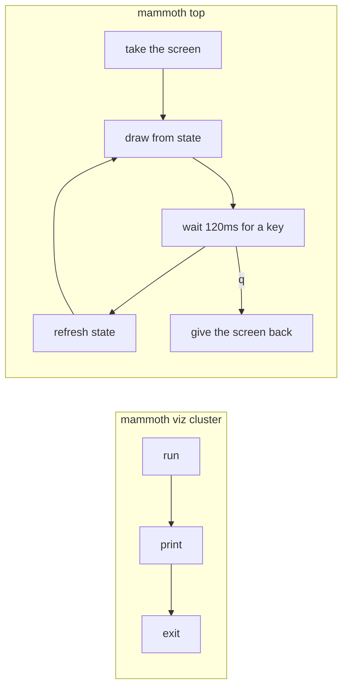
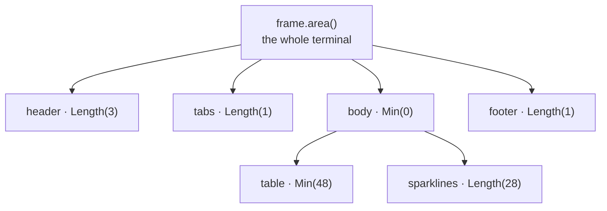

# Chapter 8b — `mammoth top`, the live dashboard

**What you'll build:** `mammoth top` — a full-screen, live-updating cluster
dashboard that works over SSH.

**Time:** about 3 hours.

Here is the finished thing. The layout is exactly what the test suite in step 7
renders; the sparklines are shown filled in, as they will be after the dashboard
has been running for a minute.

```
╭ cluster ───────────────────────────────────────────────────────────────────────────────╮
│mammoth  prod-eu-1  358.0 GB / 640.0 GB  56% used   ·   3 live   1 dead                 │
╰────────────────────────────────────────────────────────────────────────────────────────╯
  nodes    health
╭ workers ─────────────────────────────────────────────────╮╭ blocks, recent history ────╮
│  NODE RACK         USED                 BLOCKS           ││                            │
│● w1   /dc1/rack-a  ██████████░░░░  71%     798000        ││▂▃▄▅▆▇█▇▆▅▄▃▄▅▆▇█▇▆▅▄▃▂▁▂▃▄ │
│● w2   /dc1/rack-a  ████████▏░░░░░  58%     651000        ││▃▄▅▆▇█▇▆▅▄▃▂▃▄▅▆▇█▇▆▅▄▃▂▁▂▃ │
│◐ w3   /dc1/rack-b  █████████████▎  94%    1057000        ││▅▆▇█▇▆▅▄▃▂▁▂▃▄▅▆▇█▇▆▅▄▃▂▁▂▃ │
│✕ w4   /dc1/rack-b  ░░░░░░░░░░░░░░   0%          0        ││                            │
╰──────────────────────────────────────────────────────────╯╰────────────────────────────╯
 q  quit   tab  switch view   j/k  select node
```

Green rows are healthy, `w3` is yellow at 94% full, and the dead `w4` is red
with a flat sparkline. Every one of those colours comes from the `Tone` enum you
wrote in chapter 8a — this chapter adds no new colours at all.

---

## Before you start

```markdown
- [ ] Chapter 8a is merged — `mammoth_viz::style::Tone` exists
- [ ] Chapter 6 is merged — `cluster_report()` returns real numbers
- [ ] My terminal is at least 80 columns wide: `tput cols`
- [ ] I am on a new branch: `git checkout -b feat/top`
```

### Files you will touch

```
crates/mammoth-viz/
├── Cargo.toml              EDIT   add ratatui
└── src/
    └── style.rs            EDIT   ① the same six Tones, for ratatui
crates/mammoth-cli/
├── Cargo.toml              EDIT   add ratatui
└── src/
    ├── main.rs             EDIT   ⑥ dispatch Command::Top
    └── commands/
        ├── mod.rs          EDIT   pub mod top;
        └── top.rs          NEW    ②–⑤ state, drawing, the event loop
```

### Who this is for

**Ben's track**, after chapter 8a. It is the largest single file in the guide
outside `LocalBackend`, and it is also the most fun — you will spend most of the
three hours adjusting layouts and watching them redraw.

### Run the examples first

Do not skip this. Twenty minutes here saves an hour of confusion later, and
example 16 is essentially the answer key for this chapter:

```bash
cargo run -q -p mammoth-parts --example 15-tui-hello
```

Press `q` to leave. Then the full dashboard, which is what you are building:

```bash
cargo run -q -p mammoth-parts --example 16-tui-dashboard
```

`tab` switches views, `j`/`k` move the selection, `q` quits. If you are working
somewhere without a real terminal, both take `--check` and print their frames as
plain text instead.

---

## Why a TUI at all

You have `mammoth viz cluster`. It prints a heatmap and exits. To watch a
recovery you type it again, and again, and squint at what moved.

`watch -n2 mammoth viz cluster` gets you most of the way, and for a while that
is genuinely the right answer. What it cannot do is the thing you actually want
during an incident: keep history, let you select a node, switch between views,
and hold state between frames. A dead worker's recovery is a *shape over time*,
and a command that exits cannot show you a shape.



The other reason is that it works where a browser does not. Chapter 9's web
dashboard is better in every way *except* that it needs a browser, a port and a
network path. `mammoth top` runs down an SSH connection to a machine in a
locked rack, which is exactly where you are when it matters.

---

## Step 1 · The three things a TUI does that a CLI does not

A CLI writes lines and forgets them. A TUI **owns the screen**, and that means
three mechanisms you have not needed until now.

**The alternate screen.** Like `vim` or `less`: the terminal swaps to a blank
buffer, you draw on it, and on exit the user's scrollback returns untouched. If
you skip this, quitting leaves forty screens of dashboard in their history.

**Raw mode.** Normally the terminal buffers a line and echoes what you type, so
your program sees `q\n` only after Enter. Raw mode turns both off: keystrokes
arrive one at a time, unechoed, and Ctrl-C becomes a key event you handle rather
than a signal that kills you.

> **The dangerous half.** Raw mode is a property of the *terminal*, not of your
> process. Exit without turning it off — including by panicking — and the user
> is left in a shell with no echo and no line editing, which looks broken and
> usually needs a blind `reset`. **Every exit path must restore.** Test it: put
> a `panic!()` in your draw function and check that the panic message is
> readable and your shell still works.

**A frame loop.** You redraw everything, from your state, many times a second.
That sounds wasteful; it is not. Ratatui renders into a buffer of cells, diffs
it against the previous frame, and writes escape sequences only for cells that
changed. A dashboard where one number moved sends a handful of bytes.

`ratatui::init()` handles the first two, including — the important part — a
panic hook that undoes them before the panic message prints.

Add the dependency to **both** `crates/mammoth-viz/Cargo.toml` and
`crates/mammoth-cli/Cargo.toml`:

```toml
ratatui = { workspace = true }
```

Ratatui re-exports crossterm, so you write `ratatui::crossterm::…` and never add
crossterm yourself. Two versions of crossterm in one binary is a real and
confusing failure; letting ratatui pick is how you avoid it.

## Step 2 · The same six tones, for ratatui

Append to `crates/mammoth-viz/src/style.rs`:

```rust
/// The same six tones, expressed the way `ratatui` wants them.
///
/// This module is the reason `mammoth top` and `mammoth viz cluster` look like
/// one program. Both ask for `Tone::Warn`; neither one names a colour.
pub mod tui {
    use ratatui::style::{Color, Modifier, Style};

    use super::Tone;

    /// Colour only.
    pub fn colour(tone: Tone) -> Color {
        match tone {
            Tone::Ok => Color::Green,
            Tone::Warn => Color::Yellow,
            Tone::Critical => Color::Red,
            Tone::Accent => Color::Cyan,
            Tone::Heading => Color::White,
            Tone::Muted => Color::DarkGray,
        }
    }

    /// Colour plus weight, matching `Tone::style` on the CLI side.
    pub fn style(tone: Tone) -> Style {
        let s = Style::default().fg(colour(tone));
        match tone {
            Tone::Heading | Tone::Critical => s.add_modifier(Modifier::BOLD),
            Tone::Muted => s.add_modifier(Modifier::DIM),
            _ => s,
        }
    }
}
```

Two functions, and every screen in the product now agrees about what yellow
means. Note that `Muted` is `BrightBlack` on the CLI side and `DarkGray` here:
those are the same colour under two names, which is exactly the sort of detail
you do not want scattered across twelve files.

## Step 3 · State, and only state

Create `crates/mammoth-cli/src/commands/top.rs`. Start with the data:

```rust
//! `mammoth top` — htop for your cluster.
//!
//! ## The rule this file is built around
//!
//! **State, then draw. Never fetch inside a draw.**
//!
//! ```text
//! struct App { … plain data … }   what is true right now
//! fn absorb(&mut self, report)    the only thing that changes it
//! fn draw(frame, &App)            reads it; changes nothing
//! ```
//!
//! `draw` runs on every frame — eight or ten times a second. If it called the
//! backend, a master having a slow moment would freeze the interface, and you
//! would be hammering the cluster you are trying to diagnose. Keep `draw` pure
//! and the worst a slow backend can do is show you numbers a second or two old.

use std::collections::{HashMap, VecDeque};
use std::time::{Duration, Instant};

use mammoth_core::types::{ClusterReport, NodeId, NodeState};
use mammoth_core::{Backend, Result};
use mammoth_viz::style::tui as theme;
use mammoth_viz::{bar, tone_for_fill, tone_for_node, Tone};
use ratatui::crossterm::event::{self, Event, KeyCode, KeyEventKind};
use ratatui::layout::{Constraint, Layout, Rect};
use ratatui::style::{Modifier, Style};
use ratatui::text::{Line, Span};
use ratatui::widgets::{
    Block, BorderType, Borders, Cell, Gauge, Paragraph, Row, Sparkline, Table, Tabs,
};
use ratatui::Frame;

use crate::commands::fs::human;

/// How many samples of throughput history each node keeps.
const HISTORY: usize = 32;

/// Which view is on screen.
#[derive(Clone, Copy, PartialEq, Eq)]
enum Tab {
    Nodes,
    Health,
}

/// Everything the screen is a function of.
///
/// Deliberately plain: no `Backend`, no channels, no handles. If you can build
/// an `App` by hand in a test — and step 7 does — then you can test the drawing.
struct App {
    report: ClusterReport,
    /// Throughput history per node, newest last. `VecDeque` because you push
    /// one end and pop the other on every refresh.
    history: HashMap<NodeId, VecDeque<u64>>,
    tab: Tab,
    selected: usize,
    refresh: Duration,
    quit: bool,
}

impl App {
    fn new(report: ClusterReport, refresh: Duration) -> Self {
        let mut app = Self {
            report: report.clone(),
            history: HashMap::new(),
            tab: Tab::Nodes,
            selected: 0,
            refresh,
            quit: false,
        };
        app.absorb(report);
        app
    }

    /// Fold a fresh report into the state. The only mutation point.
    fn absorb(&mut self, report: ClusterReport) {
        for n in &report.nodes {
            let series = self.history.entry(n.id.clone()).or_default();
            // `blocks` stands in for throughput until the worker reports it.
            // Whatever you graph, sample it here — not in `draw`.
            series.push_back(n.blocks);
            if series.len() > HISTORY {
                series.pop_front();
            }
        }
        self.report = report;
        self.selected = self.selected.min(self.report.nodes.len().saturating_sub(1));
    }

    fn on_key(&mut self, key: KeyCode) {
        let count = self.report.nodes.len().max(1);
        match key {
            KeyCode::Char('q') | KeyCode::Esc => self.quit = true,
            KeyCode::Tab => {
                self.tab = if self.tab == Tab::Nodes { Tab::Health } else { Tab::Nodes }
            }
            KeyCode::Down | KeyCode::Char('j') => self.selected = (self.selected + 1) % count,
            KeyCode::Up | KeyCode::Char('k') => {
                self.selected = (self.selected + count - 1) % count
            }
            _ => {}
        }
    }

    fn fill(&self) -> f64 {
        if self.report.capacity == 0 {
            0.0
        } else {
            self.report.used as f64 / self.report.capacity as f64
        }
    }

    fn live(&self) -> usize {
        self.report.nodes.iter().filter(|n| n.state != NodeState::Dead).count()
    }
}
```

Note what is *not* in `App`: no `Backend`, no terminal, no I/O handle. That is
what makes step 7's tests possible.

## Step 4 · Layout

Ratatui's layout is one idea repeated: **split a rectangle into rectangles**.



Three constraints cover almost everything:

| Constraint | Means |
| --- | --- |
| `Length(3)` | exactly 3 rows (or columns), always |
| `Min(0)` | whatever is left over — put this on the part that should grow |
| `Percentage(50)` | half, recomputed on every resize |

Add the drawing to `top.rs`:

```rust
fn draw(frame: &mut Frame, app: &App) {
    let [header, tabs, body, footer] = Layout::vertical([
        Constraint::Length(3),
        Constraint::Length(1),
        Constraint::Min(0),
        Constraint::Length(1),
    ])
    .areas(frame.area());

    draw_header(frame, header, app);
    draw_tabs(frame, tabs, app);
    match app.tab {
        Tab::Nodes => draw_nodes(frame, body, app),
        Tab::Health => draw_health(frame, body, app),
    }
    draw_footer(frame, footer);
}

fn draw_header(frame: &mut Frame, area: Rect, app: &App) {
    let fill = app.fill();
    let dead = app.report.nodes.len() - app.live();

    let line = Line::from(vec![
        Span::styled("mammoth", theme::style(Tone::Accent).add_modifier(Modifier::BOLD)),
        Span::styled(format!("  {}  ", app.report.name), theme::style(Tone::Muted)),
        Span::raw(format!("{} / {}  ", human(app.report.used), human(app.report.capacity))),
        Span::styled(
            format!("{:.0}% used", fill * 100.0),
            theme::style(tone_for_fill(fill)),
        ),
        Span::styled("   ·   ", theme::style(Tone::Muted)),
        Span::styled(format!("{} live", app.live()), theme::style(Tone::Ok)),
        if dead > 0 {
            Span::styled(format!("   {dead} dead"), theme::style(Tone::Critical))
        } else {
            Span::raw("")
        },
    ]);

    frame.render_widget(Paragraph::new(line).block(panel(" cluster ")), area);
}

/// Every panel in this dashboard is drawn with the same border, so the screen
/// reads as one thing rather than five widgets that happen to be adjacent.
fn panel(title: &str) -> Block<'_> {
    Block::default()
        .borders(Borders::ALL)
        .border_type(BorderType::Rounded)
        .border_style(theme::style(Tone::Muted))
        .title(Span::styled(title.to_string(), theme::style(Tone::Muted)))
}

fn draw_tabs(frame: &mut Frame, area: Rect, app: &App) {
    let selected = match app.tab {
        Tab::Nodes => 0,
        Tab::Health => 1,
    };
    frame.render_widget(
        Tabs::new(vec![" nodes ", " health "])
            .select(selected)
            .style(theme::style(Tone::Muted))
            .highlight_style(
                Style::default()
                    .fg(ratatui::style::Color::Black)
                    .bg(theme::colour(Tone::Accent))
                    .add_modifier(Modifier::BOLD),
            )
            .divider(""),
        area,
    );
}

fn draw_footer(frame: &mut Frame, area: Rect) {
    let key = Style::default()
        .fg(ratatui::style::Color::Black)
        .bg(theme::colour(Tone::Accent));
    let label = theme::style(Tone::Muted);
    frame.render_widget(
        Paragraph::new(Line::from(vec![
            Span::styled(" q ", key),
            Span::styled(" quit  ", label),
            Span::styled(" tab ", key),
            Span::styled(" switch view  ", label),
            Span::styled(" j/k ", key),
            Span::styled(" select node  ", label),
        ])),
        area,
    );
}
```

**Always show the keys.** A TUI with no visible way out is a genuinely
distressing thing to be dropped into over SSH, and a one-row footer costs
nothing.

## Step 5 · The node table, and a sparkline per row

```rust
fn draw_nodes(frame: &mut Frame, area: Rect, app: &App) {
    let [table_area, spark_area] =
        Layout::horizontal([Constraint::Min(48), Constraint::Length(30)]).areas(area);

    let rows: Vec<Row> = app
        .report
        .nodes
        .iter()
        .enumerate()
        .map(|(i, n)| {
            let f = if n.capacity == 0 { 0.0 } else { n.used as f64 / n.capacity as f64 };
            let node_tone = tone_for_node(n.state);
            let fill_tone = tone_for_fill(f);
            let row = Row::new(vec![
                Cell::from(node_tone.symbol().to_string()).style(theme::style(node_tone)),
                Cell::from(n.id.0.clone()),
                Cell::from(n.rack.clone()).style(theme::style(Tone::Muted)),
                Cell::from(bar(f, 14)).style(theme::style(fill_tone)),
                Cell::from(format!("{:>3.0}%", f * 100.0)).style(theme::style(fill_tone)),
                Cell::from(format!("{:>9}", n.blocks)).style(theme::style(Tone::Muted)),
            ]);
            // The selected row is reversed rather than recoloured, so it stays
            // obvious whatever tone the row already had.
            if i == app.selected {
                row.style(Style::default().add_modifier(Modifier::REVERSED))
            } else {
                row
            }
        })
        .collect();

    frame.render_widget(
        Table::new(
            rows,
            [
                Constraint::Length(1),
                Constraint::Length(4),
                Constraint::Length(12),
                Constraint::Length(14),
                Constraint::Length(5),
                Constraint::Length(10),
            ],
        )
        .header(Row::new(vec!["", "NODE", "RACK", "USED", "", "BLOCKS"]).style(
            theme::style(Tone::Heading).add_modifier(Modifier::BOLD),
        ))
        .block(panel(" workers ")),
        table_area,
    );

    // A `Table` cell holds text, so a `Sparkline` cannot live inside one. Draw
    // the sparklines in their own column, one `Rect` per row, aligned with the
    // table: +1 for the top border, +1 for the header.
    let block = panel(" blocks, recent history ");
    let inner = block.inner(spark_area);
    frame.render_widget(block, spark_area);

    for (i, n) in app.report.nodes.iter().enumerate() {
        let y = inner.y + 1 + i as u16;
        if y >= inner.bottom() {
            break; // more nodes than rows; step 8 exercise 1 fixes this
        }
        let row = Rect { x: inner.x, y, width: inner.width, height: 1 };
        let data: Vec<u64> =
            app.history.get(&n.id).map(|h| h.iter().copied().collect()).unwrap_or_default();
        frame.render_widget(
            Sparkline::default().data(&data).style(theme::style(tone_for_node(n.state))),
            row,
        );
    }
}

fn draw_health(frame: &mut Frame, area: Rect, app: &App) {
    let [gauges, note] = Layout::vertical([Constraint::Length(10), Constraint::Min(0)]).areas(area);

    let block = panel(" replication ");
    let inner = block.inner(gauges);
    frame.render_widget(block, gauges);

    let h = &app.report.health;
    let total = (h.healthy + h.under_replicated + h.critical + h.corrupt).max(1) as f64;
    let rows: [(&str, u64, Tone); 4] = [
        ("healthy    (3/3)", h.healthy, Tone::Ok),
        ("under-repl (2/3)", h.under_replicated, Tone::Warn),
        ("critical   (1/3)", h.critical, Tone::Critical),
        ("corrupt", h.corrupt, Tone::Critical),
    ];

    let areas = Layout::vertical([Constraint::Length(2); 4]).split(inner);
    for ((label, count, tone), a) in rows.iter().zip(areas.iter()) {
        let frac = *count as f64 / total;
        frame.render_widget(
            Gauge::default()
                .gauge_style(theme::style(*tone))
                .ratio(frac.clamp(0.0, 1.0))
                .label(Span::styled(
                    format!("{label}   {count}   {:.2}%", frac * 100.0),
                    theme::style(Tone::Heading).add_modifier(Modifier::BOLD),
                )),
            *a,
        );
    }

    let dead: Vec<String> = app
        .report
        .nodes
        .iter()
        .filter(|n| n.state == NodeState::Dead)
        .map(|n| n.id.0.clone())
        .collect();
    let message = if dead.is_empty() {
        Line::from(Span::styled(
            "  every block is at its target replication",
            theme::style(Tone::Ok),
        ))
    } else {
        Line::from(Span::styled(
            format!("  {} is dead — its blocks are being rebuilt", dead.join(", ")),
            theme::style(Tone::Warn),
        ))
    };

    frame.render_widget(
        Paragraph::new(vec![
            message,
            Line::from(Span::styled(
                "  reads keep working while two copies remain",
                theme::style(Tone::Muted),
            )),
        ]),
        note,
    );
}
```

## Step 6 · The loop, and giving the screen back

```rust
/// `mammoth top`
pub async fn top(be: &dyn Backend, refresh: Duration) -> Result<()> {
    // `ratatui::init()` enters the alternate screen, turns on raw mode, hides
    // the cursor, and installs a panic hook that undoes all three *before* the
    // panic message prints. That hook is the difference between a crash you can
    // read and a shell you have to `reset`.
    let mut terminal = ratatui::init();
    let result = run(&mut terminal, be, refresh).await;
    // On every path out — Ok, Err, or a `?` several frames deep.
    ratatui::restore();
    result
}

async fn run(
    terminal: &mut ratatui::DefaultTerminal,
    be: &dyn Backend,
    refresh: Duration,
) -> Result<()> {
    let mut app = App::new(be.cluster_report().await?, refresh);
    let mut last = Instant::now();

    loop {
        terminal.draw(|frame| draw(frame, &app))?;

        // `poll` with a timeout is what makes the loop both responsive and
        // alive. Block on `read()` and the clock freezes between keystrokes;
        // spin with no timeout and you burn a whole core drawing frames nobody
        // asked for.
        if event::poll(Duration::from_millis(120))? {
            match event::read()? {
                // Windows sends both Press and Release for every key. Without
                // this check each keystroke fires twice — the classic first
                // TUI bug, and one that never reproduces on a Mac.
                Event::Key(key) if key.kind == KeyEventKind::Press => app.on_key(key.code),
                // A resize needs no work: the next `draw` re-reads `frame.area()`
                // and every Layout recomputes from it. Getting resize for free
                // is most of why you write against Layout rather than against
                // hard-coded coordinates.
                Event::Resize(_, _) => {}
                _ => {}
            }
        }

        if last.elapsed() >= app.refresh {
            app.absorb(be.cluster_report().await?);
            last = Instant::now();
        }

        if app.quit {
            return Ok(());
        }
    }
}
```

> **When this loop stops being good enough.** `LocalBackend::cluster_report()`
> returns in microseconds, so awaiting it inline is fine. A real
> `ClusterBackend` will take 50–200 ms, and the interface will visibly hitch
> every two seconds. The fix, when you get there, is to move the fetch onto its
> own task and let the loop take whatever has arrived:
>
> ```rust
> let (tx, mut rx) = tokio::sync::mpsc::channel(4);
> tokio::spawn(async move {
>     loop {
>         if let Ok(r) = backend.cluster_report().await {
>             let _ = tx.send(r).await;
>         }
>         tokio::time::sleep(refresh).await;
>     }
> });
> // in the loop, instead of the `if last.elapsed()` block:
> if let Ok(report) = rx.try_recv() {
>     app.absorb(report);
> }
> ```
>
> `try_recv` never blocks, so the frame rate stops depending on the network.
> Do not build this today — it needs an owned `Backend`, which arrives with
> `ClusterBackend` in M5. Build it when the hitch is real.

Register the module in `commands/mod.rs`:

```rust
pub mod fs;
pub mod top;
pub mod viz;
```

Give the command an argument in `cli.rs`:

```rust
    /// Live TUI dashboard — htop for your cluster.
    Top {
        /// Seconds between refreshes.
        #[arg(long, default_value_t = 2)]
        interval: u64,
    },
```

and dispatch it in `main.rs`:

```rust
        cli::Command::Top { interval } => {
            commands::top::top(&be, std::time::Duration::from_secs(interval)).await
        }
```

```bash
cargo build -p mammoth-cli
```

## Step 7 · Test it without a terminal

A full-screen program looks untestable. It is not — and this is the part most
people never find out about.

`TestBackend` is a grid of cells with no terminal behind it. You render into it
and assert on what came out, in CI, deterministically, with no tty. Add this to
the bottom of `top.rs`:

```rust
#[cfg(test)]
mod tests {
    use mammoth_core::types::{NodeReport, ReplicationHealth};
    use ratatui::backend::TestBackend;
    use ratatui::Terminal;

    use super::*;

    fn report() -> ClusterReport {
        let gb = 1024 * 1024 * 1024;
        let node = |id: &str, rack: &str, state, used: u64| NodeReport {
            id: NodeId(id.to_string()),
            address: format!("{id}:7100"),
            rack: rack.to_string(),
            state,
            used: used * gb,
            capacity: 160 * gb,
            blocks: used * 7000,
            volumes: 4,
            disk_p99_ms: 4.2,
        };
        ClusterReport {
            name: "test".into(),
            leader: Some(NodeId("m1".into())),
            safe_mode: false,
            used: 358 * gb,
            capacity: 640 * gb,
            nodes: vec![
                node("w1", "/dc1/rack-a", NodeState::Healthy, 114),
                node("w2", "/dc1/rack-a", NodeState::Healthy, 93),
                node("w3", "/dc1/rack-b", NodeState::Warn, 151),
                node("w4", "/dc1/rack-b", NodeState::Dead, 0),
            ],
            health: ReplicationHealth {
                healthy: 4_201_882,
                under_replicated: 1_204,
                ..Default::default()
            },
        }
    }

    /// Render a frame and return it as one string.
    fn render(app: &App) -> String {
        let mut terminal = Terminal::new(TestBackend::new(90, 20)).expect("test terminal");
        terminal.draw(|frame| draw(frame, app)).expect("draw");
        let buffer = terminal.backend().buffer().clone();
        (0..buffer.area.height)
            .map(|y| {
                (0..buffer.area.width).map(|x| buffer[(x, y)].symbol()).collect::<String>()
            })
            .collect::<Vec<_>>()
            .join("\n")
    }

    #[test]
    fn nodes_view_lists_every_worker() {
        let app = App::new(report(), Duration::from_secs(2));
        let screen = render(&app);
        for id in ["w1", "w2", "w3", "w4"] {
            assert!(screen.contains(id), "{id} missing from:\n{screen}");
        }
        assert!(screen.contains("3 live"));
        assert!(screen.contains("1 dead"));
    }

    #[test]
    fn the_dead_node_is_drawn_in_the_critical_tone() {
        // Colour is in the buffer too, so "is the dead node red" is a test
        // rather than a thing you check by eye and forget.
        let app = App::new(report(), Duration::from_secs(2));
        let mut terminal = Terminal::new(TestBackend::new(90, 20)).expect("test terminal");
        terminal.draw(|frame| draw(frame, &app)).expect("draw");
        let buffer = terminal.backend().buffer().clone();

        let critical = theme::colour(Tone::Critical);
        let found = (0..buffer.area.height).any(|y| {
            (0..buffer.area.width).any(|x| {
                let cell = &buffer[(x, y)];
                cell.symbol() == "✕" && cell.fg == critical
            })
        });
        assert!(found, "no red ✕ for the dead worker");
    }

    #[test]
    fn tab_switches_views_and_q_quits() {
        let mut app = App::new(report(), Duration::from_secs(2));
        assert!(render(&app).contains("workers"));
        app.on_key(KeyCode::Tab);
        assert!(render(&app).contains("replication"));
        app.on_key(KeyCode::Char('q'));
        assert!(app.quit);
    }

    #[test]
    fn selection_wraps_at_both_ends() {
        let mut app = App::new(report(), Duration::from_secs(2));
        app.on_key(KeyCode::Up);
        assert_eq!(app.selected, 3, "up from the top wraps to the bottom");
        app.on_key(KeyCode::Down);
        assert_eq!(app.selected, 0);
    }
}
```

```bash
cargo test -p mammoth-cli
```

```
running 4 tests
test commands::top::tests::selection_wraps_at_both_ends ... ok
test commands::top::tests::tab_switches_views_and_q_quits ... ok
test commands::top::tests::nodes_view_lists_every_worker ... ok
test commands::top::tests::the_dead_node_is_drawn_in_the_critical_tone ... ok
```

Four tests, and between them they cover the two things that actually break: a
layout change that pushes a column off screen, and a palette change that makes
a failure invisible. Neither is something you would catch by looking.

## Check it works

```bash
export MAMMOTH_HOME=/tmp/mammoth-demo
./target/debug/mammoth top
```

Work down this list on the running dashboard:

```markdown
- [ ] The header shows the cluster name, usage and a live/dead count
- [ ] Every worker has a row, a coloured bar and a sparkline
- [ ] `j` and `k` move the highlight, and it wraps at both ends
- [ ] `tab` switches to the health view and back
- [ ] The footer shows the keys
- [ ] **Resize the window while it is running** — everything reflows, nothing
      is clipped or duplicated
- [ ] `q` exits, and your shell prompt comes back exactly where it was
- [ ] Your scrollback is untouched — no dashboard frames in your history
```

Then the two failure paths, which matter more than any of the above:

**Ctrl-C.** Press it while `top` is running, then type something. If your
terminal does not echo, raw mode was left on.

**A panic.** Temporarily add `panic!("boom")` at the top of `draw`, rebuild, and
run `top`. You should see a normal, readable panic message and get a working
shell back. If you get a broken terminal instead, your restore path is wrong —
which is exactly the bug worth finding on purpose rather than in front of
someone. Remove the `panic!` afterwards.

```bash
stty sane   # the incantation, if you ever do end up in a broken shell
```

## Commit it

```bash
cargo fmt --all && cargo clippy --workspace --all-targets -- -D warnings && cargo test --workspace
```

```bash
git add -A && git commit -m "feat(cli): add mammoth top, the live TUI dashboard"
```

## Done when

```markdown
- [ ] `mammoth top` runs and draws every worker
- [ ] `j`/`k`/`tab`/`q` all work
- [ ] Resizing the terminal reflows the layout
- [ ] Quitting restores the shell, the cursor and the scrollback
- [ ] A panic inside `draw` still leaves a usable terminal
- [ ] `cargo test -p mammoth-cli` runs the four `TestBackend` tests
- [ ] `top.rs` contains no colour names — only `Tone` and `theme::`
- [ ] `draw` performs no I/O and takes `&App`, not `&mut App`
- [ ] `mmcheck` passes
- [ ] Committed, pushed, PR opened and merged
```

## Exercises

1. **Scrolling.** More than a screenful of workers and the extra rows vanish.
   Ratatui has `TableState` with `render_stateful_widget`; use it so the
   selection scrolls the viewport. Then decide what the sparkline column does —
   this is why the two are hard to keep aligned.
2. **A detail pane.** Make `Enter` on a selected worker open a third view:
   address, rack, volumes, `disk_p99_ms`, block count. Every field is already in
   `NodeReport`.
3. **`--once`.** Draw a single frame, print it as plain text, and exit — the
   `--check` mode the examples have. Useful in CI, in a cron mail, and for
   pasting into an incident channel.
4. **Pause.** `space` freezes refreshing and shows `PAUSED` in the header. Two
   lines of state, and it is the feature people ask for first, because numbers
   moving while you are trying to read them is maddening.
5. **A colour-blind check in CI.** Extend
   `the_dead_node_is_drawn_in_the_critical_tone` into a test that asserts every
   `NodeState` renders a *distinct symbol*, not merely a distinct colour.

## If it went wrong

**My terminal is broken after a crash** — `stty sane`, or open a new tab. Then
find the exit path that skipped `ratatui::restore()`.

**Every keystroke registers twice** — you are on Windows and did not filter on
`key.kind == KeyEventKind::Press`.

**The screen flickers, or the fan spins up** — `event::poll` has no timeout, so
the loop never sleeps. Give it 100–150 ms.

**Nothing redraws until I press a key** — the opposite: you called
`event::read()` directly, which blocks until a key arrives. Poll first, read
only if poll says yes.

**`error[E0308]: expected [Rect; 4], found Rc<[Rect]>`** — you used `.split()`
where the destructuring form needs `.areas()`. `.areas()` returns a fixed-size
array and needs the count to be known; `.split()` returns a slice.

**The sparklines do not line up with the table rows** — the offset is border +
header. If you change either, the `+ 1` in the loop changes with it.

**A widget draws over another** — two `Rect`s overlap. Print them
(`dbg!(area)`) and check the arithmetic; ratatui will happily let you draw
anywhere you ask.

**Unicode boxes look like `?`** — the terminal is not in UTF-8 mode, or the font
lacks box-drawing characters. Same fix as chapter 8.

**`cargo test -p mammoth-cli` hangs** — a test called `run` or `ratatui::init()`
rather than `TestBackend`. Tests must never touch the real terminal.

---

**Next:** [Chapter 9 — The web UI and the gateway](09-web-ui.md)
