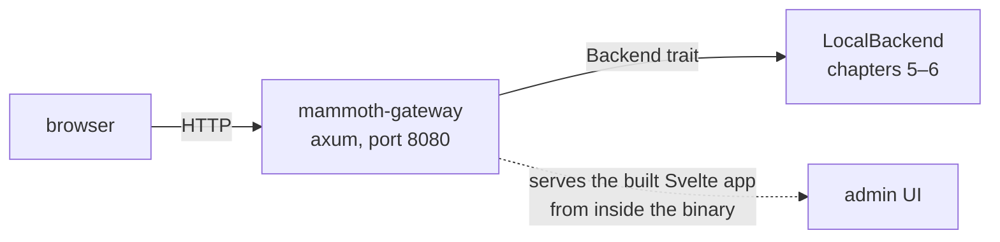

# Chapter 9 — The web UI and the gateway

**What you'll build:** a browser dashboard, served by the `mammoth` binary itself.

**Time:** about 4 hours.

---

## Before you start

```markdown
- [ ] Node.js 20+ is installed — `node --version`
- [ ] Chapter 6 is merged, **or** I am building against fake JSON for now
- [ ] I am on a new branch: `git checkout -b feat/gateway-and-ui`
```

**You do not have to wait for chapter 6.** Serve a hard-coded JSON blob from the
gateway, build the entire dashboard against it, and swap in the real backend
when [handoff 3](TEAM-PLAN.md#handoff-3--ana--cai-end-of-chapter-6) lands. The
API shape is fixed by `mammoth-core`'s types, so a dashboard built against fake
data of the right shape keeps working.

### Files you will touch

Two halves, one Rust and one TypeScript:

```
crates/mammoth-gateway/
├── Cargo.toml              EDIT   axum, tower-http, rust-embed
└── src/
    ├── lib.rs              EDIT   the router
    ├── api.rs              NEW    the REST handlers
    └── ui.rs               NEW    serve the embedded assets

crates/mammoth-cli/src/commands/
├── mod.rs                  EDIT   pub mod serve;
└── serve.rs                NEW    the `mammoth serve` command

ui/                         the Svelte app — already scaffolded
├── package.json
└── src/lib/types.ts        EDIT   keep in step with mammoth-core's types
```

### Two things to understand before you type

**The gateway talks to a `Backend`, not to `LocalBackend`.** Same guarantee as
the CLI: this dashboard will work against a real cluster unchanged.

**The UI is compiled *into* the binary** with `rust-embed`. There is no separate
web server and no "where do the static files go" step — one artifact ships
everything.

### Who this is for

**Cai's track** — and it is a different skill set from chapters 5–8: TypeScript,
Svelte, HTTP rather than Rust and async I/O. If your team has anyone with web
experience, this is theirs, and it runs in parallel with everything else.

> **Verification note.** Unlike chapters 1–8 and 10, this chapter's code was
> written to the same standard but **not machine-verified end to end**. Expect to
> debug a little more than usual, and read the "If it went wrong" section before
> you assume you mistyped something.

---

The CLI is for you. The web UI is for everyone else — and it is what people
screenshot. The front end already exists in `ui/`; this chapter builds the Rust
half that feeds it — the REST API, the embedded assets, and
`serve --role gateway` — and then points the two at each other.

> **This chapter is a different skill set** from chapters 5–8: TypeScript,
> Svelte, HTTP. If your team split the work as chapter 3 suggested, this is
> person C's track and it can run in parallel with chapters 7–8.

## The shape of it



Two things worth noticing before you write code:

**The gateway talks to a `Backend`, not to `LocalBackend`.** Same trait, same
guarantee: this dashboard will work against a real cluster unchanged.

**The UI is compiled *into* the binary** with `rust-embed`. No separate web
server, no "where do I put the static files" step. `mammoth ui` just works, and
there is exactly one artifact to ship.

## Step 1 · The API

The endpoints the UI needs are already specified in
[`web/src/content/docs/api/index.md`](../../web/src/content/docs/api/index.md).
Start with three:

```
GET /api/v1/cluster/report          the overview page
GET /api/v1/fs?path=/data           the file browser
GET /api/v1/fs/blocks?path=/data/x  the block matrix
```

Add the dependencies to `crates/mammoth-gateway/Cargo.toml`:

```toml
[dependencies]
mammoth-core  = { workspace = true }
mammoth-local = { workspace = true }
axum          = { workspace = true }
tokio         = { workspace = true }
serde         = { workspace = true }
serde_json    = { workspace = true }
tower-http    = { version = "0.6", features = ["cors", "trace"] }
rust-embed    = { version = "8", features = ["axum"] }
mime_guess    = "2"
```

Then `crates/mammoth-gateway/src/lib.rs`:

```rust
//! Web server, REST API and the embedded UI.

#![forbid(unsafe_code)]

pub mod api;
pub mod ui;

use std::sync::Arc;

use axum::Router;
use mammoth_core::Backend;

/// Shared state every handler gets.
#[derive(Clone)]
pub struct AppState {
    pub backend: Arc<dyn Backend>,
}

/// Build the whole application: API under /api/v1, UI everywhere else.
pub fn app(backend: Arc<dyn Backend>) -> Router {
    Router::new()
        .nest("/api/v1", api::routes())
        .fallback(ui::handler)
        .with_state(AppState { backend })
}
```

**`Arc<dyn Backend>`** is the trait object again, this time shared across
threads. `Arc` is a reference count, so cloning `AppState` for each request is
cheap — it bumps a counter, it does not copy the backend.

Now `crates/mammoth-gateway/src/api.rs`:

```rust
//! The REST API. The CLI and the UI consume the same endpoints.

use std::path::PathBuf;

use axum::extract::{Query, State};
use axum::http::StatusCode;
use axum::response::{IntoResponse, Response};
use axum::routing::get;
use axum::{Json, Router};
use serde::Deserialize;

use crate::AppState;

pub fn routes() -> Router<AppState> {
    Router::new()
        .route("/cluster/report", get(cluster_report))
        .route("/fs", get(list))
        .route("/fs/blocks", get(blocks))
}

#[derive(Deserialize)]
pub struct PathQuery {
    path: PathBuf,
}

async fn cluster_report(State(s): State<AppState>) -> Result<Response, ApiError> {
    let report = s.backend.cluster_report().await?;
    Ok(Json(report).into_response())
}

async fn list(
    State(s): State<AppState>,
    Query(q): Query<PathQuery>,
) -> Result<Response, ApiError> {
    let entries = s.backend.list(&q.path).await?;
    Ok(Json(entries).into_response())
}

async fn blocks(
    State(s): State<AppState>,
    Query(q): Query<PathQuery>,
) -> Result<Response, ApiError> {
    let layout = s.backend.block_layout(&q.path).await?;
    Ok(Json(layout).into_response())
}

/// Wraps a Mammoth error so it becomes a sensible HTTP response *and* keeps
/// the error code the CLI shows. Same errors, same codes, two surfaces.
pub struct ApiError(mammoth_core::Error);

impl From<mammoth_core::Error> for ApiError {
    fn from(e: mammoth_core::Error) -> Self {
        ApiError(e)
    }
}

impl IntoResponse for ApiError {
    fn into_response(self) -> Response {
        use mammoth_core::Error::*;
        let status = match self.0 {
            NotFound(_) => StatusCode::NOT_FOUND,
            WrongKind { .. } => StatusCode::BAD_REQUEST,
            NotEnoughWorkers { .. } | SafeMode { .. } => StatusCode::SERVICE_UNAVAILABLE,
            LeaseHeld { .. } => StatusCode::CONFLICT,
            _ => StatusCode::INTERNAL_SERVER_ERROR,
        };
        let body = serde_json::json!({
            "code": self.0.code(),
            "message": self.0.to_string(),
            "hints": self.0.hints(),
            "docs": self.0.docs_url(),
        });
        (status, Json(body)).into_response()
    }
}
```

**That `ApiError` type is the chapter's best idea.** One error enum, defined in
`mammoth-core`, now produces both the teaching CLI output *and* a structured
JSON error with the right HTTP status. Add a variant once, and both surfaces
get it.

## Step 2 · Embed the UI

`crates/mammoth-gateway/src/ui.rs`:

```rust
//! Serves the built Svelte app from inside the binary.

use axum::http::{header, StatusCode, Uri};
use axum::response::{IntoResponse, Response};
use rust_embed::RustEmbed;

#[derive(RustEmbed)]
#[folder = "../../ui/build/"]
struct Assets;

/// Serve an embedded asset, falling back to index.html so client-side
/// routing works on a deep link like /files/data/sales.csv.
pub async fn handler(uri: Uri) -> Response {
    let path = uri.path().trim_start_matches('/');
    let path = if path.is_empty() { "index.html" } else { path };

    match Assets::get(path).or_else(|| Assets::get("index.html")) {
        Some(content) => {
            let mime = mime_guess::from_path(path).first_or_octet_stream();
            ([(header::CONTENT_TYPE, mime.as_ref())], content.data).into_response()
        }
        None => (StatusCode::NOT_FOUND, "ui not built — run `cargo xtask build-ui`").into_response(),
    }
}
```

> **`#[folder = "../../ui/build/"]` must exist at compile time.** If you have
> not run the UI build yet, `rust-embed` will complain. Create the directory
> with a placeholder to get moving:
>
> ```bash
> mkdir -p ui/build && echo "<h1>not built yet</h1>" > ui/build/index.html
> ```

## Step 3 · The `serve` command

Add to `crates/mammoth-cli/src/commands/mod.rs`:

```rust
pub mod serve;
```

and create `crates/mammoth-cli/src/commands/serve.rs`:

```rust
//! `mammoth serve --role gateway`

use std::sync::Arc;

use mammoth_core::Result;

pub async fn gateway(addr: &str) -> Result<()> {
    let backend = Arc::new(super::backend()?);
    let app = mammoth_gateway::app(backend);

    let listener = tokio::net::TcpListener::bind(addr).await?;
    println!("  Web UI  →  http://{addr}");
    println!("  API     →  http://{addr}/api/v1/cluster/report");
    println!();
    println!("  press ctrl-c to stop");

    axum::serve(listener, app).await?;
    Ok(())
}
```

Wire it in `main.rs`:

```rust
        cli::Command::Serve { role } => match role.as_str() {
            "gateway" | "all" => commands::serve::gateway("127.0.0.1:8080").await,
            other => Err(mammoth_core::Error::Config(format!(
                "unknown role: {other} (try master, worker, gateway or all)"
            ))),
        },
```

and add `mammoth-gateway = { workspace = true }` to the CLI's `Cargo.toml`.

## Check the API works

```bash
cargo run -p mammoth-cli -- serve --role gateway
```

In another terminal:

```bash
curl -s localhost:8080/api/v1/cluster/report | python3 -m json.tool | head -20
```

```json
{
    "name": "local",
    "leader": "local",
    "safe_mode": false,
    "used": 3670016,
    "capacity": 1030792151040,
    "nodes": [
        {
            "id": "w1",
            "address": "127.0.0.1:7001",
            "rack": "/dc1/rack-a",
            "state": "healthy",
```

```bash
curl -s "localhost:8080/api/v1/fs/blocks?path=/data/sales.csv" | python3 -m json.tool | head
```

And the error path, which should give you a 404 *and* a usable body:

```bash
curl -s -w '\n%{http_code}\n' "localhost:8080/api/v1/fs?path=/nope"
```

```json
{"code":"E0101","docs":"https://projectorcha.github.io/Mammoth/errors/E0101","hints":[],"message":"no such path: /nope"}
404
```

## Step 4 · The front end

```bash
cd ui && npm install && npm run dev
```

Open <http://localhost:5173>. **The front end is already written** — it shipped
with the scaffold, and it is a complete dashboard rather than a stub:

| Route | What it shows |
| --- | --- |
| `/` | capacity, throughput, block health, alerts, and the four fast paths as live numbers |
| `/nodes` | sortable, rack-grouped worker table with per-node detail |
| `/files` · `/files/[...path]` | namespace browser, and per-file block placement, read plan and EC layout |
| `/distribution` | the six visualizations, a repair panel, and a 24-hour time machine |
| `/jobs` | stage DAG, task Gantt, and the straggler that is setting your job's runtime |
| `/cluster` | Raft members, and what the last start actually cost |

**It works before your gateway does.** `src/lib/api.ts` probes
`/api/v1/cluster/report`; if nothing answers, it falls back to the simulated
cluster in `src/lib/demo.ts` — twelve workers, one dead, a repair in flight —
and says so in a banner. So person C can build every screen while persons A and
B are still on chapters 7 and 8, and the two halves meet at a typed interface
instead of at a merge conflict.

```
ui/src/
├── app.html            theme bootstrap, before first paint
├── app.css             the --mm-* ramp, shared with the docs site
├── lib/
│   ├── types.ts        every shape the gateway serves
│   ├── api.ts          the typed client, with the demo fallback
│   ├── demo.ts         the simulated cluster
│   ├── live.svelte.ts  one shared, ref-counted subscription
│   ├── format.ts       bytes, rates, durations — one place
│   ├── components/     Panel, Stat, Meter, StateDot, Sparkline, FastPaths
│   └── charts/         BlockMatrix, HeatGrid, Treemap, RackTopology,
│                       SkewScatter, FlowSankey
└── routes/             the seven pages above
```

Two conventions worth copying if you add a page:

**Read from `live`, not from `api`.** `live.svelte.ts` holds one subscription
with a reference count — the first component to `attach()` starts it, the last
to detach stops it, and every page reads the same `$state`. Six pages polling
the same endpoint independently is how a dashboard becomes the cluster's
busiest client.

**Colour comes from the value, not from the caller.** `Meter` decides its own
colour from its fraction, so 94% is the same red on every page it appears on.
The heat ramp goes further and picks its label colour from the tile's
luminance, because white text on the gold middle of a heat scale is not
readable.

Your job in this step is to make the *real* data arrive: `npm run dev` proxies
`/api` to port 8080, so start the gateway in the other terminal and watch the
banner disappear.

```bash
cargo run -p mammoth-cli -- serve --role gateway
```

`$state` is Svelte 5's rune syntax — it makes a variable reactive, so the page
re-renders when it changes.

## Step 5 · Build it into the binary

```bash
cd ui && npm run build
```

That writes `ui/build/`, which is exactly the folder `rust-embed` points at.
Rebuild the binary and the UI is inside it:

```bash
cargo build -p mammoth-cli
./target/debug/mammoth serve --role gateway
```

Open <http://localhost:8080> — same page, no Node running.

Wire it into `xtask` so nobody has to remember the two steps. In
`xtask/src/main.rs`, replace the `build-ui` arm:

```rust
        Some("build-ui") => {
            let status = std::process::Command::new("npm")
                .args(["ci"])
                .current_dir("ui")
                .status()
                .expect("npm not found — install Node 20+");
            assert!(status.success(), "npm ci failed");

            let status = std::process::Command::new("npm")
                .args(["run", "build"])
                .current_dir("ui")
                .status()
                .expect("npm run build failed to start");
            assert!(status.success(), "npm run build failed");

            ExitCode::SUCCESS
        }
```

```bash
cargo xtask build-ui
```

## Commit it

```bash
cargo fmt --all && cargo clippy --workspace --all-targets -- -D warnings && cargo test --workspace
```

```bash
cd ui && npm run check && cd ..
```

```bash
git add -A && git commit -m "feat(gateway): add REST API, embedded UI and serve --role gateway"
```

Note `ui/build/` and `ui/.svelte-kit/` are already in `.gitignore` — build
output does not belong in Git. CI rebuilds it.

## Done when

```markdown
- [ ] `cargo run -- serve --role gateway` starts without errors
- [ ] Each API endpoint returns valid JSON when I curl it
- [ ] `npm run build` in `ui/` succeeds
- [ ] The built assets are embedded — the binary serves the UI with no `ui/`
      directory next to it
- [ ] The dashboard loads in a browser and shows **real** data from LocalBackend
- [ ] Putting a file with the CLI and refreshing the page shows the new file
- [ ] An error from the backend shows as a readable message in the UI, not a
      blank page or a spinner forever
- [ ] `mmcheck` passes
- [ ] Committed, pushed, PR opened and merged
```

The sixth box is the one that proves the whole architecture. You wrote a file
through the **CLI**, and it appeared in the **browser**, because both went
through the same `Backend`. Neither knows the other exists.

**This is the demo.** When someone asks what your team has built, this is what
you show them — so it is worth spending twenty minutes making the first screen
look right.

## Exercises

The front end is written; these are all on the Rust side of the line, which is
the half that does not exist yet.

1. **`/api/v1/fs` and `/api/v1/fs/blocks`.** The file browser and the block
   matrix are already built against them. Return the shapes in
   `ui/src/lib/types.ts` and both pages light up with no front-end change.
2. **Live updates.** `subscribe()` in `api.ts` expects SSE at
   `/api/v1/events`, carrying `node_state`, `block_health`, `throughput`,
   `job_update` and `alert`. Implement it with `axum::response::sse` and push a
   `cluster_report` every two seconds. The header's *simulated* pill turns into
   *live* on its own.
3. **`/api/v1/distribution/*`.** Four endpoints — `heat`, `treemap`, `skew`,
   `topology` — feed the whole visualization page. `cluster_report` and `list`
   already have everything they need.
4. **The time machine.** `/api/v1/cluster/report?minutes_ago=N`. Keep a ring
   buffer of reports and serve the nearest one. Watching blocks redistribute
   after a node failure is both genuinely useful and the best demo you have.
5. **`mammoth ui`.** Start the gateway and open the browser in one command.
   `webbrowser` is the crate.

## If it went wrong

**`rust-embed` fails with "folder does not exist"** — create the placeholder
`ui/build/index.html` as shown above, or run `npm run build` first.

**The page loads but every API call 404s** — check the gateway is on 8080 and
that you are hitting the Vite dev server on 5173, not the other way round. In
production (`serve --role gateway`) everything is on 8080.

**CORS errors in the browser console** — you are calling 8080 directly from
5173 instead of using the proxy. Use relative URLs (`/api/v1/...`), which is
what `api.ts` does.

**Changes to the Svelte code do not show up** — you are looking at the embedded
build on 8080, not the dev server on 5173. `rust-embed` bakes the assets in at
compile time; rebuild the binary to refresh them.

**`error[E0277]: the trait bound Arc<LocalBackend>: Backend is not satisfied`**
— you need `Arc<dyn Backend>`, not `Arc<LocalBackend>`. Write
`let backend: Arc<dyn Backend> = Arc::new(super::backend()?);`.

**`npm run check` complains about `$state`** — you are on Svelte 4. Runes need
Svelte 5. Check `ui/package.json` says `"svelte": "^5.0.0"`.

**The header says *simulated* and the numbers look too tidy** — nothing answered
on `/api/v1`, so the UI is drawing `src/lib/demo.ts`. That is the intended
behaviour, and the banner says so. Start the gateway and reload.

**`sveltekit is not exported from @sveltejs/vite-plugin-svelte`** — it comes from
`@sveltejs/kit/vite`. The Svelte plugin is what SvelteKit wraps, not what
exports the SvelteKit plugin.

---

**Next:** [Chapter 10 — Publishing the docs to GitHub Pages](10-github-pages.md)
