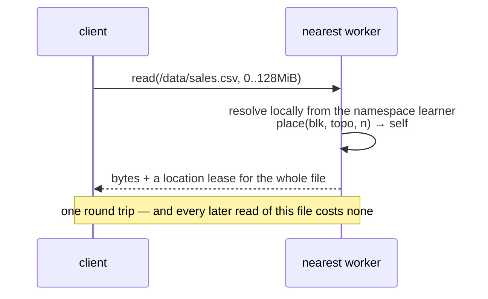
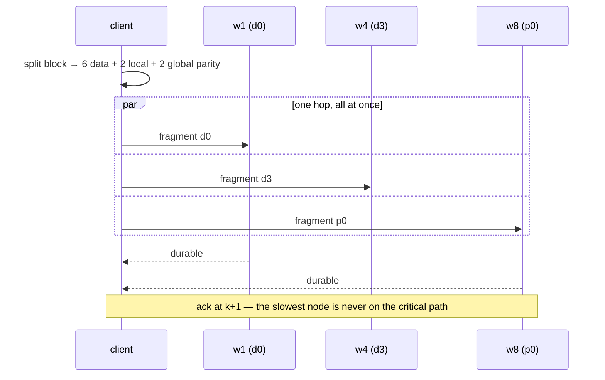
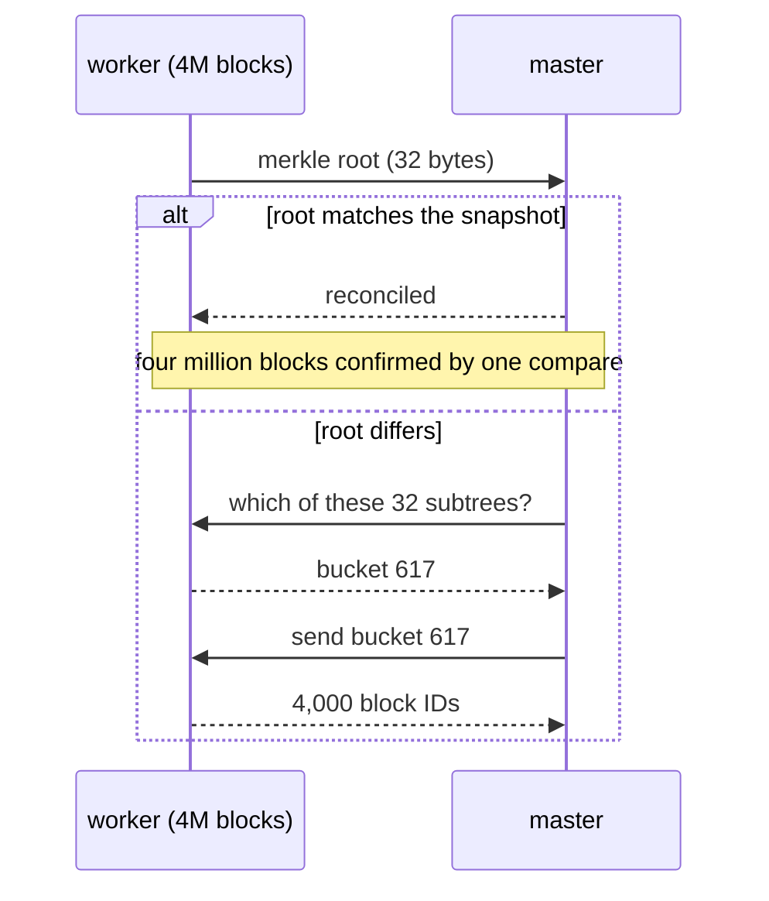

# Chapter 12 — The four fast paths

**What you'll build:** rendezvous placement in `LocalBackend` today, and the
design for the read path, the write path, repair and startup you will implement
at M5.

**Time:** about 90 minutes for the code, plus a careful read.

---

## Before you start

```markdown
- [ ] Chapters 5–6 are merged — you have a `LocalBackend` to add §0 to
- [ ] All three of you are reading this together
- [ ] Nobody has started writing `mammoth-master` or `mammoth-worker` yet
```

**Read this before you write the distributed half, not after.** Two of the four
ideas here are *simpler* than the HDFS approach they replace, and all four are
far cheaper to build in than to retrofit. Reading it in week 12 instead of week
20 is worth more than any code in this guide.

### What is real and what is design

| Section | Status |
| --- | --- |
| **§0 · rendezvous placement** | Real code. You add it to `LocalBackend` today and it works. |
| **§1 · the one-shot read** | Design. The machinery does not exist yet. |
| **§2 · fan-out dispersal write** | Design. |
| **§3 · declustered parallel repair** | Design. |
| **§4 · warm start** | Design. |

Every number in §1–§4 is a **target derived from a cost model**, not a
benchmark. Treat them as the shape of the answer, not as measurements.

### Files you will touch (in §0 only)

```
crates/mammoth-core/src/
├── place.rs        NEW    rendezvous placement — it belongs in core, because
│                          master, worker and client must all compute the same
│                          answer from the same inputs
└── lib.rs          EDIT   pub mod place;

crates/mammoth-local/src/
└── lib.rs          EDIT   use it instead of the chapter 5 placement rule
```

---

> **This chapter is a design chapter.** The rendezvous placement in §0 is real
> code you can add to the repository right now and see working. Everything from
> §1 onward describes machinery that does not exist yet — it is written to the
> same standard as the rest of the guide, but it has not been compiled against a
> real cluster, because there is not one yet. Treat §1–§4 as the plan you build
> from, not as code to paste.
>
> Every number in this chapter is a **target derived from a cost model**, not a
> benchmark. When these land, the numbers get replaced with measurements from a
> published harness — or they get deleted.

## Why this chapter exists

You now have a filesystem that works on one machine. The next thing you build is
the distributed version, and there are four places where Hadoop's design costs
far more than it needs to:

| | Hadoop | Mammoth | |
| --- | --- | --- | --- |
| Open + read | 2 round trips, every time | 0–1 round trip | [§1](#1--the-one-shot-read) |
| Write a block | 3 serial hops, serial acks | 1 parallel hop, quorum ack | [§2](#2--the-fan-out-dispersal-write) |
| Rebuild a dead node | one source, one sink, chained | every node, in parallel | [§3](#3--declustered-parallel-repair) |
| Master restart | 30+ min rebuilding the block map | seconds, no rebuild | [§4](#4--warm-start) |

**Read this before you write `mammoth-master` or `mammoth-worker`.** Two of the
four are *simpler* than the HDFS approach, not harder — and all four are much
cheaper to build now than to retrofit.

## 0 · The one idea: placement is computed

Everything in this chapter falls out of one decision.

HDFS **stores** placement. The NameNode holds a `block → [DataNode]` map in RAM
and is the only thing that knows it, so everything else has to ask — and the map
has to be rebuilt at every start, because it is nowhere else.

Mammoth **computes** placement. Given a block ID and the current topology, every
party — client, gateway, master, worker — derives the same replica set
independently, in about 200 ns, with no lookup and no message.

You already have a version of this. `LocalBackend::place` from
[chapter 5](05-localbackend-part-1.md) picks workers with `id % n`. That is the
right *shape* and the wrong *function*: modulo means that adding or removing a
worker reshuffles nearly every block. Swap in **rendezvous hashing** (also called
Highest Random Weight) and only the blocks that actually scored the departed node
have to move.

### What it does, before the code

Twelve nodes, three racks, one block. Hash the block ID together with each
node's seed, sort by the result, then walk the list taking the first node from
each rack you have not used yet:

```
block 1001 · every node scores itself

  w6    rack-b   18,270,361,829,568,255,012   ← rack-b's best   ✔ take it
  w4    rack-a   13,359,206,972,967,333,524   ← rack-a's best   ✔ take it
  w10   rack-c   13,349,019,384,023,089,140   ← rack-c's best   ✔ take it
  w3    rack-a    7,389,733,331,342,564,557     rack-a used
  w9    rack-c    6,450,597,512,760,413,242     rack-c used
  w5    rack-b    6,436,809,817,028,817,419     rack-b used
  …

  blk_1001 → w6, w4, w10
```

Three things to notice, because they are the whole design:

1. **Nobody was asked.** Any process with the node list gets `w6, w4, w10` on
   its own, in a few hundred nanoseconds.
2. **The rack rule is free.** It falls out of the walk, so it cannot be
   forgotten in a config file.
3. **Removing w7 does not move this block.** w7 was not in the top three, so
   blk_1001 stays exactly where it is. Only blocks that actually scored w7 into
   their top three have to move — about 3 in 12.

That last point is the one to hold on to. With `id % n`, removing one node of
twelve reshuffles about **91%** of your blocks. With rendezvous hashing it
disturbs **25%** — which is `replication / nodes`, the theoretical minimum. The
third test below measures exactly that.

### The code

Add this to `crates/mammoth-core/src/place.rs` — it belongs in `core`, because
the client, the master and the worker all need the same answer:

```rust
//! Rendezvous (Highest Random Weight) placement.
//!
//! Pure function: no state, no I/O, no lock. Given a block ID and a topology,
//! every process in the cluster derives the same replica set independently.

/// One candidate machine. `seed` is stable for the life of the node.
#[derive(Debug, Clone, PartialEq, Eq)]
pub struct Candidate {
    pub id: String,
    pub rack: String,
    pub seed: u64,
    /// Higher = more of the cluster's data. 1.0 is the baseline.
    pub weight: f64,
}

/// A 64-bit mix. Deterministic across platforms and Rust versions, which
/// `DefaultHasher` explicitly is not — and placement must never move because
/// someone upgraded a compiler.
///
/// Swap this for `xxhash_rust::xxh3::xxh3_64` when you take the dependency;
/// the property that matters is avalanche, not the specific function.
fn mix64(mut x: u64) -> u64 {
    x ^= x >> 33;
    x = x.wrapping_mul(0xff51_afd7_ed55_8ccd);
    x ^= x >> 33;
    x = x.wrapping_mul(0xc4ce_b9fe_1a85_ec53);
    x ^ (x >> 33)
}

/// The weight this node bids for this block. Highest bid wins.
fn score(block: u64, c: &Candidate) -> f64 {
    let h = mix64(block ^ mix64(c.seed));
    // Map to (0, 1), then apply the standard weighted-rendezvous transform.
    // A node with twice the weight wins twice as often, on average.
    let u = (h >> 11) as f64 / (1u64 << 53) as f64;
    if c.weight <= 0.0 {
        return f64::NEG_INFINITY;
    }
    -c.weight / u.max(f64::MIN_POSITIVE).ln()
}

/// The replica set for `block`, best first, spread across racks.
///
/// Rack rule: take the highest-scoring node from each new rack until we run out
/// of racks, then fall back to the ranking. So replica 2 is always in a
/// different failure domain than replica 1, by construction rather than by
/// policy.
pub fn place(block: u64, candidates: &[Candidate], n: usize) -> Vec<&Candidate> {
    let mut ranked: Vec<_> = candidates.iter().map(|c| (score(block, c), c)).collect();
    ranked.sort_unstable_by(|a, b| b.0.total_cmp(&a.0));

    let racks: std::collections::HashSet<&str> =
        candidates.iter().map(|c| c.rack.as_str()).collect();
    let rack_count = racks.len();

    let mut out = Vec::with_capacity(n);
    let mut used: std::collections::HashSet<&str> = std::collections::HashSet::new();

    // Pass 1: one per rack, highest scorer first.
    for (_, c) in &ranked {
        if out.len() == n {
            break;
        }
        if used.insert(c.rack.as_str()) {
            out.push(*c);
        }
    }
    // Pass 2: if we need more replicas than there are racks, keep going down
    // the ranking. Fewer racks than replicas is a real cluster shape, not an
    // error — it just means you survive fewer simultaneous rack failures.
    if out.len() < n && rack_count < n {
        for (_, c) in &ranked {
            if out.len() == n {
                break;
            }
            if !out.iter().any(|o| o.id == c.id) {
                out.push(*c);
            }
        }
    }
    out
}
```

### The tests that make it worth having

```rust
#[cfg(test)]
mod tests {
    use super::*;

    fn cluster(n: usize) -> Vec<Candidate> {
        (0..n)
            .map(|i| Candidate {
                id: format!("w{}", i + 1),
                rack: format!("rack-{}", (b'a' + (i % 3) as u8) as char),
                seed: i as u64 * 0x9e37_79b9_7f4a_7c15,
                weight: 1.0,
            })
            .collect()
    }

    #[test]
    fn deterministic() {
        let c = cluster(12);
        for block in 0..1000 {
            assert_eq!(place(block, &c, 3), place(block, &c, 3));
        }
    }

    #[test]
    fn spreads_across_racks() {
        let c = cluster(12);
        for block in 0..1000 {
            let picked = place(block, &c, 3);
            let racks: std::collections::HashSet<_> =
                picked.iter().map(|p| &p.rack).collect();
            assert_eq!(racks.len(), 3, "block {block} put two replicas in one rack");
        }
    }

    /// The property modulo hashing does not have, and the reason to bother.
    #[test]
    fn removing_a_node_moves_almost_nothing() {
        let full = cluster(12);
        let reduced: Vec<_> = full.iter().filter(|c| c.id != "w7").cloned().collect();

        let mut moved = 0;
        const N: u64 = 100_000;
        for block in 0..N {
            let a: Vec<_> = place(block, &full, 3).iter().map(|c| c.id.clone()).collect();
            let b: Vec<_> = place(block, &reduced, 3).iter().map(|c| c.id.clone()).collect();
            if a != b {
                moved += 1;
            }
        }
        // Only blocks that scored w7 in their top 3 are disturbed: about 3/12.
        // Modulo hashing would move nearly all of them.
        let fraction = moved as f64 / N as f64;
        assert!(fraction < 0.30, "moved {fraction:.3} of blocks, expected < 0.30");
    }
}
```

That third test is the whole argument. Run it, then change `place` back to
`block % n` and run it again — you will watch the number go to nearly 1.0.

### Wire it into `LocalBackend`

```rust
    fn place(&self, id: BlockId, replication: u8) -> Vec<Replica> {
        let candidates: Vec<Candidate> = WORKERS
            .iter()
            .enumerate()
            .map(|(i, (name, rack))| Candidate {
                id: (*name).to_string(),
                rack: (*rack).to_string(),
                seed: i as u64,
                weight: 1.0,
            })
            .collect();

        mammoth_core::place::place(id.0, &candidates, replication as usize)
            .into_iter()
            .enumerate()
            .map(|(rank, c)| Replica {
                node: NodeId(c.id.clone()),
                rack: c.rack.clone(),
                state: if rank == 0 { ReplicaState::Primary } else { ReplicaState::Replica },
            })
            .collect()
    }
```

### Check it works

```bash
cargo test -p mammoth-core place
```

```console
running 3 tests
test place::tests::deterministic ... ok
test place::tests::spreads_across_racks ... ok
test place::tests::removing_a_node_moves_almost_nothing ... ok
```

```bash
rm -rf ~/.mammoth/data          # placement changed — old blocks are elsewhere now
cargo run -p mammoth-cli -- put ./big.bin /data/big.bin
cargo run -p mammoth-cli -- viz blocks /data/big.bin
```

> **Existing data moves.** `place` is how `LocalBackend` finds blocks, so
> changing the function orphans everything written with the old one. That is
> exactly the migration problem a real cluster has, which is why real placement
> is versioned by a **topology epoch** — §1.

### What this buys the other three sections

- A client can compute where a block is → **it does not have to ask** (§1).
- A writer can compute where fragments go → **no allocation round trip** (§2).
- Every node's blocks are spread across every other node → **repair is
  N-way parallel** (§3).
- The master can compute what it *should* have → **reports become a diff, not a
  rebuild** (§4).

## 1 · The one-shot read

**Hadoop:** ask the NameNode where the blocks are, then ask a DataNode for
bytes. Two round trips before a byte moves, every open, through the one global
lock — and again every ten blocks on a long scan, because locations come in
batches.

**Mammoth:** zero to one.



Three pieces:

**a. Location leases.** `open` returns the whole block list, the topology epoch
and a signed lease with a TTL. While it is valid, the client reads any range with
no metadata traffic at all.

```rust
pub struct OpenHandle {
    pub inode: u64,
    pub blocks: Vec<BlockId>,
    pub epoch: u64,             // the topology this placement was derived from
    pub expires: SystemTime,
    pub signature: [u8; 32],    // so a worker can trust it without asking
}
```

**b. Epoch stamping.** Every request carries the epoch the client used. A worker
whose epoch is newer answers `EpochTooOld` with the current topology attached —
about 4 KB — and the client retries. This is the piece people skip, and skipping
it produces silent misses under churn. Do not skip it.

**c. Inline resolve.** Workers run a **Raft learner** replica of the namespace:
read-only, lag-bounded, non-voting, so it costs the quorum nothing. A client with
no lease sends `path + range` to the nearest worker, which resolves the inode
locally and either serves the bytes or returns a one-hop redirect.

Then the two mechanisms you already have documented compose on top —
**short-circuit reads** (pass the fd over a Unix socket when the replica is
local) and **hedged reads** (fire at the second replica when the first is slow).
Hedging is free here, because the client derived the whole replica set itself.

| | Hadoop | Mammoth |
| --- | --- | --- |
| cold open, big file | 2 RTT | **1 RTT** |
| next read of the same file | 1 RTT, 2 every 10 blocks | **0 RTT** |
| small file (< 1 MiB) | 2 RTT | **1 RTT**, bytes included |
| master CPU per read | one lock acquisition each | **zero on the warm path** |

**Build order:** `place()` → epoch on every RPC → `OpenHandle` + client
`LeaseCache` → worker-side learner → `read(path, range)` on the worker.

## 2 · The fan-out dispersal write

**Hadoop:** chain replication. Each 64 KB packet goes to the first DataNode,
which forwards to the second, which forwards to the third; acks come back down
the chain. The client's uplink is never tripled — that is the virtue, and it is
a real one.

The costs: three hops out and three acks back **in series**; one slow disk stalls
the write because the packets must pass through it; a node dying mid-block means
tearing the pipeline down, re-establishing it and re-sending; and 3× storage.

**Mammoth:** stop chaining. Scatter in parallel, ack on a quorum, send parity
instead of copies.



The shape of it:

```rust
pub async fn write_block(&self, block: BlockId, bytes: Bytes) -> Result<()> {
    // 1. Encode. SIMD Galois-field math — multiple GB/s per core, so the
    //    network is the bottleneck and not this.
    let frags = self.codec.encode(&bytes)?;          // k data + m parity

    // 2. Choose k+m targets. No round trip: it is a pure function.
    let targets = place(block.0, &self.topo.candidates(), frags.len());

    // 3. Send them all at once, each on its own connection with its own
    //    sliding window. No shared packet barrier, so jitter stays local.
    let mut inflight: FuturesUnordered<_> = frags
        .into_iter()
        .zip(targets)
        .map(|(f, t)| self.send_fragment(t, block, f))
        .collect();

    // 4. Ack at k+1. The rest keep going; they are simply not waited on.
    let mut durable = 0;
    while let Some(result) = inflight.next().await {
        if result.is_ok() {
            durable += 1;
            if durable >= self.codec.k() + 1 {
                self.repair.watch(block, inflight);   // finish in the background
                return Ok(());
            }
        }
    }
    Err(Error::NotEnoughWorkers { wanted: self.codec.k() as u8 + 1, available: durable as u8 })
}
```

### What it actually costs

One 128 MiB block, 25 GbE (3.1 GB/s) per node, 0.1 ms one-way latency, disks
fast enough not to matter. A fragment is 22.4 MB; ten of them is 224 MB.

| | chain | dispersal |
| --- | --- | --- |
| a 64 KiB append — latency-bound | 3 hops out + 3 acks ≈ **0.66 ms** | 1 hop + 1 ack ≈ **0.24 ms** |
| a full block, all healthy — bandwidth-bound | 134 MB out of one NIC ≈ **43 ms** | 224 MB out of one NIC, ack at 7 ≈ **50 ms** |
| a full block, one node 200 ms slow | ≈ **243 ms** | ≈ **50 ms** |
| a full block, one node dies mid-write | rebuild + re-send ≈ **seconds** | ≈ **50 ms** |
| bytes on the fabric | 403 MB | **224 MB** |
| bytes out of the client's NIC | **134 MB** | 224 MB |
| bytes on disk | 403 MB | **224 MB** |

**Read row two before you believe the rest.** On a healthy cluster moving one
large block, chaining is about 15% *faster*, because the client only has to push
134 MB instead of 224 MB. Dispersal does not win that case and the docs should
not pretend it does.

It wins the cases that actually govern a cluster: small writes (3×, because they
are latency-bound), the slow-node case (5×, and that is your p99), the
dead-node case (three orders of magnitude), and total network and disk (0.56×).

**The tradeoff in one line:** the client's NIC carries 1.67× instead of 1×, and
in exchange the fabric and the disks carry 0.56×, and the tail stops depending
on the worst node in the chain.

When the client's uplink really is the constraint — a thin client on a slow
link, or a block small enough that one hop is all of it —
`write.mode = "mirror"` runs the same code path as a **two-level fan-out tree**:
client → one worker → the other two *in parallel*. Depth 2 instead of 3, 1×
uplink, 3× storage. Still better than a chain.

| mode | depth | client uplink | storage | use for |
| --- | --- | --- | --- | --- |
| `disperse` *(default)* | **1** | 1.67× | **1.67×** | everything that is not tiny |
| `mirror` | 2 | 1× | 3× | thin clients, tiny blocks, hot re-reads |
| `pipeline` | 3 | 1× | 3× | HDFS-compatible; migration comparisons only |

**Build order:** benchmark the codec against your NIC *first* — if the encode is
not comfortably faster than the link, this design is wrong for your hardware →
`place()` for targets → one task per fragment → "first k+1 to succeed" →
`PendingFragments` for the losers → CRC32C on arrival.

**The thing to get right:** quorum acking is a real durability tradeoff, not a
free optimization. `k+1` durable is weaker than `k+m` durable. Default to
quorum, document it as a choice, and make `ack_policy = "all"` work.

## 3 · Declustered parallel repair

Chain replication's other job is every copy made *after* the first write. A
machine dies; its blocks must become fully redundant again.

**Hadoop:** the NameNode issues copy commands — one source DataNode reads a
block and pipelines it to one target. The same chain, run again later. Throughput
is bounded by a handful of source disks, so rebuilding a dead 160 TB node takes
**hours**, during which one more failure is a real risk. And a node that reboots
in 90 seconds can trigger a petabyte of copying that is garbage the moment it
finishes.

**Mammoth:** three changes.

**a. Declustering — every node repairs, at once.** Because placement is
rendezvous-derived over the whole cluster rather than fixed replica groups, the
surviving copies of a dead node's blocks are spread across *every other node*.
Repair is `N−1` sources reading and `N−1` sinks writing, simultaneously. Rebuild
time goes from `C / disk_bw` to roughly `C / (N · disk_bw · share)` — and it gets
*faster* as the cluster grows, which is the opposite of how HDFS behaves.

**b. LRC — make the common repair cheap.** Plain RS(6,3) reconstructs one lost
fragment by reading **six** across the network. Local Reconstruction Codes add a
local parity per group, so the case that actually happens — one fragment gone —
is repaired from **three** fragments inside one rack.

A block is 128 MiB, so a fragment is 22.4 MB. Node w12 dies, taking `d1`:

```
RS(6,3)      read any 6 survivors     6 × 22.4 MB = 134 MB, across racks
LRC(6,2,2)   read d1's own group      3 × 22.4 MB =  67 MB, inside one rack
             (d0, d2, and local parity l0)
```

| | RS(6,3) | **LRC(6,2,2)** |
| --- | --- | --- |
| storage overhead | 1.50× | 1.67× |
| fragments read to fix one loss | 6 | **3** |
| where those reads come from | across racks | **inside one rack** |
| to rebuild a whole dead node (4.75M fragments) | 638 TB read | **319 TB read** |

0.17× more disk buys **319 TB of network you do not spend**, on the failure that
happens every day. Disk is cheap during an incident; repair bandwidth is not.

And the declustering is worth putting a number on too — 600 MB/s of repair
budget per surviving node:

| Cluster | Dead node held | Chained | Declustered |
| --- | --- | --- | --- |
| 12 nodes | 106 TB | **49 hours** | **4h 30m** |
| 200 nodes | 160 TB | **74 hours** | **22 minutes** |

The chained column barely moves between the rows, because it does not matter how
many machines you own if one of them is doing the work.

**c. Repair is a scheduled queue, not a reflex.**

```rust
/// The work list is a *diff*, not a scan: place() says who should hold the
/// block, the reconciled map says who does, and the difference is the queue.
pub struct RepairQueue {
    /// Ordered by how close to gone the data is. Nothing else matters.
    heap: BinaryHeap<Reverse<(u8 /* remaining */, BlockId)>>,
    /// A node that is merely absent gets `repair.delay` before we copy
    /// anything. Confirmed disk loss skips the window.
    deferred: BTreeMap<Instant, Vec<BlockId>>,
    /// Token bucket per node and per rack uplink. Not optional: repair that
    /// takes an outage with it is worse than repair that takes ten more minutes.
    budget: RateLimiter,
}
```

Reconstruct on the **target**, not the source — the node that will hold the new
fragment pulls what it needs and does the Galois-field math itself. That spreads
the CPU the same way declustering spreads the I/O.

**Build order:** expectation diff → priority heap → delay window → work-stealing
pull from workers → token buckets sized from *measured* idle bandwidth.

## 4 · Warm start

**Hadoop:** the NameNode does not store the block map. It stores the namespace,
but *where* each block lives is rebuilt in RAM at every start from full block
reports. **30+ minutes on a large cluster**, read-only the whole time — and worst
exactly when it hurts most, during recovery from whatever caused the restart.

**Mammoth:** do not rebuild it. It is on disk, and it is derived state anyway.

**a. Persisted — restart is a page-in.** The map is written as an
`rkyv`-archived structure next to the Raft snapshot and **memory-mapped** on
start. `rkyv`'s archived form *is* the in-memory form, so there is no
deserialization pass — the map is usable as soon as it is mapped, and pages fault
in as they are touched. `O(1)` in the number of blocks.

```rust
let mmap = unsafe { Mmap::map(&File::open(path)?)? };
// No parse, no allocation, no loop over ten million entries.
let map = rkyv::access::<ArchivedBlockMap, rkyv::rancor::Error>(&mmap)?;
```

**b. Derived — reports are a correction, not a source of truth.** `place()`
already says where every block *should* be. What the master persists is the
**exception list**: the blocks that are somewhere else because a disk filled up
or a repair is mid-flight. On a healthy cluster that list is nearly empty.

**c. Verified by Merkle root — 32 bytes per worker.** Each worker keeps a
shallow Merkle tree over its block-ID space — 1024 leaves by prefix bucket, each
an `xxhash3` over that bucket's sorted IDs, updated incrementally as blocks come
and go.



A worker holding 4.75M fragments with `merkle_fanout = 1024` has about 4,640 IDs
per bucket. IDs are 8 bytes:

```
clean restart          root matches                      32 bytes total
after a crash          root differs → 3 of 32 subtrees → 3 buckets
                       → 13,920 ids                     113 KB, 4 round trips
HDFS, every restart    every block id from every node    38 MB per node,
                                                         456 MB for twelve,
                                                         under the global lock
```

Cost is `O(differences · log n)`, not `O(blocks)` — and the shape is the point,
not the ratio. Merkle cost grows with what *changed*; block-report cost grows
with what *exists*, which is the thing that gets bigger every time you add a
disk.

**d. Safe mode is per-range.** Each namespace shard leaves safe mode as soon as
*its own* ranges reconcile, instead of everything waiting on one cluster-wide
99.9% threshold. Reads are served from the mapped snapshot immediately — it is
committed, durable state — and writes open per shard as the roots arrive.

| | Hadoop | Mammoth |
| --- | --- | --- |
| what happens at start | rebuild from `O(blocks)` reports | `mmap` a file |
| wire bytes, clean restart | every block ID, from every node | **32 bytes per worker** |
| complexity | `O(total blocks)` | `O(1)` + `O(differences · log n)` |
| time, 10M blocks / 200 nodes | **30+ min** | **< 10 s** *(target)* |
| reads during startup | blocked | **served from the snapshot** |

**Build order:** checkpoint the map on the Raft snapshot boundary, so there is no
third thing to keep in sync → `memmap2` + `rkyv` → `MerkleIndex` on the worker
(a fixed 1024-leaf array; adding a block rehashes one leaf) → 32-way descent →
per-shard safe-mode state machine → a background scrub that re-derives `place()`
over the course of a day and reports drift.

**The thing to get right:** a memory-mapped map means a corrupt file is a corrupt
boot. Checksum the archive, keep the previous generation, and make
`master.block_map = "rebuild"` a fallback path you actually test — not a config
key nobody has ever exercised.

## Check it works

Only §0 is buildable today, and it is worth doing properly:

```bash
cargo test -p mammoth-core place
cargo clippy --workspace --all-targets -- -D warnings
cargo run -p mammoth-cli -- viz blocks /data/big.bin
```

The `viz blocks` output should still show one replica per rack. If two replicas
land in the same rack, the rack pass in `place` is wrong — check that you are
inserting into `used` and not into `out`.

## If it went wrong

**`spreads_across_racks` fails** — you have fewer racks than replicas. With three
workers all in `rack-a`, three replicas cannot be in three racks. The test builds
a 12-node, 3-rack cluster; check your `cluster()` helper.

**`removing_a_node_moves_almost_nothing` fails at ~1.0** — you are still hashing
with modulo somewhere, or `score` is not mixing the node seed into the block ID.
Both inputs must go through the avalanche.

**Old files 404 after switching placement** — expected, and the point of the
warning above. `rm -rf ~/.mammoth/data` and re-`put`. In a real cluster this is
what the topology epoch and the balancer are for.

**`viz blocks` shows a different layout than before** — also expected. Rendezvous
hashing does not agree with modulo about anything.

## Commit it

```bash
cargo fmt --all && cargo clippy --workspace --all-targets -- -D warnings && cargo test --workspace
```

```bash
git add -A && git commit -m "feat(core): rendezvous placement, replacing modulo"
```

## Done when

For the code half (§0):

```markdown
- [ ] `cargo test -p mammoth-core place` passes
- [ ] The same inputs always produce the same placement — it is deterministic
- [ ] Adding a node moves only a small fraction of blocks, not most of them
- [ ] Rack diversity still holds: no block has all replicas in one rack
- [ ] `LocalBackend` uses it, and chapter 6's five tests still pass
- [ ] `mmcheck` passes
- [ ] Committed, pushed, PR opened and merged
```

For the design half (§1–§4), as a team:

```markdown
- [ ] All three of us have read §1–§4
- [ ] Each of us can explain **one** of the four fast paths to the other two
- [ ] We agree which of the four we are building first
- [ ] We know which are cheap now and expensive later (all four)
- [ ] That decision is written down as an ADR before anyone opens
      `crates/mammoth-master/src/lib.rs`
```

The fifth box is the whole point of this chapter existing at this position in
the guide. The cost of designing a one-shot read into a system that has not been
written is close to zero. The cost of retrofitting one into a system with three
round trips baked into its RPCs is a rewrite.

## Exercises

1. **Weighted placement.** Give one worker `weight: 2.0` and confirm it receives
   roughly twice the blocks. This is how you add a bigger machine to a cluster
   without rebalancing everything.
2. **Measure the disruption.** Print the exact fraction of blocks that move when
   you remove one node of `n`, for `n` in 6, 12, 24, 48. Compare against `3/n` —
   the theoretical answer for three replicas.
3. **The epoch.** Add a `topology_epoch: u64` to `ClusterReport` and have
   `viz blocks` print it. It costs nothing now and it is the field everything in
   §1 hangs off.
4. **The exception list.** Add a `HashMap<BlockId, Vec<NodeId>>` to
   `LocalBackend` that overrides `place()` for specific blocks, and a
   `mammoth admin pin` command that writes to it. That is the whole idea behind
   §4's "reports are a diff" — the master stores the exceptions, not the rule.

## Read these

The mechanisms here are not novel; they are assembled from systems that already
proved them.

- **Rendezvous hashing** — Thaler & Ravishankar, 1996. Two pages, and the
  weighted variant is one line.
- **CRUSH** (Ceph) — the same idea with a hierarchy, and the best paper on
  failure-domain-aware placement.
- **Azure's LRC paper** — "Erasure Coding in Windows Azure Storage", USENIX ATC
  2012. Where LRC comes from and why the repair cost mattered enough to invent it.
- **Apache Ozone** — what the HDFS team built after learning what HDFS got
  wrong. The most direct prior art you have for §4.
- **Dynamo**, §4.7 — Merkle-tree anti-entropy, which is §4's reconciliation.

---

**Next:** you are at the end of the guide. Go build
[M5](../ROADMAP.md) — and build `mammoth-testkit` at the same time, so every
distributed bug you hit reduces to a seed number.

← [Back to the guide index](README.md)
