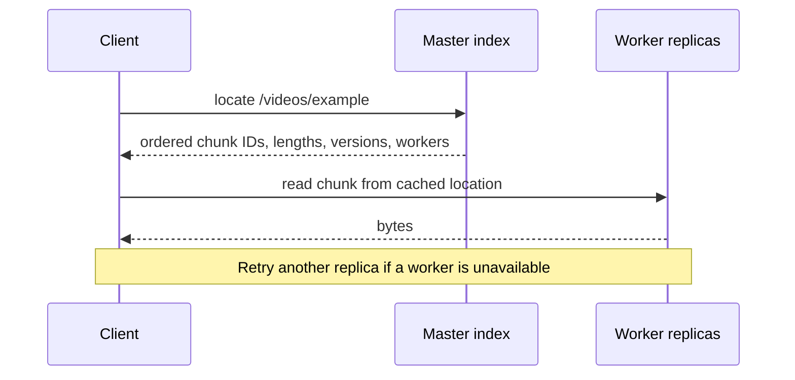
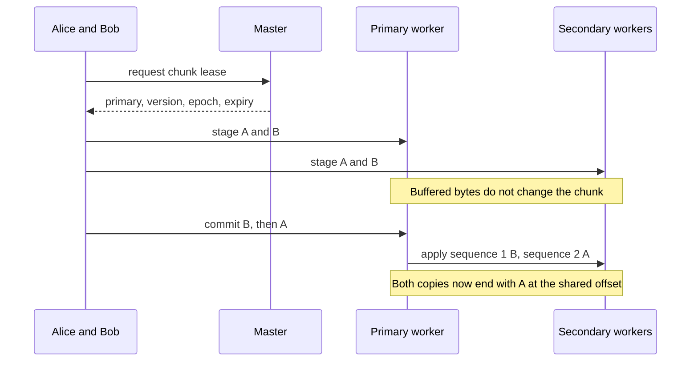

# Chapter 13 — GFS reliability, with a runnable local model

**Time:** 30 minutes. **Prerequisites:** [Concepts](CONCEPTS.md) and a working
Rust toolchain. You can run this before implementing chapters 5–6.

This chapter accompanies the supplied [GFS video](https://www.youtube.com/watch?v=C3-FIM2xTIw).
Use the [coverage audit](GFS-COVERAGE.md) to see every timestamp mapped to source,
tests and remaining milestones.

## 1. Run it

From the repository root:

```bash
cargo run -p mammoth-local --example gfs-demo
cargo test -p mammoth-local --test gfs
```

The demo asserts its results and exits unsuccessfully if an expectation fails.
It uses six worker stores, two masters and a logical clock. It stores bytes in
memory; it opens no ports and writes no data files. Each `tick()` advances 30
simulated seconds immediately, so the complete exercise takes no real-time
heartbeat waits. It is separate from `LocalBackend` and the CLI's unfinished
`quickstart` command.

Source to follow:

- [Example](../../crates/mammoth-local/examples/gfs-demo.rs): the scenario below.
- [Model](../../crates/mammoth-local/src/gfs.rs): metadata, workers, leases and events.
- [Tests](../../crates/mammoth-local/tests/gfs.rs): failure boundaries and write schedules.
- [ADR 0003](../adr/0003-gfs-teaching-simulation.md): scope and modeling choices.

## 2. From one disk to a cluster

A local filesystem maps filenames to disk storage, often using allocation
blocks of a few KiB. Its indexes may use inodes, extents or other structures;
"Master Index" is a useful analogy, not a standard component name.

The distributed version adds another level: a file maps to ordered **chunks**,
and a chunk maps to machines holding copies. The operating system on each worker
still manages that worker's own disk blocks. These two kinds of block are not
interchangeable.

The demo stores `/videos/example`, containing `abcdefgh01234567TAIL`:

| Index | Bytes | Worker IDs at creation |
| --- | --- | --- |
| 0 | `abcdefgh` | 0, 1, 2 |
| 1 | `01234567` | 3, 4, 5 |
| 2 | `TAIL` | 0, 1, 2 |

Eight-byte chunks make this visible. The model's library default is 64 MiB;
Mammoth's planned service configuration uses 128 MiB. The final chunk has only
four bytes; it does not require eight bytes of padding.

Large files can exceed one disk's capacity, and multiple workers can provide
aggregate bandwidth. Scaling does not guarantee linear speedup: the client,
network, placement, storage and workload all impose limits. The video's huge
data volumes and frequent failures motivate the design; this repository does
not verify those figures as current YouTube measurements.

## 3. The index tells the client where to go



`create_file` splits bytes and writes each copy to a separate worker store.
`locate` reads the master index. `read_location` consults only worker stores.
`read_file` joins those chunks in file order. A master holds IDs and metadata,
not the demo's file bytes. Mammoth's separate small-file inlining design is
not enabled in this model.

The model uses worker IDs instead of IP addresses. The service will need
registration, advertised addresses, RPC transport and cache refresh. Those
interfaces remain on the [gap checklist](GFS-COVERAGE.md#acceptance-checklist).

## 4. Three copies and automatic repair

The placement rule chooses distinct healthy workers, preferring racks not
already represented in the replica set. Three copies tolerate loss of two
copies if the third remains intact and reachable. They do not tolerate all
three disappearing, or a building failure that takes every copy with it.

In the demo, worker 0 loses both its availability and its stored bytes:

| Logical time | What happens |
| --- | --- |
| 0 s | Worker 0 fails; another replica can still serve reads |
| 30 s | First missed heartbeat; no re-copy yet |
| 60 s | Second missed heartbeat; no re-copy yet |
| 90 s | Third miss; master marks worker 0 dead and copies its chunks from survivors |

`tick` supplies heartbeats for live roles, checks deadlines and invokes repair
automatically. The demo replaces lost copies on worker 3. No user command
requests that repair. Later ticks do not create extra copies once the target
count is restored.

The tests also exercise the less convenient outcomes:

- With only three workers, losing one leaves two copies and no spare machine.
  The model reports `UnderReplicated`, continues reads and retries repair later.
- Losing every copy yields `ChunkUnavailable`; there is no source to rebuild
  from. Temporary unavailability and permanent disk loss both block reads, but
  a stopped worker can return with data if its disk was not erased.
- A returning worker starts quarantined. Its next heartbeat reconciles stored
  versions and removes stale, unlisted copies before cached clients can read it.

Racks are correlated failure domains, not proof of geographic separation.
Production deployment must decide which rack/site losses it intends to survive,
including where master state and backups live. Replication also copies logical
mistakes; backup retention and restore are separate work.

## 5. Concurrent clients: bytes first, order second

Two clients changing the same offset can leave replicas different if workers
apply requests in different orders. For example, one worker might see A then B,
while another sees B then A.

The demo makes the ordering authority explicit:



`stage` returns a mutation ID. `commit` is the primary's ordered event: its
sequence number depends on the commit order, not on when data was staged.
Every current replica must have the bytes before application. The example
stages Alice then Bob, orders Bob then Alice, and checks every copy contains
`AAAAefgh`. Tests explore all six orders of three overlapping clients.

A lease contains a primary worker, chunk version, master epoch and expiry.
Expired authority is rejected at the exact expiry boundary. Repair can restore
copies while a lost primary's lease is still valid, but a replacement primary
must wait for expiry unless a master epoch change fences the old authority.
A new lease invalidates old buffered writes.

Keep these concepts distinct:

| Concept | Meaning |
| --- | --- |
| File writer lease | Limits who may replace/write a file through a filesystem API |
| Chunk primary lease | Gives one worker authority to order mutations from clients |
| Read location lease/cache | Allows reuse of chunk locations, with validation and expiry |
| `ReplicaState::Primary` | Existing visualization label; does not itself grant authority |
| Transfer mode | How bytes travel; pipelining or parallel sends do not establish order |

The original GFS paper describes relaxed consistency and record append, including
retry duplicates. This demo only overwrites a range **within an existing chunk**.
It does not implement record append, cross-chunk transactions or an exactly-once
network protocol. See [GFS §2.7 and §3](https://research.google/pubs/the-google-file-system/).

## 6. Protecting the index and switching masters

Every successful model event copies the metadata snapshot to each online
master. Worker bytes remain in their own stores. The example then stops master
0 while a staged write is pending.

1. New `locate` operations fail while the active master is unavailable.
2. A client with cached locations can still read the worker bytes.
3. After three missed beats, the external controller promotes master 1 and
   changes the simulated service endpoint returned by `active_master()`.
4. The controller increments the master epoch, fencing old leases. A test uses
   a lease that has **not expired** to prove fencing is independent of timeout.
5. The client obtains a fresh lease, stages again and completes its write.

The final file is `DONEefgh01234567TAIL`. Already committed data survives the
role failure, while the uncommitted staged write is discarded. A restarted
master copies the active snapshot and rejoins as a follower; it does not take
leadership back automatically.

Real master recovery requires persistent logs/checkpoints and a safe decision
about who may write. Routing a name to a standby only changes where clients go;
it cannot disable an isolated old leader. Mammoth plans Raft and leader-aware
client retries in M6. The demo's controller has perfect knowledge and can fence
authority atomically. Its `active_master()` change is a routing analogy, not
a DNS integration or a Raft election.

With only one online master, model writes proceed with one metadata copy.
That is **degraded redundancy** in this teaching model. Both masters down means
metadata operations fail. It is not a production quorum policy.

## 7. What these checks prove, and what they leave open

Each model call is one atomic event on a single thread. The model can stop a
participant between staging and commit, but cannot crash a disk halfway through
applying a commit. It centrally observes replica versions/sequences to check
invariants; that is not a blueprint for a master RPC on every GFS mutation.

Production workers need independent enforcement, persistent version/sequence
state, partial-write recovery, bounded staging buffers, backpressure, retry
identity and handling of reordered messages. Metadata must be durable before
acknowledging dependent operations. Network partitions and clock skew require
the future multi-process, seeded fault harness. Passing these tests does not
mark M5 or M6 complete.

GFS's emphasis on **bandwidth** means moving large totals efficiently across
many clients. **Latency** is how long a particular request waits. Large chunks
and fewer metadata exchanges can improve bandwidth, while waiting for copies
and rebuilding failures still affect latency. The demo copies tiny buffers and
clones metadata; it is not a benchmark. Use the planned performance suite to
measure throughput and tail latency under healthy and repairing workloads.

## Done when

- [ ] Run the example and explain why repair happens at 90 s, not 60 s.
- [ ] Explain why the final overlapping write matches the primary's order.
- [ ] Explain why cached worker reads can outlive the active master.
- [ ] Explain why an old unexpired lease must still fail after takeover.
- [ ] Read the [coverage audit](GFS-COVERAGE.md) and identify the M4, M5 and M6 gaps.

**Back:** [Chapter 12](12-the-fast-paths.md) · [Guide index](README.md).
