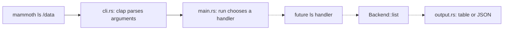
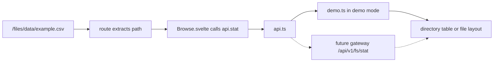

# Find your way around the code

Start at an entry point and follow one request. You do not need to read every
crate before making a change.

## The repository structure

```text
Mammoth/
├── Cargo.toml                 Rust workspace members and shared dependencies
├── Cargo.lock                 exact resolved Rust dependency versions
├── rust-toolchain.toml        default Rust toolchain (stable)
├── .cargo/config.toml         cargo xtask command alias
├── .nvmrc                     Node 22 for both frontend apps
├── crates/
│   ├── mammoth-core/src/      shared library; start here after the CLI
│   │   ├── lib.rs             public modules and re-exports
│   │   ├── backend.rs         Backend's seven methods and ByteStream
│   │   ├── types.rs           storage records: FileStatus, Replica, reports
│   │   ├── error.rs           Result alias, errors, stable codes and hints
│   │   └── config.rs          configuration data structures
│   ├── mammoth-cli/src/
│   │   ├── main.rs            process entry point and command dispatch
│   │   ├── cli.rs             clap arguments and subcommands
│   │   ├── output.rs          tables, JSON and errors
│   │   └── commands/mod.rs    home for future command handlers
│   ├── mammoth-local/         GFS teaching model; LocalBackend still to build
│   │   ├── src/gfs.rs         deterministic metadata/worker/lease simulation
│   │   ├── examples/gfs-demo.rs  executable reliability walkthrough
│   │   └── tests/gfs.rs       failure boundaries and mutation-order checks
│   ├── mammoth-viz/           terminal visualization exercise, placeholder
│   ├── mammoth-gateway/       HTTP server exercise, placeholder
│   └── ...                   other planned distributed-system crates
├── examples/parts/examples/   16 independent Rust programs you can run now
├── ui/src/                    Svelte dashboard; detailed tree below
├── web/src/content/docs/      public documentation website pages
├── docs/guide/                learning and contribution guides
├── docs/adr/                  Architecture Decision Records: why we chose X
├── tests/                     planned integration/simulation harness docs
└── xtask/src/main.rs          build UI, generate CLI reference, copy assets
```

A **workspace** groups Rust packages. A **crate** is a compiled Rust library or
binary. A package's `Cargo.toml` declares its dependencies. `src/lib.rs` is a
library entry point; `src/main.rs` is a program entry point. `pub` exposes an
item to other code; `mod` declares a module; `use` brings a name into scope.

For example, `mammoth-core` is the package name in Cargo, but Rust imports use
underscores:

```rust
use mammoth_core::{Backend, Result};
```

This is an import fragment, not a complete executable. See
[the Rust reference](RUST-REFERENCE.md) for the syntax used in this project.

## Follow a CLI request



Solid arrows work today. Dashed arrows need implementation. Reading `cli.rs`
tells you which arguments are accepted, not whether they do anything yet.
`--help` and `--version` are handled by clap before dispatch. Other commands
currently return a friendly `NotImplemented` error.

The trait method in the real code is:

```rust
async fn list(&self, path: &Path) -> Result<Vec<FileStatus>>;
```

Read it left to right: an asynchronous method, borrowing its backend and a
path, returning either a vector (growable list) of file records or an error.
The semicolon means a trait declaration with no implementation here.

Find the implementation later with `rg 'impl Backend' crates`. Right now that
search has no storage implementation; this is an expected scaffold boundary.

The GFS example runs separately: `gfs-demo.rs` → `gfs::Simulation` → separate
worker byte stores and replicated metadata snapshots. It does not use `Backend`,
the gateway or sockets. See [chapter 13](13-gfs-reliability.md) and the
[coverage audit](GFS-COVERAGE.md) before treating the model as service code.

## Follow a dashboard request

```text
ui/src/
├── routes/+layout.svelte         navigation, theme, shared live connection
├── routes/+page.svelte           overview
├── routes/nodes/+page.svelte     workers and sorting
├── routes/files/+page.svelte     root file browser
├── routes/files/[...path]/
│   └── +page.svelte              nested file/directory URL
├── routes/distribution/+page.svelte  charts and history controls
├── routes/jobs/+page.svelte      jobs and task timings
├── routes/cluster/+page.svelte   master metadata
├── lib/components/Browse.svelte decides directory versus file view
├── lib/types.ts                 dashboard JSON shapes (TypeScript)
├── lib/api.ts                   HTTP calls, timeouts, data source selection
├── lib/demo.ts                  deterministic simulated data
├── lib/live.svelte.ts            shared report and connection lifecycle
├── lib/format.ts                size/time formatting and file URL encoding
├── lib/html.ts                  escaping text for HTML chart tooltips
├── lib/charts/                  chart components and shared ECharts setup
└── app.css                      global design tokens and base styles
```



A browser URL and a filesystem path are different values. `fileHref()` encodes
special characters in each filename. `/data/notes#1.txt` must become
`/files/data/notes%231.txt`; otherwise the browser treats `#1.txt` as an anchor.

## Decide where your change belongs

| Change | Start in | Check |
| --- | --- | --- |
| CLI argument or command help | `crates/mammoth-cli/src/cli.rs` | `cargo run -p mammoth-cli -- --help`, `cargo xtask docs` |
| Storage behavior | `crates/mammoth-local/` (chapters 5–6) | Focused tests, then workspace tests |
| Shared storage record or error | `crates/mammoth-core/` | Talk to the other tracks first; build all crates |
| Dashboard text/layout | Route `.svelte` file or reusable component | `npm run check`, browser at narrow and wide widths |
| Async request bug | `api.ts`, `live.svelte.ts`, consuming component | `npm test`, delayed/failing responses |
| API shape | `ui/src/lib/types.ts` and future gateway adapter | [API contract](API-CONTRACT.md) and fixtures |
| Public docs text | `web/src/content/docs/` | `npm run build` in `web/` |
| CLI reference | `cli.rs`, then generate | Never hand-edit the generated reference |
| Beginner explanation | `docs/guide/` | Run commands and check relative links |

## A small debugging routine

1. Reproduce one specific symptom. Example: “Opening a file named `a#b.txt`
   goes to the wrong page.”
2. Trace input → transformation → output. Here: raw path → URL → route parameter.
3. State what should be preserved: the literal `#` belongs to the filename.
4. Fix the smallest responsible function (`fileHref`), then use it at callers.
5. Add a regression test for the broken behavior and check the real page.

A regression test fails before the bug fix and passes after it. It records the
behavior your teammates should preserve, not every internal implementation step.
