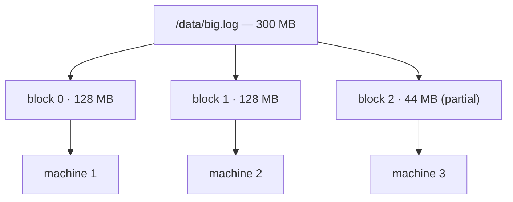
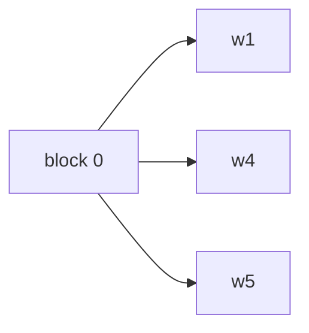
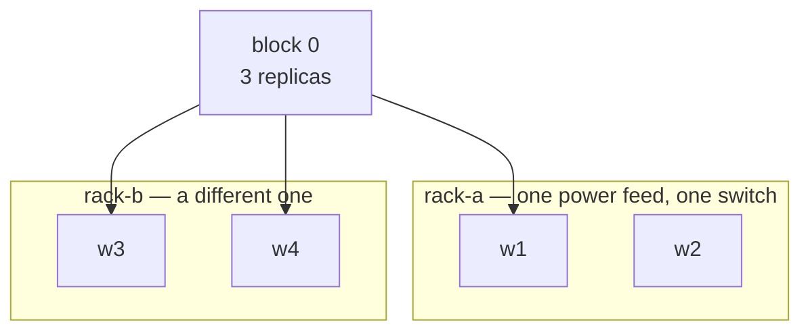
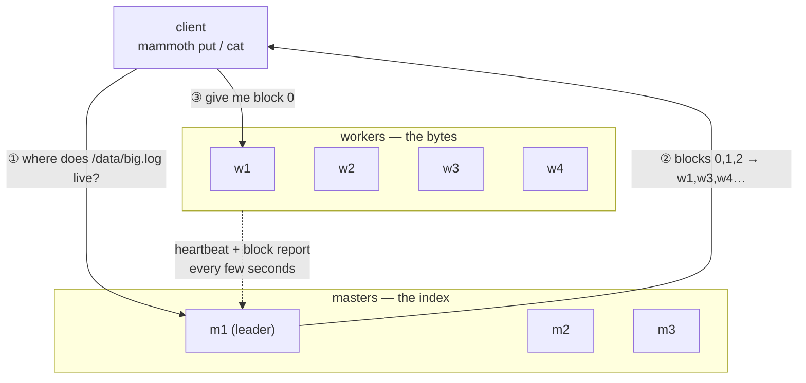
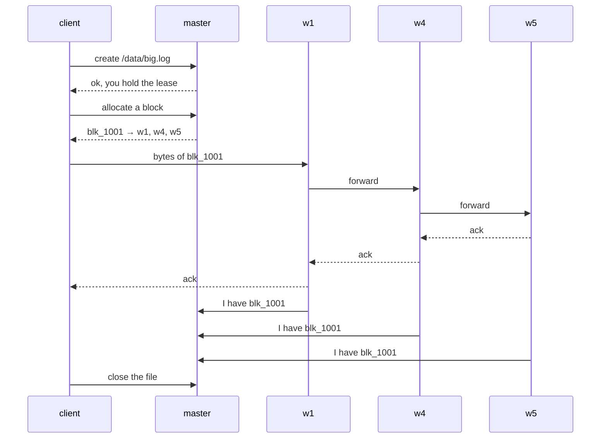
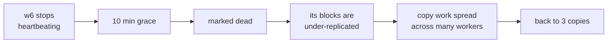

# Distributed storage, from zero

**Read this if you have never built — or used — a system like this.** It takes
about forty minutes, it involves no code, and it is the difference between
typing chapters 5 and 6 and *understanding* them.

Nothing here is Mammoth-specific until the last section. These are the ideas
behind HDFS, GFS, Ceph, S3 and every other system in this family, and once you
have them, the code in this repository stops looking arbitrary.

The [glossary](GLOSSARY.md) defines every term in one line. This page explains
*why the terms exist*.

---

## 1 · The three walls

You have a file. It grows. Eventually you hit a wall — and it is worth being
precise about which one, because they need different answers.

**Wall 1: capacity.** The file is bigger than any disk you can buy. A 400 TB
dataset does not fit on a 20 TB drive, and there is no drive coming that fixes
this, because the data grows faster than the drives do.

**Wall 2: throughput.** Suppose it did fit. One disk reads at roughly 200 MB/s.
Reading 400 TB at 200 MB/s takes **23 days**. Even if the capacity problem
vanished, the time problem would still make the data useless.

**Wall 3: failure.** Disks die. The rule of thumb is 1–2% of drives per year, so
in a rack of a hundred disks, something dies most months. On one machine, a dead
disk is a bad afternoon. Across a thousand machines it is Tuesday, and a design
that treats failure as an exception will spend all its time in the exception
path.

Every idea in the rest of this page is an answer to one of those three.

## 2 · The one idea

Cut the file into pieces, and put the pieces on different machines.



That is the whole trick, and it answers two walls at once:

- **Capacity** — the file is now limited by the *total* disk in the cluster, not
  by the largest single disk.
- **Throughput** — the three pieces sit on three machines with three disks, so
  they can be read **at the same time**. Three disks read three times as fast.
  Three hundred disks read three hundred times as fast, and the 23-day read
  becomes under two hours.

Those pieces are called **blocks**. The file no longer exists anywhere as a
single object — it exists as a *recipe*: "block 0, then block 1, then block 2".

### Why 128 MB and not 4 KB or 4 GB?

Your laptop's filesystem uses 4 KB blocks. Mammoth uses 128 MB — thirty thousand
times bigger. Both numbers are right for their job, and understanding why is
most of understanding this whole design.

The block size trades two costs against each other:

| Smaller blocks | Bigger blocks |
| --- | --- |
| Less waste on the last, partial block | Fewer blocks to keep track of |
| Work spreads across more machines | Less bookkeeping per byte read |
| **More entries in the metadata** | **Coarser parallelism** |

The metadata is the binding constraint. Something has to remember where every
block lives, and that "something" keeps its index in memory to answer fast.
Each block costs roughly 250 bytes of that index. So:

| Block size | Blocks in 1 PB | Metadata |
| --- | --- | --- |
| 4 KB | 268 billion | ~62 TB — impossible |
| 1 MB | 1.07 billion | ~250 GB — painful |
| **128 MB** | **8.4 million** | **~2 GB — comfortable** |
| 4 GB | 262 thousand | ~65 MB, but a 4 GB file gets one machine's worth of speed |

128 MB sits where the metadata is small enough to hold in memory and the blocks
are still numerous enough to spread work widely. It is also comfortably larger
than a disk seek is expensive: at 200 MB/s a 128 MB read takes 640 ms, so the
~10 ms of seek and setup is under 2% overhead. At 1 MB it would be 50%.

> **This is the number you will see everywhere.** `block_size` in `FileStatus`,
> `--block-size` on `mammoth put`, the `128 * 1024 * 1024` default in chapter 5.
> Now you know where it comes from.

## 3 · Replication: the answer to wall 3

Cutting the file up has made failure *worse*, not better. A file spread over
three machines now dies if **any** of the three dies. Spread over three hundred,
it is essentially guaranteed to be broken at all times.

The fix is unglamorous: keep every block more than once.



Three copies is the near-universal default, and the reasoning is worth
following because "why not two" is the obvious question.

With one copy, one disk failure loses data. With two copies you are safe from
one failure — but while you are *rebuilding* the lost copy, which takes minutes
to hours, you are back down to one copy, and a second failure during that window
is fatal. **Three copies means a second failure during a rebuild is survivable,
and a third would have to arrive in the same window.** The probability falls off
a cliff between two and three, and much more gently between three and four.

The cost is that you store 3 bytes for every 1 byte of data. That is why
erasure coding exists — it gets similar durability for about 1.5× — and why it
is a later milestone rather than the starting point: it is far more complex and
makes recovery much more expensive in network traffic.

### Racks: the failure that takes ten machines at once

Three copies on three machines protects you from three *independent* failures.
Real failures are not independent.

Machines live in **racks**: a cabinet of perhaps 20–40 machines sharing a power
feed and a top-of-rack network switch. When the power supply fails or someone
unplugs the wrong cable, all forty machines go at once. Three copies in one
rack is, for that failure, one copy.



So placement follows a rule: **the first copy goes wherever there is room, and
at least one copy goes in a different rack.** The usual arrangement is one
replica in rack A and two in rack B, which survives losing either rack while
keeping most writes on one fast intra-rack link.

A rack is a specific case of a **failure domain** — any set of machines that
tend to fail together. In a cloud deployment the failure domain is an
availability zone; in a single-room cluster it is a power circuit. The idea is
the same, and the placement code does not care which one you mean.

> **This is the rule you write in chapter 5**, the one `viz blocks` draws in
> chapter 8, and the reason chapter 8's `⚠` warning exists at all. A system that
> silently put all three copies in one rack would look completely healthy right
> up until it was not.

## 4 · Who keeps track: masters and workers

Two jobs, two kinds of machine, and keeping them separate is the central
architectural decision.



**Workers** store blocks. A worker is a machine with disks; it knows nothing
about files, directories or filenames. It has a pile of blocks with numeric
IDs, and it will hand one over or take a new one.

**Masters** store the namespace: which files exist, what they are called, who
owns them, and which blocks make up each file. Masters store **no file data at
all** — the total volume of a master's state is a few gigabytes for a petabyte
cluster.

The split matters because the two have completely different needs. Metadata is
small, must be perfectly consistent, and is read constantly — so it lives in
memory and is replicated by a consensus protocol. Data is enormous, is read in
big sequential gulps, and can tolerate being slightly stale on one replica — so
it lives on spinning disks and is replicated by simply copying it.

**And notice step ③.** The client asks the master *where*, and then talks to the
worker directly. The bytes never pass through the master. That single decision
is what lets one master serve a thousand workers: it handles a few thousand
small questions a second while the workers move gigabytes.

## 5 · What a write actually does

Follow `mammoth put ./big.log /data/big.log` all the way through. Every step
here is something chapter 5 or 6 has you implement, in simplified form.



Four things in there are worth naming, because each one is a decision somebody
made and could have made differently:

**The lease.** One writer at a time, per file. The master grants a lease so two
clients cannot interleave writes into the same file. It expires, so a client
that dies mid-write does not lock the file forever.

**The pipeline.** The client sends the bytes *once*, to the first worker, which
forwards to the second, which forwards to the third. The alternative — the
client sending three copies itself — would use three times the client's
bandwidth and is what a naive implementation does. (Chapter 12 §2 goes further
and makes this one hop instead of three.)

**The acknowledgement chain.** The write is not durable until the last worker
has it. The acks travel back the way the data came.

**The block report.** Workers tell the master what they hold. Crucially the
master does not *decide* what a worker has and remember it — it *learns* it,
repeatedly, from the workers. If a master restarts, it rebuilds its picture of
the world from the reports. This is why a master can lose its memory and
recover, and why "safe mode" exists (§8).

## 6 · What a read does

Simpler, and this simplicity is the reward for all the write-side machinery.

1. Ask the master for the block list of `/data/big.log`.
2. For each block, the master returns the workers holding it, **sorted by
   distance from you** — same machine first, then same rack, then anywhere.
3. Read block 0 from the nearest worker holding it. Then block 1. Then block 2.

Two properties fall out for free:

- **A dead worker is invisible.** Three copies means two other places to ask.
  The read does not fail; it does not even slow down noticeably.
- **Parallel reads are automatic.** Ten clients reading the same file spread
  themselves across the replicas without anyone coordinating it.

The "sorted by distance" step is why the system knows about racks for a second
reason: not only durability, but choosing the copy on the near side of the slow
link.

## 7 · How a cluster notices death, and heals

Every worker sends a **heartbeat** to the master every few seconds: I am alive,
here is my free space, here is my load. It is a small message and it is the
entire liveness mechanism.

When heartbeats stop, the master waits — usually around ten minutes. That delay
looks absurd the first time you see it, and it is deliberate: a worker rebooting
for a kernel patch is back in three minutes, and re-replicating its whole disk
would move terabytes across the network to fix a problem that fixed itself.
**Distinguishing "slow" from "dead" is genuinely hard, and being impatient about
it is expensive.**

Past the deadline, the master marks the worker dead and every block it held is
now under-replicated. The master queues those blocks for re-replication and
hands the work out to *many* workers at once, so the rebuild is limited by the
cluster's aggregate bandwidth rather than by any one machine.



Two things stay true throughout, and they are the reason this design is worth
the trouble: **reads never fail** — two copies remained the whole time — and
**nobody was paged**. A human finds out later that a disk died, from a
dashboard, and replaces it whenever convenient.

That whole loop is what [example 03](../../examples/03-kill-a-node/) demonstrates,
and it is the single best demo this project has.

## 8 · The four things that make this hard

If it were only §2–§7 you could build it in a fortnight. Here is what actually
makes distributed storage a serious engineering problem.

**The master is a single point of everything.** One machine holding the index
that every operation needs. Lose it and the data is intact but unreachable —
you have a warehouse full of unlabelled boxes. So masters are replicated,
usually three of them, agreeing via a consensus protocol (Raft) on every change
to the namespace. That is a large piece of machinery, it is subtle, and it is
milestone M4 for a reason.

**Metadata lives in memory.** ~250 bytes per block, and every operation touches
it. Hold a billion blocks and you need hundreds of gigabytes of RAM in one
process — which is exactly the wall HDFS hit, and exactly why a garbage-collected
runtime hurts: a full GC pause on a 200 GB heap is measured in *seconds*, during
which the whole cluster is frozen. This is the specific reason Mammoth is
written in Rust rather than on the JVM, and it is not a stylistic preference.

**Safe mode.** When a master starts, it knows the namespace (from its log) but
not where anything physically is — that knowledge lives in the workers. So it
waits, collecting block reports, refusing writes until enough of the cluster has
reported in. On a big HDFS cluster this takes 30–45 minutes, which is the single
most-hated property of the system. (Chapter 12 §4 is about making it seconds.)

**The small file problem.** Metadata cost is *per block*, not per byte. A
million 1 KB files cost the same index space as a million 128 MB files —
250 MB of master memory to store 1 GB of data. This is why systems in this
family are so bad at many-small-files workloads, and Mammoth's answer is
**inlining**: a file below a threshold has its bytes stored *in* the metadata
entry, with no block allocated at all. You implement this in chapter 6, and it
is why `mammoth stat` has an `inlined` field.

## 9 · What this system deliberately is not

Knowing the limits is as useful as knowing the features, and every one of these
is a trade someone made on purpose.

| It is not | Because |
| --- | --- |
| A general-purpose filesystem | No random writes. Write once, read many. Modifying byte 500 of a replicated 128 MB block means rewriting three copies |
| A database | No transactions, no indexes, no queries. It stores bytes |
| Low-latency | Optimised for reading gigabytes, not for reading 100 bytes quickly. A read costs a round trip to the master first |
| POSIX-compliant | No hard links, no `mmap`, and a `close()` that can fail in ways ordinary programs do not expect |
| Good at small files | See §8. Inlining softens this; it does not remove it |

**Write once, read many** is the assumption underneath all of it. Relax that and
almost every simplification above stops working.

## 10 · The vocabulary, translated

Every system in this family has the same parts under different names. You will
meet all of these in blog posts and Stack Overflow answers, so it is worth being
able to translate:

| Idea | Mammoth | HDFS | GFS | Ceph | S3 |
| --- | --- | --- | --- | --- | --- |
| The index | master | NameNode | master | MON + MDS | (hidden) |
| Stores bytes | worker | DataNode | chunkserver | OSD | (hidden) |
| A piece of a file | block | block | chunk | object | part |
| "I'm alive" | heartbeat | heartbeat | heartbeat | heartbeat | — |
| "Here's what I hold" | block report | block report | — | — | — |
| Startup wait | safe mode | safe mode | — | — | — |

Mammoth uses "master" and "worker" because they say what the machines do.
HDFS's "NameNode" is the same thing, and if you are reading Hadoop
documentation — [the Hadoop primer](../../web/src/content/docs/intro/hadoop-primer.md)
is the fast version — the translation is one-for-one.

## 11 · Where each idea shows up in the guide

You are not going to build all of this. Chapters 0–9 build a **single-machine
version** with everything simulated: six "workers" that are six directories on
your laptop, a "master" that is a metadata file, and no network at all.

That sounds like a cop-out. It is not, and here is why: the *shapes* are all
real. Blocks are real blocks. The placement rule is the real placement rule. The
`Backend` trait is the real interface. When somebody later writes
`ClusterBackend` with real machines, **the CLI, the visualizations and the web
UI do not change**, because they were never talking to your laptop — they were
talking to the trait.

| Idea | Where you build it | Where you see it |
| --- | --- | --- |
| Blocks (§2) | [ch 6](06-localbackend-part-2.md) | `mammoth stat` |
| Replication (§3) | [ch 5](05-localbackend-part-1.md) | `mammoth viz blocks` |
| Rack placement (§3) | [ch 5](05-localbackend-part-1.md) | [ch 8](08-viz-blocks.md), the `⚠` |
| Master / worker split (§4) | the `Backend` trait, [ch 4](04-the-backend-trait.md) | every command |
| Writing (§5) | [ch 6](06-localbackend-part-2.md) | `mammoth put` |
| Reading (§6) | [ch 6](06-localbackend-part-2.md) | `mammoth cat` |
| Heartbeats and healing (§7) | milestone M5 | [example 03](../../examples/03-kill-a-node/) |
| Consensus, safe mode (§8) | milestone M4, [ch 12 §4](12-the-fast-paths.md) | — |
| Inlining (§8) | [ch 6](06-localbackend-part-2.md) | `mammoth stat`, `inlined: true` |

## Check you understand it

Answer these out loud, as a team, before you start chapter 4. If two of you
disagree about any one of them, sort it out now — it is much cheaper than
sorting it out in week 4.

```markdown
- [ ] Why is the block size 128 MB and not 4 KB? Name the constraint
- [ ] Why three copies and not two? What happens during a rebuild?
- [ ] Why is it not enough for the three copies to be on three machines?
- [ ] Why do the bytes not travel through the master?
- [ ] A worker is unplugged. What does a client reading that file experience?
- [ ] Why does the master wait ten minutes before declaring a worker dead?
- [ ] Why is a million 1 KB files worse than one 1 GB file?
- [ ] What does "write once, read many" rule out?
```

---

**Next:** [Chapter 0 — Set up your machine](00-setup.md) if you have not
already, or [chapter 4 — the Backend trait](04-the-backend-trait.md) if you have.

**See also:** [the glossary](GLOSSARY.md) for one-line definitions ·
[the roadmap](../ROADMAP.md) for which milestone builds what ·
[chapter 12](12-the-fast-paths.md) for where Mammoth departs from this design
