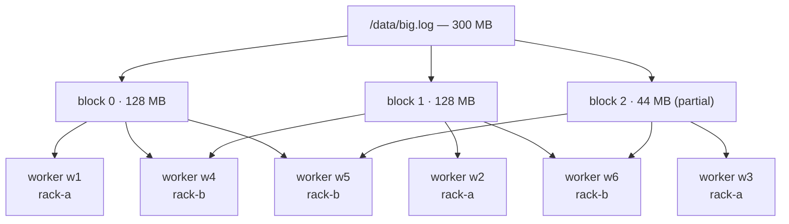
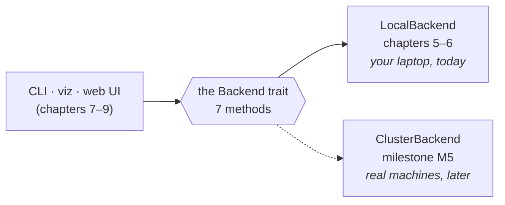
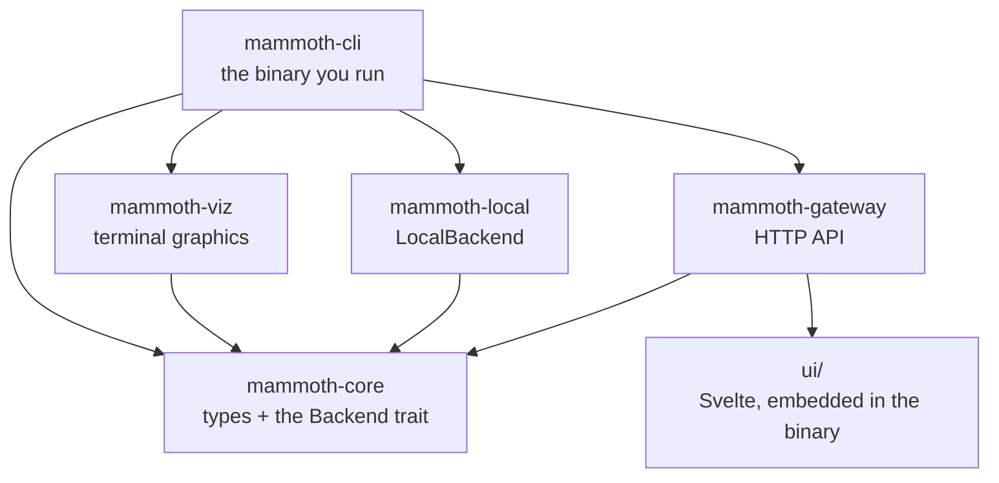

# The Mammoth build guide

A step-by-step guide to building Mammoth from the scaffold in this repository,
written for people who have not built a distributed system before.

You do not need to know Rust well. You do not need to know Hadoop at all. You do
need to be willing to type things and read error messages.

---

## Start here

| If you are… | Go to |
| --- | --- |
| **On your own, day one** | [Chapter 0 — Set up your machine](00-setup.md) |
| **A team of three, starting today** | [The three-person plan](TEAM-PLAN.md) |
| **Lost in a word you do not recognise** | [The glossary](GLOSSARY.md) |
| **About to commit, or review a PR** | [The checklists](CHECKLISTS.md) |
| **Wondering what you are even building** | the next section |

---

## What are you actually building?

A **distributed filesystem**: software that stores files too big for one
computer by cutting them into pieces and spreading the pieces over many
machines. You still type `ls /data/logs` and it still looks like one directory
tree. Hiding the thirty machines is the whole job.

Concretely, here is what a 300 MB file looks like inside Mammoth:



Three things to notice, because they are the three ideas the whole project is
built on:

1. **The file is cut into blocks.** That is how it fits on many machines, and how
   reading it can use many disks at once.
2. **Every block exists three times.** Disks die. Three copies means one death
   costs you nothing.
3. **The copies are never all in one rack.** A rack is a cabinet of machines
   sharing one power supply. All three copies in one rack means one unplugged
   cable loses the data — so the placement rule in chapter 5 forbids it.

Every unfamiliar word above is in [the glossary](GLOSSARY.md).

### What you will have at the end

By the end of chapter 8 you can do this, for real, on your laptop:

```bash
mammoth put ./big.log /data/big.log
mammoth ls /data
mammoth cat /data/big.log | head
mammoth viz blocks /data/big.log
```

…and that last one draws your file's blocks and their replicas as a picture in
your terminal. By the end of chapter 9 the same thing is a web dashboard anyone
can open in a browser.

### The trick that makes this possible in weeks instead of months

Real distributed systems take months before they do anything you can show
someone. Mammoth cheats, deliberately:



Everything you build talks to **one trait** with seven methods. First you write
`LocalBackend`, where the "cluster" is six directories on your laptop. Later
someone writes `ClusterBackend` with real machines and a real network — and
**not one line of the CLI, the visualizations, or the web UI changes.**

That is [chapter 4](04-the-backend-trait.md), and it is the most important half
hour in this guide.

---

## The code you will be working in

Sixteen crates sounds like a lot. You will touch five of them, and only three in
depth.

```
Mammoth/
├── crates/
│   ├── mammoth-core/         ← the shared vocabulary. Read it, rarely change it
│   │   └── src/
│   │       ├── backend.rs        the Backend trait          ch 4
│   │       ├── types.rs          FileStatus, BlockPlacement, Replica…
│   │       ├── error.rs          the Error type and Result alias
│   │       └── config.rs
│   ├── mammoth-local/        ← you build this                ch 5, 6
│   ├── mammoth-cli/          ← you build this                ch 2, 7
│   │   └── src/
│   │       ├── cli.rs            the command tree (clap)
│   │       ├── main.rs           dispatch
│   │       ├── output.rs         the Render trait: table or JSON
│   │       └── commands/         one file per command
│   ├── mammoth-viz/          ← you build this                ch 8
│   ├── mammoth-gateway/      ← you build this                ch 9
│   └── … 11 more, all stubs for later milestones
├── ui/                       ← the Svelte dashboard          ch 9
├── web/                      ← the documentation site        ch 10
├── docs/
│   ├── guide/                ← you are here
│   ├── adr/                     architecture decisions, and why
│   └── ROADMAP.md               the milestones M1…M8
└── Cargo.toml                ← the workspace: which crates exist
```

And how they depend on each other — note that everything points *inward* to
`mammoth-core`, and nothing points back out:



That shape is not an accident. `mammoth-core` knows nothing about the CLI, the
UI, or how blocks are stored — so all three can change without touching it.

---

## How this guide works

Each chapter is a **complete, working step**. You start it with a repository
that builds, and you end it with a repository that still builds and does one
more thing than it did before. Nothing is left half-finished between chapters.

Every chapter has the same shape:

| Section | What it gives you |
| --- | --- |
| **What you'll build** | one sentence |
| **Before you start** | what must already be true, and what to have open |
| **Why it matters** | so you are not just typing |
| **The code** | complete, not fragments |
| **Check it works** | an exact command and its exact expected output |
| **Done when** | a checklist to tick before you move on |
| **If it went wrong** | the three errors people actually hit |
| **Commit it** | the commit message to use |

> **Verified code.** Every Rust block in chapters 1, 2 and 4–8 was assembled
> exactly as written here, compiled, and run — `cargo clippy -- -D warnings`
> clean, tests passing — before this guide was published. The terminal output
> shown is real output, captured from those runs, not illustration. Chapter 10's
> build steps and expected output were verified the same way.
>
> The exceptions are **chapter 9**, whose Rust and Svelte are written to the
> same standard but were not machine-verified end to end, and **chapter 12**,
> which is a design chapter: its §0 is real code you can run today, and §1–§4
> describe machinery that does not exist yet. Treat both as a solid starting
> point rather than a guarantee, and treat every number in chapter 12 as a
> target derived from a cost model rather than a benchmark.
>
> So if you type something in and it does not work, the likely cause is a typo
> or a skipped step. Read the "If it went wrong" section at the end of each
> chapter — it lists the errors people actually hit.

### If you have never used a guide like this

- **Type the code, do not paste it.** You will read it properly, and you will
  learn far more from the typos than from the working version.
- **Do not skip "Check it works".** It is the difference between "I think that
  worked" and knowing.
- **Errors are the normal state.** Rust's compiler errors are unusually good —
  they usually name the fix. Read the whole message, including `help:`.
- **A chapter takes longer the first time.** The times listed are for someone
  not stopping to look things up. Double them and be pleasantly surprised.

---

## The chapters

### Part 1 — Getting started

Everyone on the team does all four of these, in week one.

| # | Chapter | Time | You end with |
| --- | --- | --- | --- |
| 0 | [Set up your machine](00-setup.md) | 30 min | A repo that builds |
| 1 | [The 30-minute Rust you actually need](01-rust-you-need.md) | 30 min | Enough Rust to read chapters 4–8 |
| 2 | [Your first change](02-first-change.md) | 20 min | `mammoth version`, a real command |
| 3 | [How the team works together](03-team-workflow.md) | 20 min | A merged PR and a habit |

### Part 2 — Building the storage engine

| # | Chapter | Time | You end with |
| --- | --- | --- | --- |
| 4 | [Understanding the Backend trait](04-the-backend-trait.md) | 30 min | The idea the whole project rests on |
| 5 | [LocalBackend, part 1 — layout, list, stat](05-localbackend-part-1.md) | 2 h | `list` and `stat` really working |
| 6 | [LocalBackend, part 2 — write, read, blocks](06-localbackend-part-2.md) | 3 h | Files that round-trip through blocks |
| 7 | [Wiring up the CLI](07-wiring-the-cli.md) | 2 h | `ls`, `put`, `cat`, `stat` |
| 8 | [`viz blocks` — seeing your data](08-viz-blocks.md) | 2 h | Your data, drawn |

### Part 3 — Shipping it

| # | Chapter | Time | You end with |
| --- | --- | --- | --- |
| 9 | [The web UI and the gateway](09-web-ui.md) | 4 h | A browser dashboard |
| 10 | [Publishing the docs to GitHub Pages](10-github-pages.md) | 45 min | A live public docs site |
| 11 | [Where to go next](11-what-next.md) | 15 min | A decision about what is next |

### Part 4 — Going faster than Hadoop

| # | Chapter | Time | You end with |
| --- | --- | --- | --- |
| 12 | [The four fast paths](12-the-fast-paths.md) | 90 min | The design for the distributed half |

Chapters 0–8 get you to **milestone M1–M2** in the [roadmap](../ROADMAP.md):
a working single-machine filesystem with the visualization that makes this
project worth building. Chapter 10 stands alone — you can do it on day one, and
you probably should, because a live docs site makes the project feel real.

Chapter 12 is the design for the distributed half: how a read gets down to one
round trip, how a write goes out in one hop instead of three, how a dead node is
rebuilt by the whole cluster at once, and how a master restarts in seconds
instead of half an hour. Read it before you write `mammoth-master` or
`mammoth-worker` — two of the four are *simpler* than the HDFS approach, and all
four are far cheaper to build than to retrofit.

---

## Track your progress

Copy this into a pinned GitHub issue and tick as you go. The fuller version,
with milestones and owner slots, is in [the checklists](CHECKLISTS.md#the-whole-guide--progress-tracker).

```markdown
- [ ] 0 · Set up your machine
- [ ] 1 · The 30-minute Rust you actually need
- [ ] 2 · Your first change
- [ ] 3 · How the team works together
- [ ] 4 · Understanding the Backend trait
- [ ] 5 · LocalBackend, part 1
- [ ] 6 · LocalBackend, part 2
- [ ] 7 · Wiring up the CLI
- [ ] 8 · viz blocks
- [ ] 9 · The web UI and the gateway
- [ ] 10 · Publishing the docs
- [ ] 11 · Where to go next
- [ ] 12 · The four fast paths
```

---

## The one rule

**Never commit code that does not build.** Before every commit:

```bash
cargo build --workspace
cargo test --workspace
```

If either fails, fix it before committing. A broken `main` branch blocks
everyone on the team, and un-breaking it is always harder than not breaking it.

The full pre-commit routine — and a Git hook that runs it for you so you cannot
forget — is in [the checklists](CHECKLISTS.md#before-every-commit-the-30-second-one).

## If you get stuck

1. **Read the error message.** All of it. Rust's compiler errors are unusually
   good — they usually tell you the fix.
2. **Run `cargo build` again.** Sometimes you fixed it and did not notice.
3. **Check you are in the right directory.** `pwd` should end in `/Mammoth`.
4. **Look up the word.** [The glossary](GLOSSARY.md) covers every term this
   guide uses, including the Rust and Git ones.
5. **Work down [the stuck checklist](CHECKLISTS.md#i-am-stuck).** It is eight
   boxes and it usually ends before the last one.
6. **Ask.** Open a [discussion](https://github.com/ProjectOrcha/Mammoth/discussions)
   or an issue. Paste the *full* error, not a screenshot of part of it.
