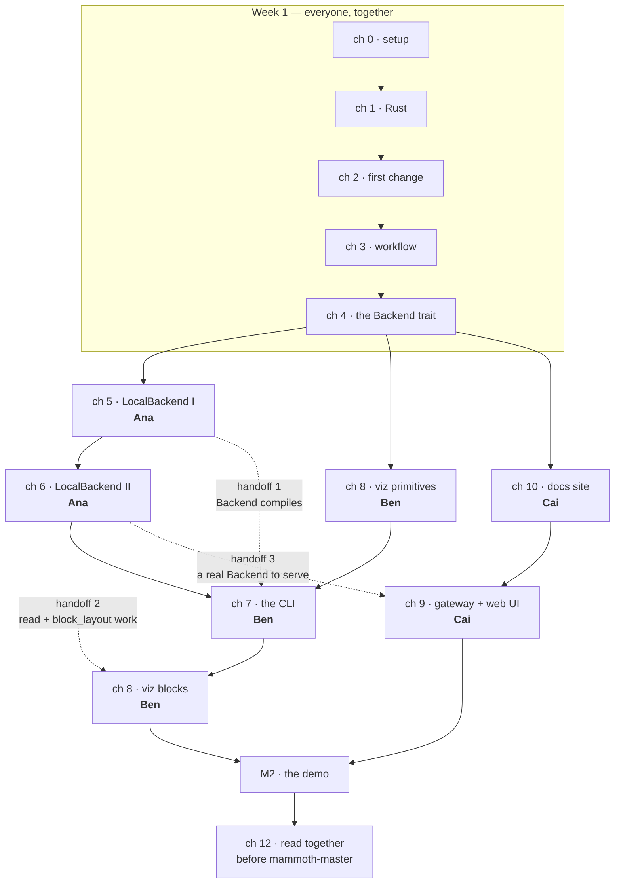

# The three-person plan

This guide is written for a team of exactly three. This page is how the three of
you split it up, in what order, and what you owe each other.

If you read only one thing here, read [the handoff contracts](#the-three-handoff-contracts).
Everything else is scheduling; those are the promises that stop the project
deadlocking.

---

## The shape of the problem

Chapters 5–10 are *nearly* independent. Nearly. There are exactly three places
where one person has to wait for another, and if you plan around those three,
all three of you can work every day without stepping on each other.



The dotted lines are the only three moments anyone waits. Names are placeholders
— put your own in.

---

## Who does what

Pick these on day one and write the real names into the table. Do not leave it
implicit; "we'll figure it out" is how two people write the same function.

| | Track | Chapters | Files they own | Skills it builds |
| --- | --- | --- | --- | --- |
| **Ana** | Storage | 5, 6 | `crates/mammoth-local/` | Rust, async I/O, filesystem layout, tests |
| **Ben** | Interface | 7, 8 | `crates/mammoth-cli/`, `crates/mammoth-viz/` | Rust, CLI design, terminal graphics |
| **Cai** | Surface | 9, 10 | `ui/`, `crates/mammoth-gateway/`, `web/` | TypeScript, Svelte, HTTP, CI/CD |

"Owns" means: **they make the final call inside those directories, and they are
the default reviewer for changes to them.** It does not mean nobody else may
touch the files.

### How to choose

- Whoever is **most comfortable with Rust** takes **Ana's track**. Chapters 5–6
  are the deepest Rust in the guide, and everyone else is downstream of them.
- Whoever likes **making things look right** takes **Ben's track**. Chapter 8 is
  the part people will screenshot.
- Whoever has **any web experience at all** takes **Cai's track**. Chapter 9 is
  TypeScript and HTTP, not Rust.
- Nobody has web experience? Give Cai chapter 10 first — it is 45 minutes, it
  ships a live site on day one, and it is a genuinely good confidence-builder.

### Everyone reads, nobody owns

Three chapters are not on anyone's track because all three of you need them:

- **Chapter 4** — read it together, out loud, before splitting up. It is the
  contract between all three tracks. Disagreeing about it in week 3 costs a week.
- **Chapter 11** — read after M2, together, to decide what comes next.
- **Chapter 12** — read together before *anyone* writes `mammoth-master`. Two of
  its four ideas are simpler than the alternative, and all four are far cheaper
  to build in than to retrofit.

---

## The three handoff contracts

A handoff is a promise: "when I say this is done, here is exactly what you can
rely on." Written down, they let the person downstream start planning before the
work lands.

### Handoff 1 — Ana → Ben, end of chapter 5

**Ana delivers:** `LocalBackend` exists, compiles, and implements the *whole*
`Backend` trait. `list` and `stat` really work; the other five may be
`unimplemented!()`.

**Ben can then:** build the whole of chapter 7's argument parsing, backend
opening, and `ls` / `stat` commands.

**Ben must not:** rely on `read`, `write` or `block_layout` yet.

The reason this works is the trait: **the day it compiles, every method
signature is final**, even where the bodies are stubs. Ben writes against
signatures, not implementations.

### Handoff 2 — Ana → Ben, end of chapter 6

**Ana delivers:** `write`, `read`, `remove`, `block_layout` and `cluster_report`
all really work, with tests.

**Ben can then:** finish `put` and `cat` in chapter 7, and `viz blocks` in
chapter 8 against real data.

### Handoff 3 — Ana → Cai, end of chapter 6

**Ana delivers:** the same thing. Cai needs a working `Backend` for the gateway
to serve.

**Cai can then:** wire the API endpoints to real data.

---

## Nobody waits: work against fake data

The handoffs above look like Ben and Cai sit idle for a week. They do not, and
this is the most useful trick in the guide:

> **Write your layer against hand-made fake data, then delete the fake data when
> the real thing arrives.**

Ben, on day one, without any of Ana's code:

```rust
// crates/mammoth-viz/src/lib.rs — temporary, delete after handoff 2
#[cfg(test)]
fn fake_layout() -> Vec<mammoth_core::BlockPlacement> {
    use mammoth_core::{BlockId, BlockPlacement, NodeId, Replica, ReplicaState};
    vec![BlockPlacement {
        id: BlockId(1001),
        index: 0,
        len: 128 * 1024 * 1024,
        replicas: vec![
            Replica { node: NodeId("w1".into()), rack: "/dc1/rack-a".into(), state: ReplicaState::Primary },
            Replica { node: NodeId("w4".into()), rack: "/dc1/rack-b".into(), state: ReplicaState::Replica },
            Replica { node: NodeId("w5".into()), rack: "/dc1/rack-b".into(), state: ReplicaState::Corrupt },
        ],
    }]
}
```

That is enough to build and *see* the entire block matrix — three replica
states, two racks, a full block — before `LocalBackend` can produce a single
byte. When handoff 2 lands, swap `fake_layout()` for `backend.block_layout(path)`
and delete the function.

The same trick works for Cai: serve a hard-coded JSON blob from the gateway,
build the entire Svelte dashboard against it, then point it at the real backend.

**Why this is safe:** everyone is coding against the same types from
`mammoth-core`. If your fake data compiles, it has the same shape as the real
data. That is chapter 4's promise, cashed in.

---

## A six-week shape

Adjust the weeks to your actual pace — the *order* is the part that matters.

| Week | Ana | Ben | Cai | Ends with |
| --- | --- | --- | --- | --- |
| **1** | ch 0–4 | ch 0–4 | ch 0–4 | Everyone set up, everyone has merged one PR, chapter 4 agreed |
| **2** | ch 5 | ch 8 primitives + fake data | ch 10 (docs site live) | **Handoff 1.** A live docs site — the project feels real |
| **3** | ch 6 | ch 7 `ls` / `stat` | ch 9 API against fake JSON | Real files listable from the CLI |
| **4** | ch 6 finish + tests | ch 7 `put` / `cat` | ch 9 Svelte dashboard | **Handoffs 2 & 3.** A file round-trips |
| **5** | help Ben; harden tests | ch 8 `viz blocks` for real | ch 9 wire to real backend | **M2.** The demo works end to end |
| **6** | ch 11 + ch 12 together | ch 11 + ch 12 together | ch 11 + ch 12 together | A decision about what to build next |

Week 2 is worth defending: Cai ships a live documentation site while the others
are still deep in Rust. **Something public existing in week 2 changes how the
team feels about the project** far more than the 45 minutes it costs.

---

## The rhythm

Three people do not need process. They need three habits.

### Daily — a ten-minute standup

Same time, every day, in a text channel is fine. Three sentences each:

1. What I finished yesterday
2. What I am doing today
3. What I am blocked on — **and who can unblock it**

That is it. If it goes past ten minutes, the conversation that caused the overrun
should be its own call with only the people it involves.

### Weekly — a demo

Friday, thirty minutes, run the actual binary. Not slides. Someone types
`mammoth ls /data` in front of the other two.

This catches the specific failure mode of a three-person team: **three people
each building something that works alone and does not compose.** It surfaces in
week 2 at a demo, or in week 5 at the deadline. Pick week 2.

### On merge — pull `main`

Whoever merges says so in the channel. Everyone else runs:

```bash
git checkout main && git pull
```

Ten seconds, and it prevents the merge conflicts nobody enjoys.

### Reviews — a rota

With three people, review is a ring. Nobody has to ask who will look at it:

```
Ana's PRs  →  Ben reviews
Ben's PRs  →  Cai reviews
Cai's PRs  →  Ana reviews
```

If your reviewer is out, the third person covers. The [PR checklists](CHECKLISTS.md#opening-a-pr)
say what to look at.

**One rule about timing:** every PR gets a **first response within one working
day**. Not necessarily approval — a response. On a three-person team a PR
sitting for two days is a third of the project stopped, which is always worse
than whatever is wrong inside the PR.

---

## When it goes wrong

### Someone is stuck for more than half a day

Say so at standup. That is what standup is for. Half a day is the threshold
because it is short enough that the sunk cost is bearable and long enough that
you genuinely tried.

If two of you are stuck on the same thing, stop and pair on it. Two people on
one problem for an hour beats two people on two problems for a day.

### One track is falling behind

The tracks are not equal in size — Ana's is the biggest. If chapter 6 is
running long, the right move is **Ben helps Ana**, not "Ben starts chapter 9 too".
Chapters 5–6 block everyone; nothing else does.

### Someone drops out or goes on holiday

Their track stalls, and that is survivable if the handoff contracts held. Before
anyone is away for more than a day, they should:

- Push their branch, even half-finished — **a pushed broken branch is infinitely
  more useful than a perfect one on a closed laptop**
- Write what state it is in and what the next step is, in the PR description
- Say which of the three handoffs they were about to hit

### `main` is broken

Whoever notices, reverts. Not "whoever broke it" — whoever notices.

```bash
git revert <the-commit-hash>
git push
```

No blame, no discussion first. Un-break `main`, then work out what happened. And
never `git reset --hard` or `git push --force` on a shared branch; that is how
people lose work.

### You disagree about a design

Small disagreement: whoever owns the files decides, and the other person lets it
go. Ownership exists precisely so small things do not need consensus.

Big disagreement — something that changes the `Backend` trait, or the on-disk
layout, or what a command is called: write it up as a
[short ADR](../adr/0002-backend-trait.md) and decide together. Two paragraphs is
a fine ADR. The value is that in three months you will remember *why*.

---

## Adopting this on an existing team

If you are handing this guide to two teammates today:

```markdown
- [ ] All three of us have run the [day-one checklist](CHECKLISTS.md#day-one--each-person-once)
- [ ] We have filled our real names into the track table above
- [ ] We have read [chapter 4](04-the-backend-trait.md) together, out loud
- [ ] We agree on the `Backend` trait, or have an open issue about it
- [ ] The [progress tracker](CHECKLISTS.md#the-whole-guide--progress-tracker) is
      pinned as a GitHub issue with owners filled in
- [ ] Standup time is agreed and in everyone's calendar
- [ ] The Friday demo is in everyone's calendar
- [ ] The review rota is written down where all three of us can see it
- [ ] Branch protection is on for `main`: require one approval and a green CI run
```

That last box is the one people skip. Turn it on — it is Settings → Branches →
Add rule in GitHub, it takes two minutes, and it makes "never push to `main`"
true rather than merely agreed.

---

**Back to:** [the guide index](README.md) · [Checklists](CHECKLISTS.md) · [Glossary](GLOSSARY.md)
