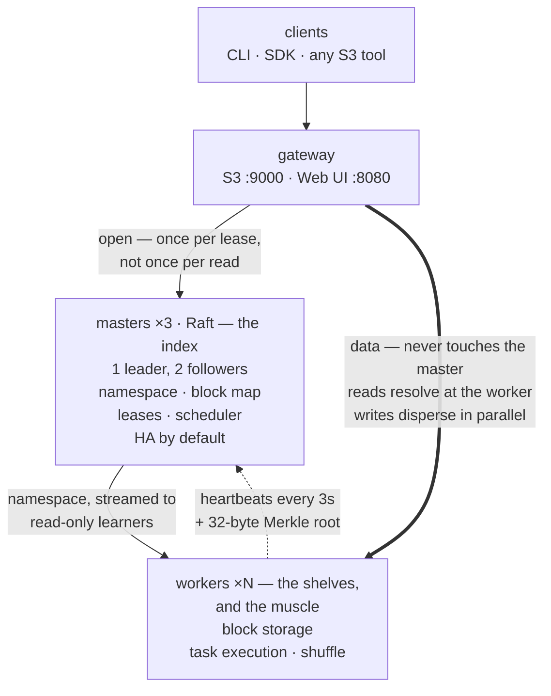

> **Storage archive.** Mammoth now focuses on [durable context memory for coding agents](/memory/). This page describes the earlier storage project.


This diagram describes the planned distributed service. The initial M5 target
uses one master; three-master HA requires M6. For executable behavior today,
see [the GFS local demonstration](/concepts/gfs/), which is a separate in-memory
model with two masters and no Raft or network service.



One binary: `mammoth serve --role master|worker|gateway|all`.

Note what the master is *not* on: the read path. Placement is computed from the
block ID rather than looked up, `open` returns a lease covering the whole file,
and workers carry a read-only replica of the namespace — so a warm read never
speaks to a master at all, and a cold one can resolve at the first worker it
reaches. That, the parallel write, the declustered repair and the memory-mapped
restart are the four mechanisms that separate this design from HDFS's:
**[The four fast paths](/concepts/fast-paths/)**.

## The Backend trait

Everything above hides behind one trait. The CLI, the gateway and the SDK are
written against it, so swapping a single-machine simulation for a real cluster
changes no caller.

```rust
#[async_trait]
pub trait Backend: Send + Sync {
    async fn list(&self, path: &Path) -> Result<Vec<FileStatus>>;
    async fn stat(&self, path: &Path) -> Result<FileStatus>;
    async fn read(&self, path: &Path, range: Range<u64>) -> Result<ByteStream>;
    async fn write(&self, path: &Path, data: ByteStream) -> Result<()>;
    async fn remove(&self, path: &Path, recursive: bool) -> Result<()>;
    async fn block_layout(&self, path: &Path) -> Result<Vec<BlockPlacement>>;
    async fn cluster_report(&self) -> Result<ClusterReport>;
}
```

Two planned implementations: `LocalBackend` (one machine, simulated workers) and
`ClusterBackend` (real masters and workers over gRPC).

## Reliability requirements

Replica placement, data transfer and write ordering are separate mechanisms.
A primary must order concurrent mutations under a valid lease, and workers
must reject stale versions and authority. Heartbeats must drive verified,
bounded repair. Master takeover must preserve acknowledged metadata and fence
the former leader before clients retry. See the
[GFS coverage and limitations](/concepts/gfs/) for what the model demonstrates
and the remaining M4–M6 work.
