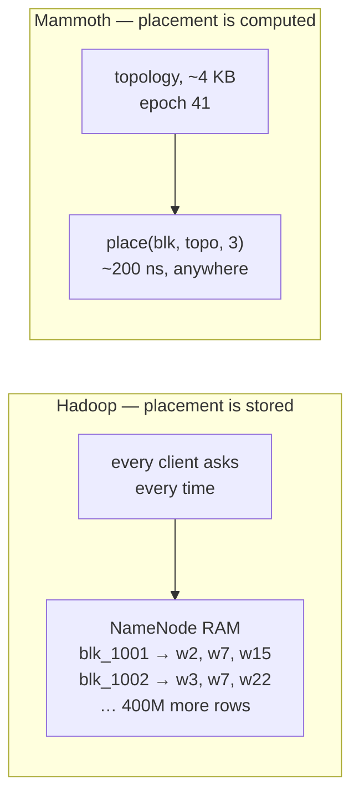
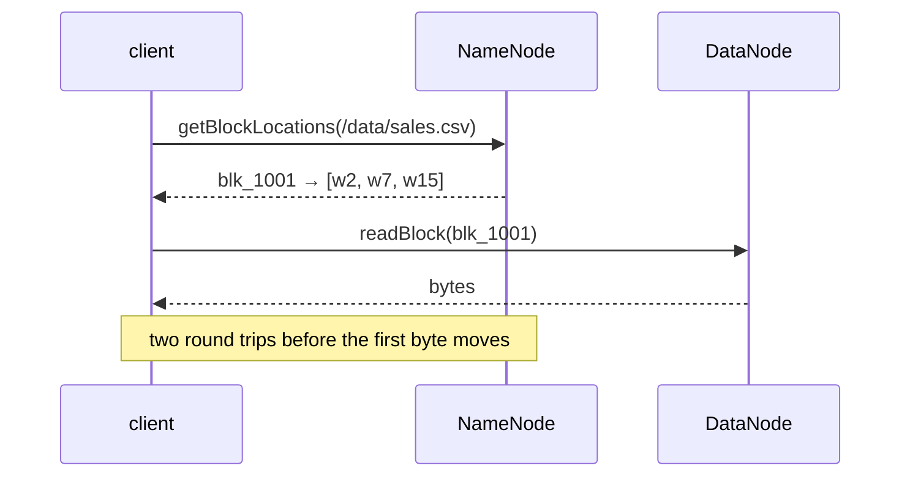
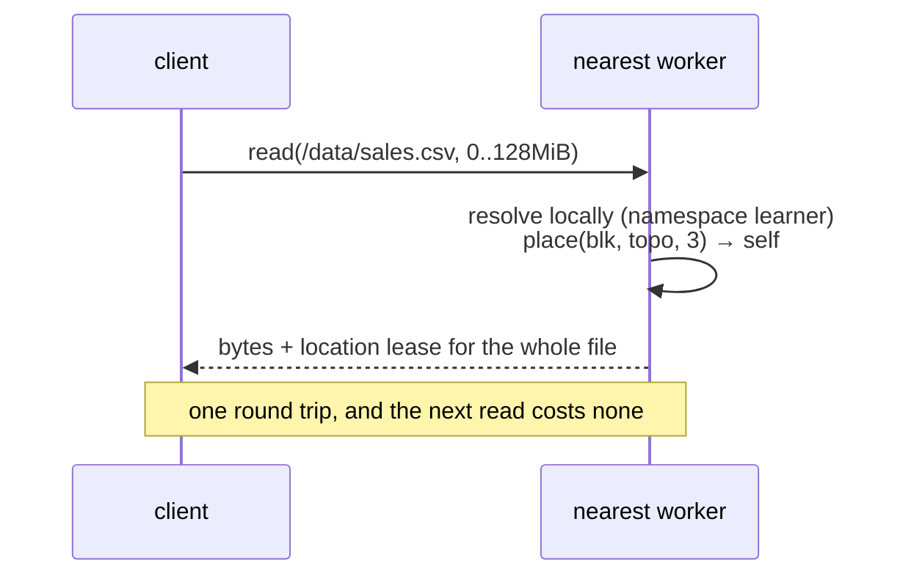
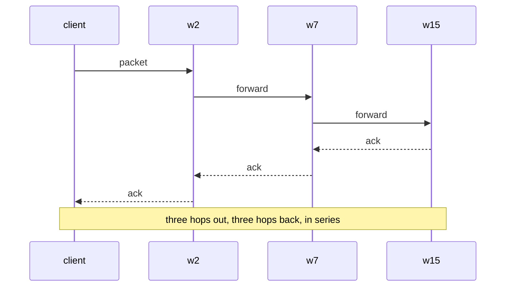
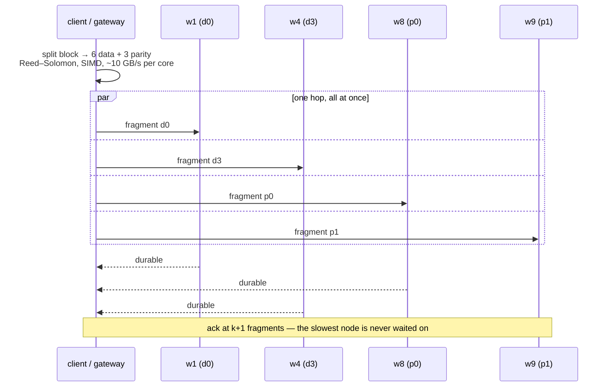
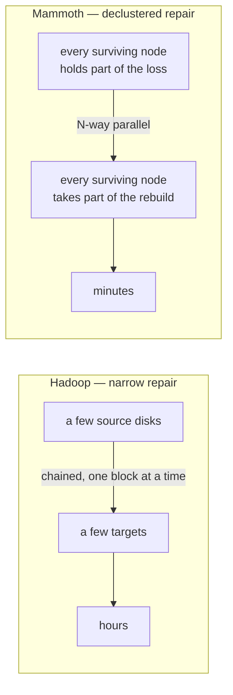
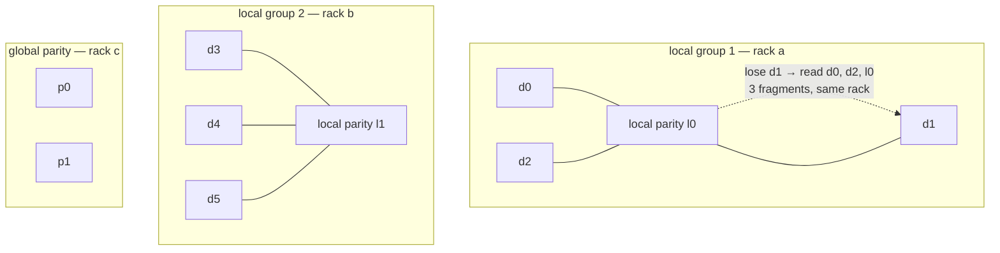
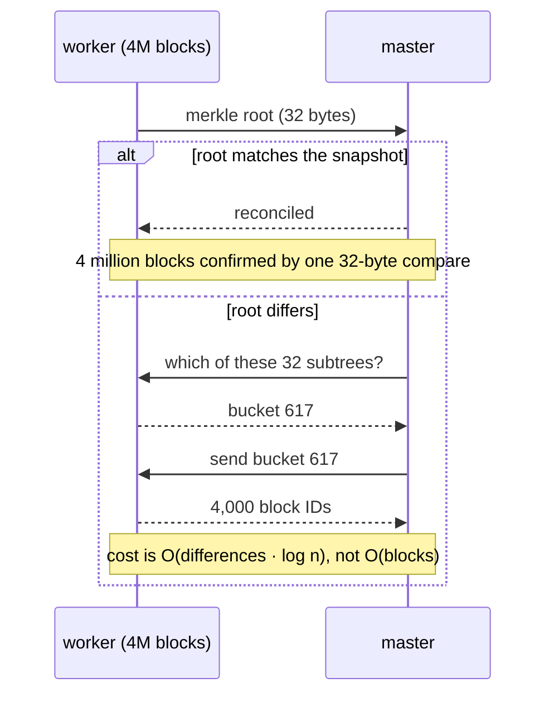

Four operations dominate how a cluster *feels*: opening a file, writing one,
rebuilding redundancy after a machine dies, and starting the master back up.
Hadoop's answers to all four were designed for 1 Gb networks and spinning disks,
and each of them pays a cost you no longer have to pay.

This page is the design for all four. Each section has the same shape: **what
Hadoop does**, **what it costs**, **what Mammoth does instead**, and **how to
build it**.

:::caution[These are design targets, not measurements]
Mammoth is pre-release. Every number below is a target derived from the
mechanism's cost model, not a benchmark result. When the mechanisms land, the
numbers get replaced with measurements from a published harness, or they get
deleted. See the [roadmap](https://github.com/ProjectOrcha/Mammoth/blob/main/docs/ROADMAP.md).
:::

| | Hadoop | Mammoth | Mechanism |
| --- | --- | --- | --- |
| **Open + read** | 2 round trips, every time | 0–1 round trip | [one-shot read](#1--the-one-shot-read) |
| **Write a block** | 3 serial hops, serial acks | 1 parallel hop, quorum ack | [fan-out dispersal](#2--the-fan-out-dispersal-write) |
| **Rebuild a dead node** | one source, one sink, chained | every node, in parallel | [declustered repair](#3--declustered-parallel-repair) |
| **Master restart** | 30+ min rebuilding the block map | seconds, no rebuild at all | [warm start](#4--warm-start) |

All four rest on one idea, so it is worth stating once before any of them:

> **Placement is computed, not remembered.**
>
> Given a block ID and the current topology, every party — client, gateway,
> master, worker — derives the same replica set independently, in about 200 ns,
> with no lookup. That single change is what makes a read skip the master, a
> repair run everywhere at once, and a restart skip the rebuild.

## 0 · Rendezvous hashing — the shared foundation

Hadoop stores placement: the NameNode holds a `block → [DataNode]` map in RAM
and is the only thing that knows it. Everything else must ask.

Mammoth derives placement with **rendezvous hashing** (Highest Random Weight).
For a block ID, score every eligible node, sort, take the top *n*:

```rust
/// The replica set for a block. Pure function — no state, no I/O, no lock.
pub fn place(block: BlockId, topo: &Topology, n: usize) -> Vec<NodeId> {
    let mut scored: Vec<_> = topo
        .writable()                                  // healthy, not full, not draining
        .map(|node| (xxh3_128(&(block.0, node.seed)), node.id))
        .collect();
    scored.sort_unstable_by(|a, b| b.0.cmp(&a.0));   // highest weight wins

    // Walk the ranking taking the first node from each new failure domain,
    // so replica 2 is always in a different rack than replica 1.
    let mut out = Vec::with_capacity(n);
    let mut racks = HashSet::new();
    for (_, id) in &scored {
        if racks.insert(topo.rack_of(*id)) || racks.len() >= topo.rack_count() {
            out.push(*id);
            if out.len() == n { break; }
        }
    }
    out
}
```

### Worked example

Twelve nodes, three racks, and one block. Score every node, sort, then walk the
ranking taking the first node from each new rack:

```
block 1001 · ranking by score

  w6    rack-b   18,270,361,829,568,255,012   ← rack-b's first  ✔ take it
  w4    rack-a   13,359,206,972,967,333,524   ← rack-a's first  ✔ take it
  w10   rack-c   13,349,019,384,023,089,140   ← rack-c's first  ✔ take it
  w3    rack-a    7,389,733,331,342,564,557     rack-a already used
  w9    rack-c    6,450,597,512,760,413,242     rack-c already used
  w5    rack-b    6,436,809,817,028,817,419     rack-b already used
  …

  replica set for blk_1001 → w6, w4, w10   (one per rack, by construction)
```

Nobody was asked. The client, the gateway, the master and every worker run those
twelve hashes and reach `w6, w4, w10` independently, in a few hundred
nanoseconds. That is the entire trick, and the next three sections are what it
makes possible.

**Now take w7 out of the cluster.** It was never in blk_1001's top three, so
blk_1001 does not move at all — its replica set is still `w6, w4, w10`. Only the
blocks that actually scored w7 into their top three are disturbed, which is
about **3 of every 12** — the replica count over the node count:

```
removing 1 node of 12, replication 3

  rendezvous hashing   25.0% of blocks move   ← exactly 3/12
  modulo hashing       ~91%  of blocks move
```

That gap is the whole reason not to write `block_id % n`. With modulo, adding a
thirteenth node reshuffles nearly the entire cluster; with rendezvous, it pulls
over about 1/13 of it and leaves the rest alone.

### Three properties earn their keep:

**Deterministic.** Anyone with the topology gets the same answer. The topology
is a few KB — node IDs, racks, weights, health — and it changes when machines
change, not when data changes. Clients cache it and stamp every request with the
`topology_epoch` they used.

**Minimally disruptive.** Remove a node and only the blocks that scored it in
their top *n* move. Nothing else is disturbed — unlike modulo hashing, where
removing one node of 200 reshuffles almost everything.

**Failure-domain aware.** The rack rule lives in the ranking walk, so it holds
by construction rather than by a placement policy someone has to remember to
configure.



What the master still owns: the **namespace** (path → block list), **leases**,
and the **exception list** — the blocks that are *not* where the function says
they should be, because a disk filled up or a repair is mid-flight. That list is
small: on a healthy cluster it is empty.

```toml
[storage]
placement = "rendezvous"      # rendezvous | explicit
```

---

## 1 · The one-shot read

### What Hadoop does

Reading a file is a two-step dance. The client asks the NameNode where the
blocks are, the NameNode answers, and only then does the client go to a
DataNode for bytes.



### What it costs

- **Two round trips before the first byte.** On a warm cluster that is maybe
  1 ms; through a full GC pause on a 200 GB heap it is *seconds*.
- **Every open hits the one lock.** `getBlockLocations` takes the
  `FSNamesystem` read lock, so a slow `listStatus` elsewhere blocks it.
- **It repeats.** HDFS hands out locations in batches (ten blocks by default),
  so a long sequential scan goes back to the NameNode again and again.
- **The NameNode is on the critical path of every read in the cluster.**

### What Mammoth does

Three changes, which together take the common case to **zero** metadata round
trips and the cold case to **one** total round trip.

**a. Location leases — `open` returns everything, once.**

The first `open` returns the complete block list, the placement epoch and a
signed lease with a TTL (default 60 s). While the lease is valid the client
reads any range of that file with no metadata traffic at all. The lease carries
the epoch, so a topology change invalidates it automatically — a stale client is
told to re-resolve, it does not read the wrong node.

**b. Inline resolve — a cold client can skip the master entirely.**

Workers run a **Raft learner** replica of the namespace: read-only, lag-bounded,
never voting, so it costs the quorum nothing. A client with no lease sends
`path + range` straight to the nearest worker. That worker resolves the inode
locally and either serves the bytes or returns a 1-hop redirect to a node that
has them.



**c. Small files are already the answer.** A file under `inline_threshold`
lives inside its own metadata, so resolving it *is* reading it. One round trip,
no block layer, no second hop.

Then the two tail-latency mechanisms that already exist in
[Performance](/Mammoth/concepts/performance/) compose on top: **short-circuit
local reads** pass a file descriptor over a Unix socket when the replica is on
the reader's machine, and **hedged reads** fire at a second replica when the
first is slow. Because the client derived the whole replica set itself, hedging
costs it no extra lookup.

### The cost model

| | Hadoop | Mammoth |
| --- | --- | --- |
| cold open, big file | 2 RTT | **1 RTT** |
| next read of the same file | 1 RTT (2 every 10 blocks) | **0 RTT** |
| small file (< 1 MiB) | 2 RTT | **1 RTT**, bytes included |
| local replica | 1 RTT + a network copy | **0 RTT**, `pread` on a passed fd |
| master CPU per read | one lock acquisition each | **zero on the warm path** |

### How to build it

1. `place()` as above, plus a `Topology` that every role loads and versions.
2. `open` returns `OpenHandle { blocks, epoch, lease_expiry, signature }`.
3. A client-side `LeaseCache` keyed by inode, invalidated on epoch bump.
4. Worker-side namespace learner — `openraft` learner node, read-only apply.
5. `read(path, range)` on the worker RPC surface, not just `read(block)`.
6. Redirect responses carry the derived replica set so the retry is direct.

```toml
[read]
short_circuit  = true
hedged_after   = "50ms"
lease_ttl      = "60s"        # how long a location lease stays usable
inline_resolve = true         # let workers resolve paths from their learner
```

---

## 2 · The fan-out dispersal write

### What Hadoop does

The client does *not* send the data three times. It sends each 64 KB packet
once, to the first DataNode, which writes it and forwards it to the second,
which forwards it to the third. Acks come back down the chain. This is **chain
replication**, and its one great virtue is that the client's uplink is never
tripled.



### What it costs

- **Latency is the sum of the chain, not the max.** Three serial hops out and
  three serial acks back. The pipeline is only as fast as its slowest link, and
  every link is on the critical path.
- **One slow disk stalls the write.** There is no way around a bad node in the
  middle — the packets have to pass through it.
- **Pipeline recovery is expensive.** If a node fails mid-block, HDFS tears the
  pipeline down, re-establishes it with a replacement, and re-sends. A flapping
  node can make a single block take minutes.
- **3× storage** for the durability of 3×.
- **A packet-level ack barrier.** The window is bounded and the acks are
  ordered, so jitter anywhere is jitter everywhere.

### What Mammoth does

**Stop chaining. Scatter in parallel, ack on a quorum, and send parity instead
of copies.**



**a. Erasure-code at the edge.** Each block is split into `k` data + `m` parity
fragments — default **LRC(6,2,2)**, explained in
[§3](#3--declustered-parallel-repair). Galois-field arithmetic with SIMD
(`reed-solomon-simd`) runs at multiple GB/s per core, so the encode is not the
bottleneck; the network is.

**b. One hop, not three.** All `k + m` fragments leave the client at the same
time, to `k + m` different nodes chosen by `place()`. Network **depth is 1**.
Latency becomes the *max* over the quorum rather than the *sum* over a chain.

**c. Quorum ack.** The write completes when any `k + 1` fragments are durable.
The remaining fragments are still in flight and still land — they are simply not
on the critical path. A single slow disk cannot extend a write, which is where
most of a p99 comes from.

**d. Independent sliding windows.** Each fragment stream has its own window and
its own cumulative ack. There is no shared packet barrier, so jitter on one
socket stays on that socket.

**e. Failure costs a fragment, not a pipeline.** A node that dies mid-write is
simply dropped: the code already carries `m` spares, and the missing fragment is
regenerated in the background. There is nothing to tear down and nothing to
re-send.

### Worked example: what this actually costs

One 128 MiB block. Assume 25 GbE per node (3.1 GB/s), 0.1 ms of one-way network
latency, and disks fast enough not to be the bottleneck. A fragment is
`128 MiB / 6` = 22.4 MB; ten of them is 224 MB.

| | chain (HDFS) | dispersal |
| --- | --- | --- |
| **a 64 KiB append** — latency-bound | 3 hops out + 3 acks back ≈ **0.66 ms** | 1 hop + 1 ack ≈ **0.24 ms** |
| **a full block, everything healthy** — bandwidth-bound | 134 MB out of one NIC ≈ **43 ms** | 224 MB out of one NIC, ack at 7 fragments ≈ **50 ms** |
| **a full block, one node 200 ms slow** | ≈ **243 ms** — the packets have to go through it | ≈ **50 ms** — that fragment is simply not in the quorum |
| **a full block, one node dies mid-write** | rebuild the pipeline and re-send ≈ **seconds** | ≈ **50 ms** — the code already carries spares |
| bytes crossing the fabric | 403 MB | **224 MB** |
| bytes out of the client's NIC | **134 MB** | 224 MB |
| bytes on disk afterwards | 403 MB (3×) | **224 MB (1.67×)** |

**Read that table honestly, because it does not say what you might expect.**

On the *healthy, bandwidth-bound* row, chain replication is about 15% **faster**
— the client only has to push 134 MB instead of 224 MB, and for a big sequential
write the client's uplink is the whole story. Nothing about dispersal beats
chaining at moving one large block through an idle cluster.

Dispersal wins everywhere else, and everywhere else is where clusters live:

- **Small writes get ~3× faster**, because they are latency-bound and a chain
  pays three round trips where dispersal pays one.
- **p99 collapses.** The slow-node row is the important one. In a chain, every
  byte passes through every replica, so one node with a sick disk slows *every
  write it participates in*. With a quorum of 7 out of 10, a slow node is simply
  not among the seven. This is the single biggest practical difference.
- **Failures stop being expensive.** A chain that loses a node mid-block has to
  be torn down, re-established and re-sent. Dispersal drops one fragment and
  carries on, because parity already covers it.
- **The fabric moves 44% less data**, and the disks hold 44% less, for the same
  durability.

**The tradeoff in one line:** the client's NIC carries `(k+m)/k` — 1.67× —
instead of 1×, and in exchange the cluster's network and disks carry 0.56× and
the tail latency stops depending on the worst node in the chain.

When the client's uplink genuinely is the constraint — a thin edge client, a
laptop over a VPN, blocks small enough that one hop is all of it — set
`mode = "mirror"` and the same code path becomes a **two-level fan-out tree**:
client → one worker → the other two *in parallel*. Depth 2 instead of 3, 1×
uplink, 3× storage. Still better than a chain; just less better.

| mode | depth | client uplink | storage | use for |
| --- | --- | --- | --- | --- |
| `disperse` *(default)* | **1** | 1.67× | **1.67×** | everything that is not tiny |
| `mirror` | 2 | 1× | 3× | thin clients, tiny blocks, hot re-reads |
| `pipeline` | 3 | 1× | 3× | HDFS-compatible; kept for migration only |

### The cost model

For one 128 MiB block, `h` = one-hop network time, `d` = the durable-write time
on one node:

| | Hadoop chain | Mammoth disperse |
| --- | --- | --- |
| network depth | 3 serial hops | **1** |
| acks | serial, back down the chain | parallel, first `k+1` wins |
| one slow node | stalls the write | excluded from the quorum |
| node dies mid-block | rebuild pipeline, re-send | drop a fragment, carry on |
| client's uplink | 1× | 1.67× |
| the fabric, and the disks | 3× | **1.67×** |

The worked example below puts numbers on all of it — including the one row where
chaining is genuinely the faster of the two.

### How to build it

1. `reed-solomon-simd` for the codec; benchmark encode against the NIC first —
   if the encode is not comfortably faster than the link, the design is wrong.
2. `place(block, topo, k + m)` to pick the `k + m` targets.
3. `tokio::spawn` one fragment stream per target; `futures::future::select_ok`
   generalised to "first `k+1` to succeed".
4. A `PendingFragments` set the repair queue drains, for the ones that lost the
   race.
5. Per-fragment CRC32C, hardware-accelerated, verified on arrival.
6. `mode = "mirror"` as the same code path with a trivial `RS(1,2)`-shaped
   identity codec, so there is one write path, not two.

```toml
[write]
mode        = "disperse"      # disperse | mirror | pipeline
ec_policy   = "lrc-6-2-2"
ack_policy  = "quorum"        # quorum acks at k+1; `all` waits for k+m
packet_size = "64KiB"
window      = "8MiB"          # per-fragment sliding window
```

---

## 3 · Declustered parallel repair

This is chain replication's other job — not the first write, but every copy made
after it. A machine dies, and its blocks must become fully redundant again.

### What Hadoop does

The NameNode notices missing replicas and issues copy commands: one source
DataNode reads a block and pipelines it to one target. The same chain, run again
later.

### What it costs

- **Repair is serial per block and narrow across the cluster.** Throughput is
  bounded by a small number of source disks, not by the cluster.
- **It is proportional to the dead node's capacity.** A 160 TB node at a few
  hundred MB/s of usable repair bandwidth is measured in *hours* — hours during
  which one more failure is a real risk.
- **It storms.** A node that reboots in 90 seconds can trigger a petabyte of
  copying that immediately becomes garbage.
- **With erasure coding it gets worse.** Rebuilding one lost RS(6,3) fragment
  requires reading **six** fragments across the network. That is a 6× read
  amplification on the most common failure there is.

### What Mammoth does

**a. Declustering — every node repairs, at once.**

Because placement is rendezvous-derived over the whole cluster rather than fixed
replica groups, the surviving copies of a dead node's blocks are spread across
*every other node*. So repair is `N−1` sources reading and `N−1` sinks writing,
simultaneously. Repair time stops scaling with one disk's bandwidth and starts
scaling with the cluster's.



The rebuild for a dead node of capacity `C` goes from `C / disk_bw` to roughly
`C / (N · disk_bw · repair_share)`. It gets *faster* as the cluster gets bigger,
which is the opposite of how HDFS behaves.

### Worked example: how long a rebuild takes

Assume each surviving node can spend 600 MB/s on repair — about 40% of an idle
NVMe machine on 25 GbE, which is what `repair.bytes_per_sec = "auto"` will
converge on.

| Cluster | Dead node held | Chained repair | Declustered repair |
| --- | --- | --- | --- |
| 12 nodes | 106 TB | 11 survivors idle · **49 hours** | 11 survivors, all at once · **4h 30m** |
| 200 nodes | 160 TB | 199 survivors idle · **74 hours** | 199 survivors, all at once · **22 minutes** |

The chained column is the same number in both rows for the same reason: it does
not matter how many machines you own if one of them is doing the work. The
declustered column is what "the rebuild scales with the cluster" means as a
number — and it is why the 200-node row is *faster* than the 12-node row despite
rebuilding half as much again.

**During those hours or minutes you are running with less redundancy than you
think you have**, which is the real argument. Cutting a rebuild from three days
to twenty minutes cuts the window in which a second failure loses data by the
same factor.

**b. LRC — make the common repair cheap.**

Plain RS(6,3) needs any 6 fragments to reconstruct 1. **Local Reconstruction
Codes** add a local parity per group, so the overwhelmingly common case — one
fragment lost — is repaired from inside one small group.



| | RS(6,3) | **LRC(6,2,2)** |
| --- | --- | --- |
| storage overhead | 1.50× | 1.67× |
| fragments read to fix **one** loss | 6 | **3** |
| where those reads come from | across racks | **inside one rack** |
| failures survived | any 3 | any 3, and most 4s |

### Worked example: one fragment, two codes

A block is 128 MiB, so each fragment is 22.4 MB. Node w12 dies and takes `d1`
with it.

```
RS(6,3) — no local groups

  need any 6 of the 8 survivors to rebuild d1
  read   d0  d2  d3  d4  d5  p0     6 × 22.4 MB = 134 MB
  from   whichever racks happen to hold them — usually all three
  write  d1                                      22.4 MB


LRC(6,2,2) — d1 lives in local group 1, with d0, d2 and local parity l0

  need only its own group
  read   d0  d2  l0                 3 × 22.4 MB =  67 MB
  from   rack-a — the whole group is placed together
  write  d1                                      22.4 MB
```

**Half the reads, and none of them cross a rack.** Now multiply by the 4.75
million fragments a dead node actually held:

| | RS(6,3) | LRC(6,2,2) |
| --- | --- | --- |
| read to rebuild the node | 638 TB | **319 TB** |
| written | 106 TB | 106 TB |
| where the reads come from | across racks | inside one rack |
| storage overhead paid for it | 1.50× | 1.67× |

That is **319 TB of network you do not spend**, on the failure that happens
every day, in exchange for 0.17× more disk. It is a good trade: during an
incident, repair bandwidth is the scarce resource and disk is not — and the
cross-rack link is the scarcest part of it.

**c. Repair is a scheduled queue, not a reflex.**

- **A delay window.** `repair.delay` (default 10 min) before touching anything
  for a node that is merely *absent*. Confirmed disk loss — an I/O error, a
  volume that failed to mount — skips the window and starts immediately.
- **Priority by remaining redundancy.** A block down to its last fragment is
  repaired before one that lost its first. The queue is ordered by how close to
  gone the data is, which is the only ordering that matters.
- **Rate control.** A token bucket per node and per rack uplink, sized as a
  share of measured idle bandwidth. Repair yields to client traffic
  automatically, so an incident does not become an outage.

### How to build it

1. A `RepairQueue` keyed by `(remaining_redundancy, block_id)` — a binary heap
   is enough; the interesting part is what feeds it.
2. Feed it from the **expectation diff**: `place()` says who should hold a
   block, the reconciled map says who does. The difference *is* the work list,
   and computing it needs no scan of anything.
3. Work-stealing: workers pull batches, so a slow node simply takes less.
4. `governor` for the token buckets; measure idle bandwidth, do not configure it.
5. Reconstruct on the **target**, not the source — the node that will hold the
   new fragment pulls what it needs and does the Galois-field math itself. That
   spreads the CPU cost the same way it spreads the I/O.

```toml
[repair]
delay         = "10m"         # grace period for an absent-but-not-dead node
parallelism   = "auto"        # auto = every healthy node participates
bytes_per_sec = "auto"        # token bucket; yields to client traffic
priority      = "redundancy"  # least-redundant blocks first
```

---

## 4 · Warm start

### What Hadoop does

The NameNode does not store the block map. It stores the namespace — the
directory tree and each file's block list — but *where* each block physically
lives is rebuilt in RAM at every start, from full block reports sent by every
DataNode.

### What it costs

**30+ minutes on a large cluster**, and during those minutes the cluster is in
safe mode: read-only, refusing writes, with the whole platform waiting on it. It
is the single worst number in HDFS operations, and it is worst exactly when it
hurts most — during recovery from the incident that caused the restart.

The cost is structural: `O(total blocks)` messages, deserialized, inserted into
a hash map, all under the global lock, all before anything else can happen.

### What Mammoth does

**Do not rebuild it. It is derived state and it is also on disk.**

**a. It is persisted, so restart is a page-in.**

The block map is written as an `rkyv`-archived structure next to the Raft
snapshot and **memory-mapped** on start. `rkyv`'s archived form is the in-memory
form, so there is no deserialization pass: the map is usable as soon as it is
mapped, and pages fault in lazily as it is touched. Load time is `O(1)` in the
number of blocks — about a second for 10 million, and most of that is `open()`.

**b. It is derivable, so reports are a diff and not a source of truth.**

`place(block, topo, n)` already says where every block *should* be. The master
does not need to be told; it needs to be *corrected*. What it keeps on disk is
the exception list — the blocks that are somewhere else. On a healthy cluster
that list is nearly empty, so the interesting state is tiny.

**c. It is verified by Merkle root, so reconciliation is 32 bytes per worker.**

Each worker keeps a shallow Merkle tree over its block-ID space — 1024 leaves by
prefix bucket, each leaf an `xxhash3` over that bucket's sorted IDs, maintained
incrementally as blocks come and go.



### Worked example: reconciling one worker

A worker holding 4.75 million fragments, with `merkle_fanout = 1024`, so about
4,640 fragment IDs per bucket. IDs are 8 bytes.

**The clean case — the master was shut down properly:**

```
  worker → master   merkle root                       32 bytes
  master → worker   reconciled

  4,750,000 fragments confirmed. Total on the wire: 32 bytes.
```

**The crash case — 4,000 blocks changed after the last checkpoint:**

```
  worker → master   merkle root                       32 bytes    ✗ differs
  master → worker   which of these 32 subtrees?      1 KB
  worker → master   subtrees 7, 19, 24                          ✗ three differ
  master → worker   which buckets in those three?    1 KB
  worker → master   buckets 231, 617, 802
  master → worker   send those three buckets
  worker → master   13,920 fragment IDs               111 KB

  Four round trips. Total on the wire: 113 KB.
```

**And what HDFS does instead:**

```
  every DataNode → NameNode   every block ID it holds

  4,750,000 × 8 bytes = 38 MB per node · 456 MB for twelve nodes
  deserialized, inserted into a hash map, under the global lock,
  before anything else can happen.
```

113 KB against 456 MB is a factor of about 4,000 — and the important part is not
the ratio but the **shape**: the Merkle cost scales with what *changed*, and the
block-report cost scales with what *exists*. One of those grows every time you
add a disk.

**d. Safe mode is per-range, so it is not one global gate.**

Each namespace shard leaves safe mode as soon as *its own* ranges reconcile,
instead of everything waiting on a single cluster-wide 99.9% threshold. Reads
are served from the mapped snapshot immediately — it is durable, committed
state — and writes open per shard, within seconds, as the roots come in.

### The cost model

| | Hadoop | Mammoth |
| --- | --- | --- |
| what happens at start | rebuild from `O(blocks)` reports | `mmap` a file |
| bytes on the wire, clean restart | every block ID, from every node | **32 bytes per worker** |
| bytes on the wire, after a crash | every block ID, from every node | only the differing buckets |
| complexity | `O(total blocks)` | `O(1)` + `O(differences · log n)` |
| time, 10M blocks / 200 nodes | **30+ min** | **< 10 s** *(target)* |
| reads during startup | blocked | **served from the snapshot** |
| writes during startup | blocked until 99.9% global | per shard, as roots arrive |

### How to build it

1. `rkyv` for the archived map; `memmap2` to map it. Keep the archive
   append-only with a generation counter, so a torn write is detectable.
2. Checkpoint on the Raft snapshot boundary, so the map and the log agree by
   construction and there is no third thing to keep in sync.
3. `MerkleIndex` on the worker: a fixed 1024-leaf array, updated on every block
   add and delete. It is a `xor`-and-rehash of one leaf, not a rebuild.
4. Descend the tree in 32-way steps to keep the round-trip count at two.
5. Make safe mode a per-shard state machine and expose it — a per-shard progress
   bar is worth more than an aggregate percentage during an incident.
6. Verify the mapped map lazily: a background scrub re-derives `place()` for
   every block over the course of a day and reports drift. Trust it at boot,
   check it forever after.

```toml
[master]
block_map          = "mmap"        # mmap | rebuild (rebuild = HDFS behaviour)
merkle_fanout      = 1024
safemode           = "per-range"   # per-range | global
safemode_threshold = 0.999         # only consulted when safemode = "global"
```

---

## Where these show up

- **`mammoth top`** — a `START` line while reconciling: mapped size, roots
  matched, shards still in safe mode.
- **The web UI** — the [distribution page](/Mammoth/concepts/visualization/)
  shows repair as it happens: how many nodes are participating, how much
  redundancy is left on the worst block, and the ETA that follows from the two.
- **The errors** — `SafeMode` names the shard that is not ready, not the
  cluster, so the fix is scoped to what is actually broken.

## What could go wrong

Written down because these are the ways each mechanism fails in practice.

**Rendezvous hashing is only as good as the epoch discipline.** A client reading
with a stale topology reads a node that no longer holds the block. Every request
carries its epoch, every response can say `EpochTooOld`, and the client re-fetches
a 4 KB topology. Get this wrong and you get silent misses under churn.

**Erasure coding costs CPU on every read of a degraded block.** While a fragment
is missing, reads of that block reconstruct. Keep the repair queue short, and
keep hot data on `mirror` — EC is for the bulk, not for the working set.

**Quorum acks are a real durability tradeoff.** `k+1` durable fragments is
weaker than `k+m`. It is the right default and it must be documented as a
choice, not hidden as an optimization. `ack_policy = "all"` exists for people
whose answer is different.

**Declustered repair can saturate the network if you let it.** The token buckets
are not optional. Repair that takes an outage with it is worse than repair that
takes an extra ten minutes.

**A memory-mapped map means a corrupt file is a corrupt boot.** Checksum the
archive, keep the previous generation, and make `rebuild` a real fallback path
that is tested — not a config key nobody has ever exercised.
