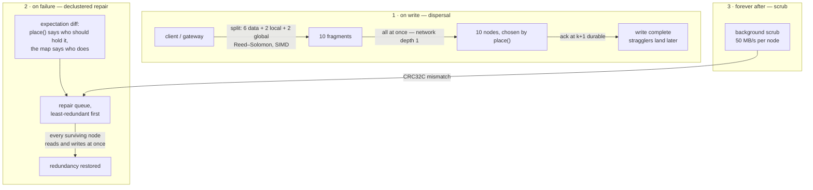

Practical guidance that most Hadoop beginners learn the painful way.

Practical guidance that belongs in your docs, and that most Hadoop beginners learn the painful way.

### 9.1 Block size

|Block size|Good for|Bad because|
|---|---|---|
|64 MB|many medium files, more parallelism|more metadata entries|
|**128 MB** (default)|general purpose|—|
|256–512 MB|huge scan-heavy files (Parquet tables)|fewer parallel tasks; a slow node hurts more|

Rule of thumb: aim for tasks that run **1–5 minutes**. Shorter and scheduling overhead dominates; longer and failures get expensive to retry.

Per-file override:

```console
$ mammoth put ./huge.parquet /warehouse/huge.parquet --block-size 512MB
```

### 9.2 Replication factor

|Policy|Use for|Storage|Durability|
|---|---|---|---|
|`replication = 1`|scratch, `/tmp`, regenerable output|1×|none — one disk loss = data loss|
|`replication = 2`|dev clusters, cold archives|2×|survives 1 failure|
|`replication = 3`|hot tables, tiny blocks, thin-uplink clients|3×|survives 2 failures, survives a rack loss|
|**`lrc-6-2-2`** (default)|general purpose|**1.67×**|survives any 3 failures, and most 4s|
|`rs-6-3`|cold archives|1.50×|survives any 3 failures — but reads 6 fragments to repair 1|

```console
$ mammoth admin ec convert /warehouse/archive --policy rs-6-3
  ✔ 412 TB queued  ·  will free ~275 TB  ·  ETA 9h
  note: EC reads are more CPU-expensive; use for cold data, not hot tables.
```

**Why LRC is the default and not RS.** Both survive three losses. The difference
is what a *single* loss costs, and single losses are what actually happen:
RS(6,3) reconstructs one missing fragment by reading **six** across the network,
while LRC(6,2,2) adds a local parity per group and reads **three**, from inside
one rack. You pay 0.17× more disk to halve the repair traffic on the case that
occurs every day. Disk is cheap during an incident; repair bandwidth is not.

### 9.2.1 How a replica actually gets made

Three distinct moments, and Hadoop uses the same chained mechanism for all
three. Mammoth does not, which is where most of its write and recovery
performance comes from. Full design in
[The four fast paths](/Mammoth/concepts/fast-paths/).



**1 · On write — dispersal, not a pipeline.** The block is erasure-coded at the
client or gateway and the fragments are sent to `k + m` nodes *in parallel*. One
network hop, not three. The write acks as soon as `k + 1` fragments are durable,
so one slow disk cannot extend it, and a node that dies mid-write costs one
fragment rather than a rebuilt pipeline.

**2 · On failure — declustered repair.** The work list is a *diff*: `place()`
says which nodes should hold a block, the reconciled map says which do, and the
difference is the queue. Because placement is spread across the whole cluster
rather than fixed replica groups, every surviving node both reads and writes
during a rebuild — repair scales with the cluster instead of with one disk.
It is rate-limited by a token bucket and it yields to client traffic, and a node
that is merely absent gets a ten-minute grace period before anything is copied.

**3 · Forever after — scrub.** A background pass re-verifies CRC32C over every
fragment. A mismatch is a corruption, and corruption feeds the same repair queue
as a failure does.

```console
$ mammoth viz health --live

  BLOCK HEALTH                                    refreshing every 2s

  ● healthy            ████████████████████████████  4,201,882   99.97%
  ◐ degraded (1 lost)  ▎                                 1,204    0.03%
  ◐ critical (3 lost)  ▏                                    12  ← urgent
  ✕ corrupt                                                   0

  recovery queue   1,216 blocks    ▓▓▓▓▓▓▓░░░░░░░  52%   ETA 4m 12s
  participating    11 of 12 nodes  ·  declustered, 11-way parallel
  recovery rate    284 blk/s · 3.1 GB/s   (capped at 40% of idle)
  cause            w12 went dead 12m ago
```

### 9.3 The small-file problem — and Mammoth's fix

**The problem:** 1 million 10 KB files (10 GB of data) consume the same metadata as 1 million 128 MB files (128 TB of data). Hadoop clusters die from this constantly.

**Mammoth's fix — inline small files.** Files below `inline_threshold` (default 1 MB) never become blocks at all. Their bytes live directly in the metadata store. No block ID, no block report entry, no replica bookkeeping — durability comes from Raft replication of the metadata itself.

```toml
[storage]
inline_threshold = "1MiB"
```

```console
$ mammoth put ./config.json /etc/config.json
  ✔ /etc/config.json  4.2 KB  ·  inlined (no blocks allocated)
```

Second line of defense — **pack** many small files into one storage extent:

```console
$ mammoth admin pack /logs/2026-01 --target-size 128MB
  ✔ 84,201 files → 612 extents   metadata entries: 84,201 → 612  (-99.3%)
```

### 9.4 File formats — splittability matters more than compression ratio

A **splittable** file can be read by many tasks in parallel. A non-splittable one is read by exactly one task, no matter how big it is.

|Format|Splittable?|Notes|
|---|---|---|
|CSV / JSON lines, uncompressed|✔|fine, but huge|
|CSV + **gzip**|✘|⚠ a 10 GB `.csv.gz` = **one** task. This is the classic beginner trap.|
|CSV + **bzip2** / **LZ4 framed**|✔|splittable compression|
|**Parquet**|✔|columnar, per-column compression, predicate pushdown — **use this**|
|**ORC**|✔|similar to Parquet, more common in old Hive stacks|
|Avro|✔|row-based, good for streaming ingest|

Have the CLI warn about it:

```console
$ mammoth put ./events.csv.gz /warehouse/events.csv.gz
  ✔ uploaded  8.2 GB

  ⚠ gzip is not splittable — this file will be processed by a single task
    even though it spans 65 blocks across 12 nodes.
    consider: parquet, or bzip2/lz4-framed if you must stay row-based.
    docs: https://projectorcha.github.io/Mammoth/data/formats
```

That one warning will save your users more time than most of your optimizations.

### 9.5 Partitioning

Lay directories out so queries can skip data:

```
/warehouse/events/dt=2026-08-25/region=in/part-0000.parquet
                  └─────┬─────┘ └────┬───┘
                   time partition  region partition
```

A query filtered to `dt=2026-08-25` reads one directory instead of the whole table.

**Don't over-partition.** `dt=.../hour=.../minute=...` on a small table gives you a million tiny files — you've traded a scan problem for a metadata problem.

```console
$ mammoth viz skew /warehouse/events --by-partition
  ⚠ 1,440 partitions, median size 340 KB
    over-partitioned: files are far below the 128 MB block size
    → mammoth admin compact /warehouse/events --target 128MB
```

### 9.6 Skew — the silent job killer

If one partition is 68× the median, your job's runtime is set by that one task. All the parallelism in the world doesn't help. `mammoth viz skew` exists specifically to make this visible before it costs you six hours.

Fixes: salt the partition key, pre-split the hot partition, or enable speculative execution so a straggler gets a duplicate task.

### 9.7 Storage tiers

```console
$ mammoth admin tier set /warehouse/events/dt=2026-08-25 --tier ssd
$ mammoth admin tier policy /warehouse/archive --rule 'age > 90d → archive'
```

|Tier|Backed by|For|
|---|---|---|
|`ssd`|NVMe|hot partitions, shuffle|
|`disk`|HDD|default|
|`archive`|dense HDD, erasure-coded|cold data|

A background **mover** relocates blocks when policies change. Pair it with `mammoth viz skew`'s access-heat output to decide what to promote.

### 9.8 Data integrity

- CRC32C per 4 KB chunk, written alongside every block, verified on **every read** and at every hop of the write pipeline.
- A background **scrubber** re-verifies blocks continuously at a throttled rate (`scrub.bytes_per_sec = "50MiB"`), catching bit rot before you read it.
- Corrupt block → reported to master → new replica made from a good copy → bad one deleted.

```console
$ mammoth admin fsck /warehouse --blocks
  scanned  4,201,882 blocks · 1.24 PB
  ✔ healthy       4,200,678
  ◐ under-repl        1,204
  ✕ corrupt               0
  ⊘ missing               0
  status: HEALTHY
```
