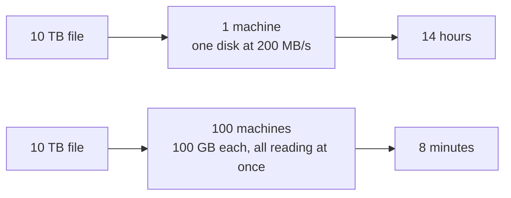
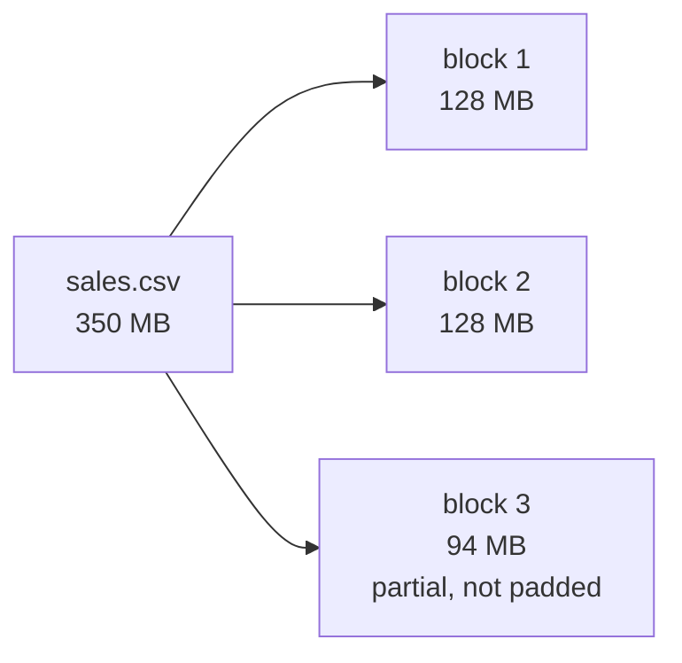
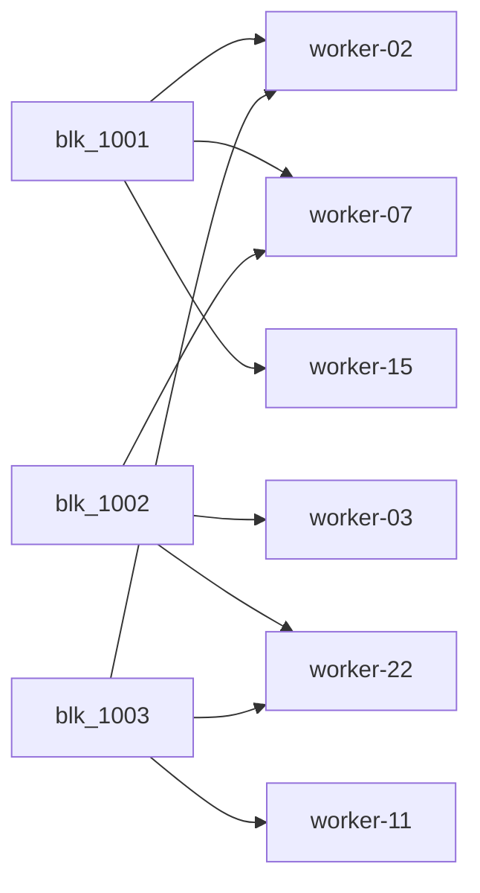
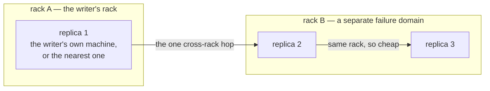
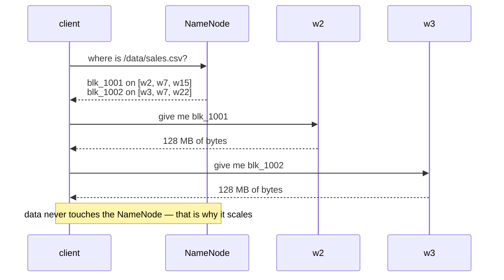
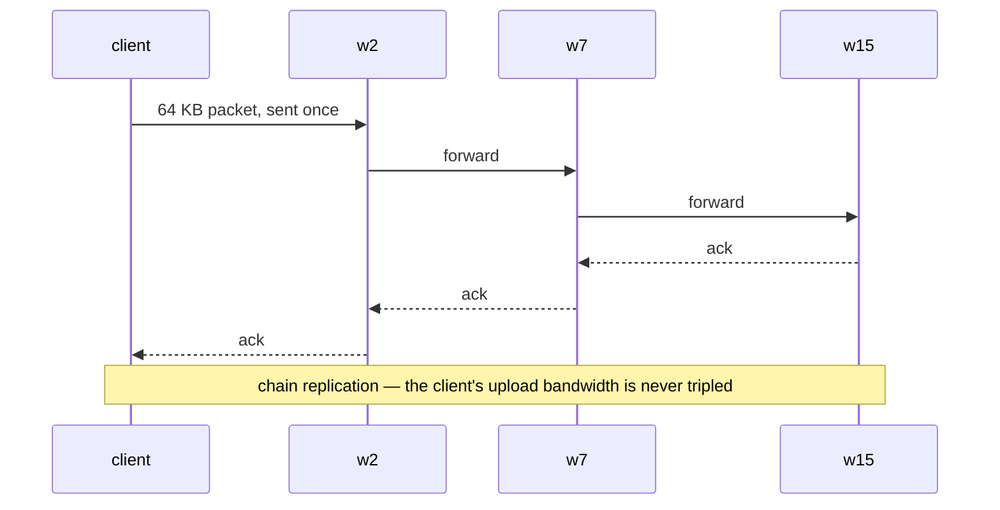
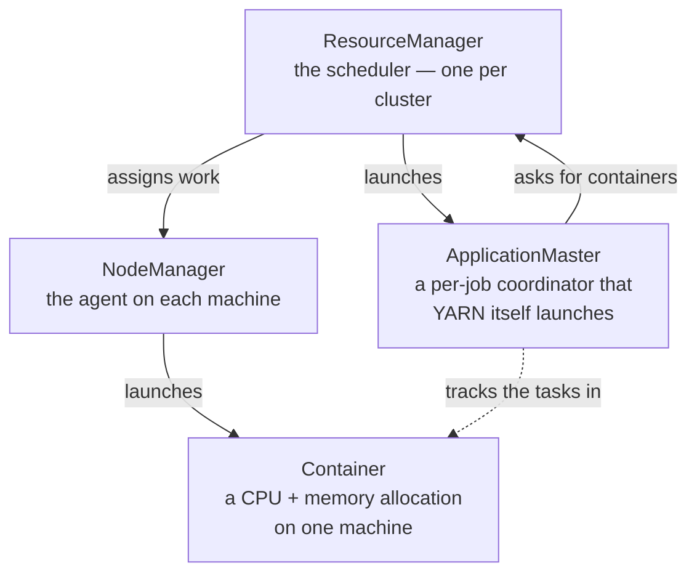
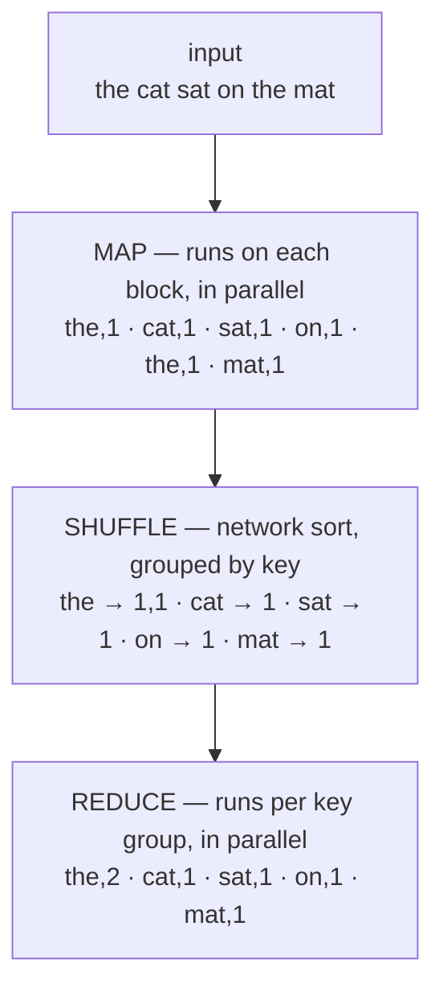

You cannot simplify something you do not understand. This is the short version of
Hadoop architecture. If you already know it, skip ahead to [What is Mammoth?](/intro/what/).


## 1.1 The problem Hadoop solves

You have a 10 TB file. No single computer has 10 TB of fast disk, and even if it did, reading it at 200 MB/s takes **14 hours**.

The idea: chop the file into pieces, put the pieces on 100 machines, and have all 100 machines read their piece _at the same time_. Now it takes 8 minutes.

That's it. That's the whole idea. Everything else is bookkeeping.



The bookkeeping problems this creates:

1. **Where is each piece?** → you need an index.
2. **What if a machine dies?** → you need copies.
3. **How do you run code on 100 machines?** → you need a scheduler.

Hadoop's three answers: **HDFS** (storage + index), **replication** (copies), **YARN** (scheduler).

## 1.2 Blocks — how a file is chopped up

A file is split into fixed-size **blocks**. Hadoop's default is 128 MB.



Each block gets a globally unique ID. The file itself becomes nothing more than an **ordered list of block IDs**:

```
/data/sales.csv → [blk_1001, blk_1002, blk_1003]
```

To read the file, you fetch those three blocks in order and concatenate them.

**Why 128 MB and not 4 KB?** Because the index has to remember every block. A 4 KB block size on a 10 TB file means 2.5 billion index entries — the index won't fit in RAM. Bigger blocks = smaller index. The tradeoff is that a 1 KB file still occupies one block _entry_ in the index (though not 128 MB of disk). This is the famous **small-file problem**, and we fix it in Mammoth (§6.3).

## 1.3 Replication — surviving machine death

Every block is stored on **3 different machines** by default. If one dies, two copies remain, and the system quietly makes a third copy somewhere else.



Cost: 10 TB of data uses 30 TB of disk. (Erasure coding later reduces this to ~15 TB — see §6.6.)

**Rack awareness.** Machines live in racks. A whole rack can lose power at once. So the placement rule is:



You get rack-failure survival while only sending data across the (expensive, slow) rack-to-rack link once instead of twice.

## 1.4 NameNode and DataNode — the librarian and the shelves

|Role|Hadoop name|What it actually does|
|---|---|---|
|**The index**|NameNode|Remembers the directory tree, file→block mapping, permissions. Holds it all **in RAM**.|
|**The shelves**|DataNode|Stores actual block bytes on local disks. Knows nothing about filenames.|

Think of a library: the **card catalog** (NameNode) tells you shelf 12, row 4. The **shelves** (DataNodes) hold the books. The catalog never holds a book; the shelves never hold the catalog.

Reading a file is a two-step dance:



**Critical detail:** the NameNode never sees file data. It only handles metadata. That's what lets one NameNode serve thousands of DataNodes.

:::tip[Mammoth's answer — the one-shot read]
Two round trips before the first byte moves, on every open, through the one
global lock. Mammoth makes it **zero to one**: placement is *computed* from the
block ID by rendezvous hashing rather than looked up, `open` hands back a
**location lease** covering the whole file, and a client with no lease can send
`path + range` straight to the nearest worker — which resolves it locally from a
read-only replica of the namespace. Warm reads never touch the master at all.
[The one-shot read →](/concepts/fast-paths/#1--the-one-shot-read)
:::

**How the NameNode learns where blocks are:** it doesn't store that on disk. Every DataNode sends a **block report** on startup ("I have these 4 million blocks") and a **heartbeat** every 3 seconds ("still alive, here's my free space"). The block→location map is rebuilt in RAM every time the NameNode restarts. That's why big Hadoop clusters take 30+ minutes to boot.

**Safe mode:** on startup the NameNode refuses writes until enough DataNodes have reported in that it's confident it knows where 99.9% of blocks live. Otherwise it'd think blocks are missing and start replicating like crazy.

:::tip[Mammoth's answer — warm start]
Thirty minutes of read-only cluster, at the exact moment you least want it.
Mammoth doesn't rebuild the map, because it doesn't have to: the map is
`rkyv`-archived and **memory-mapped** back in a second, placement is *derivable*
so reports are a correction rather than a source of truth, and each worker
confirms its four million blocks with **one 32-byte Merkle root**. Safe mode
becomes per-shard and is measured in seconds.
[Warm start →](/concepts/fast-paths/#4--warm-start)
:::

## 1.5 The write path — the replication pipeline

Writing is more interesting than reading. The client does **not** send the data three times.



The client sends each 64 KB packet **once**, to the first DataNode. That node writes it to disk _and simultaneously_ forwards it to the second, which forwards to the third. Acks flow back down the chain. This is **chain replication**, and it means the client's upload bandwidth isn't tripled.

:::tip[Mammoth's answer — the fan-out dispersal write]
Chain replication's virtue is that the client's uplink is never tripled. Its
cost is that three hops out and three acks back are all **in series**, one slow
disk stalls the whole write, and a node dying mid-block means rebuilding the
pipeline. Mammoth splits the block into Reed–Solomon fragments and **scatters
them in parallel** — network depth 1 instead of 3 — then acks as soon as a
quorum is durable, so the slowest node is never waited on. Storage drops from 3×
to 1.67×, and so does the traffic on the fabric; the client's own uplink carries
1.67× instead of 1×, which is the trade.
[The fan-out dispersal write →](/concepts/fast-paths/#2--the-fan-out-dispersal-write)
:::

**Lease:** while a file is open for writing, the client holds a _lease_ (an exclusive lock with a timeout). If the client crashes, the lease expires and the NameNode recovers the half-written file. This is how HDFS gets single-writer semantics without distributed locks.

## 1.6 YARN and MapReduce — the compute half

**YARN** is the job scheduler. Its key insight is **data locality**: don't move 128 MB of data to the code, move the 5 KB of code to the machine that already has the data.



**MapReduce** is the original programming model. Word count, the "hello world":



The **shuffle** is where MapReduce jobs spend most of their time — it's an all-to-all network transfer plus a disk sort. Every performance conversation about Hadoop eventually becomes a conversation about shuffle.

## 1.7 Why Hadoop is slow and complicated

Now the important part — what you're actually fixing.

|Problem|Why it hurts|Mammoth's answer|
|---|---|---|
|**JVM + garbage collection**|A NameNode with 200 GB heap can pause for _seconds_ during a full GC. Everything stalls.|No GC. Rust.|
|**One global lock**|The NameNode serializes nearly all namespace operations behind `FSNamesystem`'s lock. One slow op blocks thousands.|Immutable namespace behind `ArcSwap` — readers never block.|
|**Metadata in RAM only**|Namespace size is capped by one machine's RAM. ~400 bytes/file means 100M files ≈ 40 GB heap.|Raft-backed metadata store, spilled to disk.|
|**Small-file problem**|1 million 10 KB files consume the same index space as 1 million 128 MB files. Clusters die from this.|Files under 1 MiB are inlined into their own metadata.|
|**Two-step reads**|Every open costs a NameNode round trip before a single byte moves — and repeats every 10 blocks on a long scan.|[One-shot read](/concepts/fast-paths/#1--the-one-shot-read): computed placement + location leases. 0–1 RTT.|
|**Chain-replicated writes**|Three hops out and three acks back, in series. One slow disk stalls the write; a death mid-block rebuilds the pipeline.|[Fan-out dispersal](/concepts/fast-paths/#2--the-fan-out-dispersal-write): parallel RS fragments, depth 1, quorum ack.|
|**Chain-replicated repair**|One source, one sink, per block. Rebuilding a dead 160 TB node takes hours — hours of reduced redundancy.|[Declustered repair](/concepts/fast-paths/#3--declustered-parallel-repair): every node repairs at once; LRC halves the traffic.|
|**6+ XML config files**|`core-site.xml`, `hdfs-site.xml`, `yarn-site.xml`, `mapred-site.xml`... with 1000+ tunable properties.|One `mammoth.toml`, env-overridable.|
|**ZooKeeper + JournalNodes + ZKFC**|HA requires _three additional distributed systems_ just to fail over one NameNode.|Raft, built in.|
|**Kerberos**|Security is all-or-nothing and famously painful to configure.|Tokens or mTLS by default; Kerberos only if you need it.|
|**Full block reports**|A 10M-block DataNode reporting in can pause the NameNode for seconds.|Rolling `xxhash3` digests; a full report only on mismatch.|
|**Slow startup**|Rebuilding the block map from reports takes 30+ minutes on large clusters.|[Warm start](/concepts/fast-paths/#4--warm-start): the map is `mmap`ed back, workers confirm with a 32-byte Merkle root.|
|**Java everywhere**|A separate script for each subsystem: `hdfs`, `yarn`, `mapred`, `hadoop`.|One binary, one verb set: `mammoth`.|

## 1.8 Translation table — keep this handy

|Hadoop says|Mammoth says|Plain English|
|---|---|---|
|NameNode|**master**|the index|
|DataNode|**worker**|the shelves|
|Secondary NameNode|_(gone)_|a checkpoint helper we don't need|
|JournalNode / QJM / ZooKeeper / ZKFC|_(gone)_|HA plumbing, replaced by built-in Raft|
|ResourceManager|**master** (scheduler module)|the job scheduler|
|NodeManager|**worker** (executor module)|the per-machine task launcher|
|ApplicationMaster|_(gone)_|a per-job coordinator we don't need|
|Container|**slot**|a CPU+RAM reservation|
|fsimage + edits|Raft snapshot + Raft log|how the index survives restarts|
|Block|**block**|a 128 MB chunk of a file|
|Block report|**Merkle root**|a 32-byte "here's everything I'm storing"|
|Replication pipeline|**dispersal**|the fragments of one block, sent all at once|
|Block map rebuild|_(gone)_|the map is memory-mapped back, not rebuilt|
|`getBlockLocations`|_(gone)_|placement is computed from the block ID|
|Safe mode|**safe mode**|read-only until the index is trustworthy|
|Rack awareness|**topology**|which machines share a failure domain|
|`hdfs dfs -ls /`|`mammoth ls /`|list a directory|
