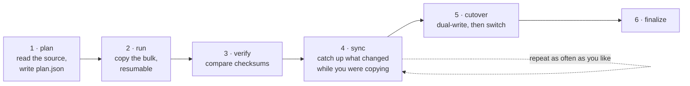

Two different meanings of "migration". You need both: getting your data **out of
Hadoop**, and upgrading **Mammoth itself** later.

## 11.1 Getting data out of Hadoop

Nobody migrates a petabyte in one command. The design here is six steps, each of
which you can stop, inspect and resume — and the first one moves nothing at all.



The whole thing is **idempotent**. Every step can be run again safely, so
"something went wrong" never means "start over".

### Step 1 · Plan — look, don't touch

```bash
mammoth migrate plan \
    --source hdfs://namenode:8020/user/warehouse \
    --dest /warehouse \
    --out plan.json
```

This walks the source and writes a manifest. **It copies nothing.** Read the
output before you do anything else:

```console
  scanned     4.2M files · 890 TB
  skew        12 hotspot directories flagged
  small files 1.1M files under 1 MB → will be inlined (saves ~1.1M metadata entries)
  estimate    9h 12m at 20 GB/s
  ✔ plan.json written
```

Three lines worth reacting to:

- **`small files`** — this is usually the number that sells the migration. A
  million files under 1 MB cost a million block-map entries in HDFS and cost
  *nothing* here, because they get inlined into their own metadata.
- **`skew`** — directories that are far larger than their siblings. They will be
  the slowest part of the copy and the slowest part of every job afterwards.
  [`viz skew`](/Mammoth/cli/viz/#viz-skew) explains what to do about them.
- **`estimate`** — if this is longer than you expected, it is almost always the
  small files, not the bytes.

Narrow the scope when you need to:

```bash
mammoth migrate plan \
    --source hdfs://namenode:8020/user/warehouse \
    --dest /warehouse \
    --include '*.parquet' \
    --exclude '*/_temporary/*' \
    --preserve perms,owner,times,acl,xattr \
    --out plan.json
```

| Flag | Does |
| --- | --- |
| `--include` / `--exclude` | Globs, applied in that order. `_temporary` is Hive's scratch — always exclude it. |
| `--preserve` | Which metadata to carry over. Drop `acl,xattr` if the source does not use them; it is faster. |
| `--out` | The manifest. Keep it in version control — it is the record of what you intended to move. |

For a Kerberised source, authenticate at plan time and the credentials are
reused for the rest:

```bash
mammoth migrate plan ... \
    --source-auth kerberos --principal u@REALM --keytab /etc/u.keytab
```

### Step 2 · Run — copy the bulk

```bash
mammoth migrate run --plan plan.json --dry-run
```

**Always `--dry-run` first.** It reports exactly what would happen and writes
nothing. Then drop the flag:

```bash
mammoth migrate run --plan plan.json \
    --parallelism 128 \
    --bandwidth-limit 10Gbps \
    --checkpoint .mammoth-migrate.db \
    --on-conflict skip
```

| Flag | Does | Start with |
| --- | --- | --- |
| `--parallelism` | Files copied at once. | 128; raise it if the source is idle, lower it if it is not |
| `--bandwidth-limit` | Cap on the read side. | **Set this.** The production cluster you are reading from still has users |
| `--checkpoint` | Where progress is recorded. | any local path — this is what makes step 3 possible |
| `--on-conflict` | What to do when the destination already has the file: `skip`, `overwrite`, `newer`. | `skip` |

**`--bandwidth-limit` is the flag people regret skipping.** An uncapped
migration will happily saturate the source cluster's network and turn a
background copy into an outage on a system you have not migrated off yet.

### Step 3 · Resume — because it will be interrupted

```bash
mammoth migrate resume --checkpoint .mammoth-migrate.db
```

Nine hours is long enough for a laptop to sleep, a VPN to drop, or someone to
close the terminal. The checkpoint is a local database of
`(source_path, state, bytes_done, checksum, attempts)`; resuming skips every row
marked `Done` and picks up partial files where they stopped.

You can run this as many times as you like. Running it on an already-complete
migration is a no-op that takes seconds.

### Step 4 · Verify — prove it arrived intact

```bash
mammoth migrate verify --plan plan.json --mode checksum --report verify.html
```

| `--mode` | Compares | Cost |
| --- | --- | --- |
| `size` | File sizes only | seconds |
| `checksum` | Content, via composite checksum | no re-read of the data |
| `full` | Byte-for-byte re-read of both sides | slow, and rarely necessary |

**`checksum` is the mode that matters**, and it is the feature that makes people
trust the migration. Mammoth implements HDFS's
`MD5-of-MD5-of-CRC32C` composite checksum, so both sides can compare a value
each already computed while writing — no second full read of 890 TB.

```console
  4,201,882 files compared
  ✔ identical      4,201,880
  ⚠ missing                1   /warehouse/tmp/_SUCCESS  (excluded by --exclude)
  ✕ mismatched             1   /warehouse/sales/part-0917.parquet
      source changed during the copy — step 5 will pick it up
```

A mismatch here is almost never corruption. It is a file that changed on the
source *while* you were copying it, which is exactly what step 5 exists for.

### Step 5 · Sync — catch up the delta

```bash
mammoth migrate sync --plan plan.json --since-last-run
```

Copies only what changed since the last run or sync. It is fast, so **run it
repeatedly** — the point is to shrink the delta until a cutover is trivial:

```console
  changed since 2026-08-25 04:12   1,204 files · 8.2 TB
  ✔ 6m 41s
```

Keep syncing until a run takes minutes rather than hours. That is the signal
that you are ready to cut over.

### Step 6 · Cut over

```bash
mammoth migrate cutover --mode dual-write --duration 72h
```

Dual-write sends every new write to **both** clusters while reads still come
from the old one. For three days you have a live, continuously verified copy and
a rollback that costs nothing — point reads back at Hadoop and carry on.

When you are satisfied:

```bash
mammoth migrate cutover --finalize
```

Reads move to Mammoth and dual-write stops. **This is the point of no return**;
writes after it exist only here.

### Other sources

The same six steps work against anything with a `MigrationSource` implementation
— only `--source` changes:

```bash
mammoth migrate run --source s3://bucket/prefix --source-region ap-south-1 --dest /data
mammoth migrate run --source file:///mnt/nas --dest /archive
mammoth migrate run --source gs://bucket/prefix --dest /data
```

### Hive metastore paths

Data that has moved is useless if the metastore still points at the old
location. Rewrite the paths — dry run first, always:

```bash
mammoth migrate metastore --hive-uri thrift://hms:9083 \
    --rewrite 'hdfs://namenode:8020/=s3://mammoth/' \
    --databases sales,logs \
    --dry-run
```

Note the target is the **S3 prefix**, not a Mammoth-specific scheme: the gateway
speaks S3, so Spark, Trino and Hive keep using the connector they already have.

### Implementation notes

For whoever is building this:

- `trait MigrationSource { fn walk(&self) -> Stream<Item = SourceEntry>; fn open(&self, p) -> AsyncRead; }`
  with implementations for WebHDFS, S3, GCS and the local filesystem.
- Checkpoint in a local `redb` or SQLite:
  `(source_path, state, bytes_done, checksum, attempts)`. Re-running skips
  `Done` rows — idempotent by construction, rather than by carefulness.
- Split large files into parallel range reads, so a 1 TB file is not
  single-threaded while 127 workers idle.
- **Implement the `MD5-of-MD5-of-CRC32C` composite checksum.** Step 4 is the
  step that earns trust, and it only works if both sides can compute the same
  value without re-reading.
- Stream progress to the Web UI as well as the terminal. A migration is a good
  demo and a long one — people will want to watch it.

## 11.2 Upgrading Mammoth itself

Same shape: check, dry run, roll forward one node at a time, and keep a
rollback until you deliberately give it up.

```bash
mammoth admin upgrade check                    # what would change, and what breaks
mammoth admin upgrade start --to 0.4.0 --dry-run
mammoth admin upgrade start --to 0.4.0         # rolling, one node at a time
mammoth admin upgrade status
mammoth admin rollback --to 0.3.2              # valid only before finalize
mammoth admin upgrade finalize                 # point of no return
```

Take a metadata backup before you start. It is cheap and it is the only thing
that helps if the upgrade goes badly:

```bash
mammoth admin metadata backup  --out meta-2026-08-25.snap
mammoth admin metadata restore --in  meta-2026-08-25.snap
```

**The rules that make rollback real:**

- Bump `layout_version` in `VERSION` on any on-disk change.
- Keep the old layout alongside the new one via hardlinks — free, until
  `finalize` removes them.
- A node refuses to start against a layout newer than it understands, and says
  exactly what to do about it rather than crashing.
